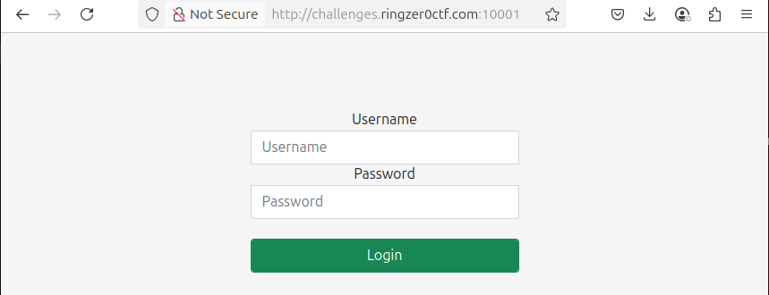
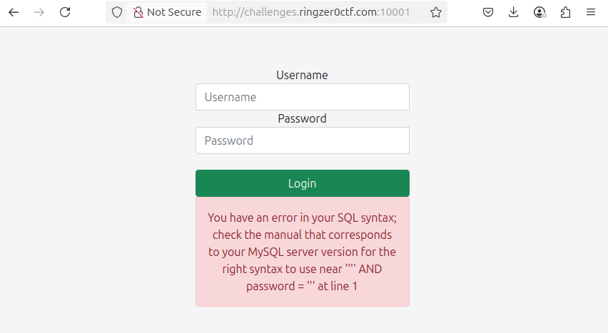
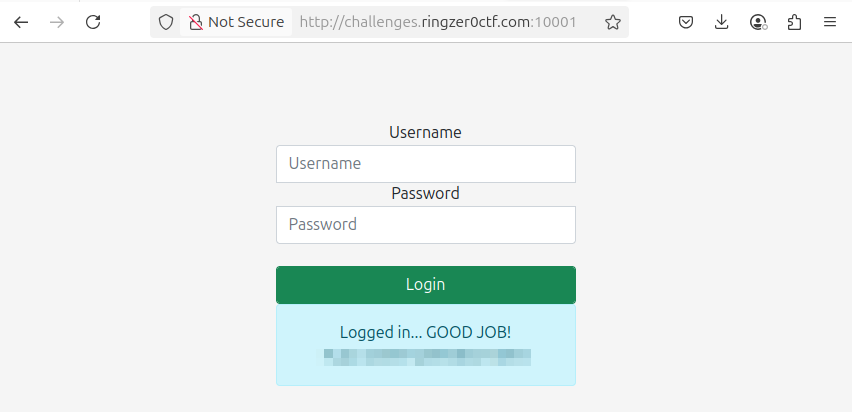

# Most basic SQLi pattern.

- Write-up by: ElkhornHeavy
- Category: SQL Injection
- Points: 1

## The Challenge



This challenge contains inputs for a Username and a Password, plus a Login
button.

Right-clicking the page and selecting `View Page Source` from the context menu
brings up the source. The source is very simple and the only important part is
the form component containing the inputs and Login button. This all looks very
standard with no big surprises. Anything of interest is happening on the server.

## Solving the Challenge

The hints are clear: this is SQL Injection, and should be of the most basic
type. The first step is to see how the website reacts to a bare `'` character as
the username:



This website is so very helpful to an attacker:

> You have an error in your SQL syntax; check the manual that corresponds to
> your MySQL server version for the right syntax to use near '''' AND password
> = ''' at line 1

- The server actually displays a snippet of the query, which is helpful in
  designing an attack
- The database is MySQL, so MySQL-isms need to be remembered

### The Query

A little creativity is needed to imagine what SQL query is used. It is probably
something like:

```sql
SELECT * FROM users WHERE username = '[INPUT1]' AND password = '[INPUT2]'
```

When `'` was used as `[INPUT1]`, this broke the query with unbalanced quotation
marks:

```sql
SELECT * FROM users WHERE username = ''' AND password = ''
```

The problem is that the website is not _sanitizing_ the user input. This is
classic SQL injection, where _escaping_ from the query is the goal. If `'` will
break the query, then how do to something interesting without breaking the
query?

To idea is to use something like the following as the username input:

```sql
' OR true --
```

Why this "username" input works:

- `'` closes the username string.
- ` OR true` ensures the condition is always true.
- `-- ` with an important trailing space turns the rest (the password check)
  into a comment. The trailing space is specific to MySQL databases.

So the final SQL query run by the website is:

```sql
SELECT * FROM users WHERE username = '' OR true -- ' AND password = ''
```

This results in every user being selected from the table. If the code is only
checking that the result returns a non-zero number of rows, then it thinks that
the username and password check out



and the flag (obscured) is displayed!

## Security Considerations

- Always sanitize user input before using it.
- Unsanitized user input can be used to alter the behaviour of an SQL query.
- SQL injection attacks are all about guessing what query is being run by the
  server, and how to manipulate it.
