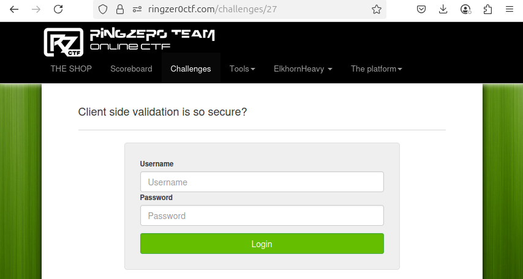
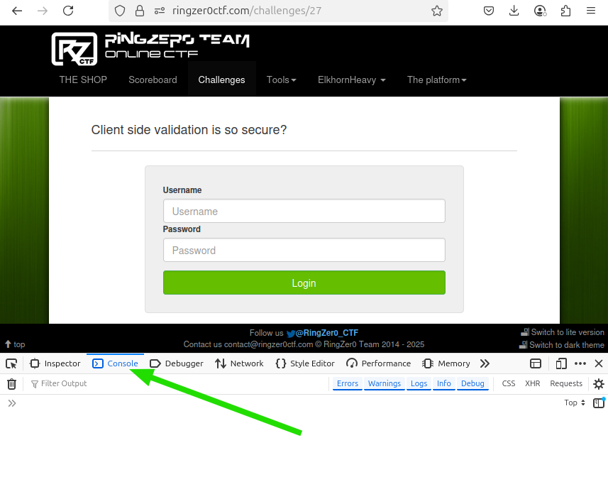
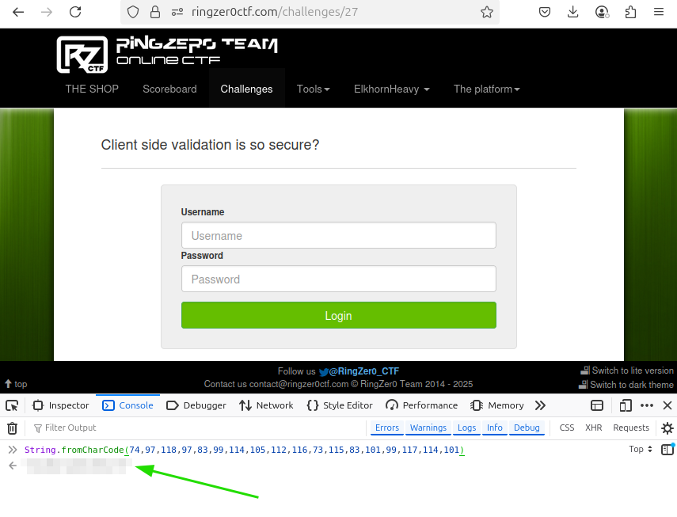

# Client-side validation is bad!

- Write-up by: ElkhornHeavy
- Category: JavaScript
- Points: 1

## The Challenge



Looks like a standard login form with Username and Password inputs, plus a
Login button.

Right-clicking the page and selecting `View Page Source` from the context menu
brings up the source.

### The Form

The first important part of the source is the form component containing the
inputs and Login button. This all looks very standard with no big surprises.
Some formatting and comments make it a bit more clear:

```html
<!-- The "action" is blank, so the form logic is probably in Javascript on the
web page itself. -->
<form action="" method="post">
  <label>Username</label>
  <!-- The input for the username, with an "id" value of "cuser" -->
  <input
    class="form-control"
    type="text"
    name="username"
    id="cuser"
    placeholder="Username"
  />

  <label>Password</label>
  <!-- The input for the password, with an "id" value of "cpass" -->
  <input
    class="form-control"
    type="password"
    name="password"
    id="cpass"
    placeholder="Password"
  />

  <!-- The button to submit the form, with a "class" value of "c_submit" -->
  <input
    type="submit"
    style="margin-top: 12px;"
    value="Login"
    class="c_submit form-control btn btn-success"
  />
</form>
```

### The Code

Further down the page is the important part: the JavaScript that checks the
username and password. Some formatting and comments make it a bit more clear:

```javascript
// The $() syntax is jQuery, a library for making it easier to write JavaScript
// that runs in the browser. It start with saying that when the Login (c_submit)
// button is clicked then do the code within the clause that follows.
$(".c_submit").click(function (event) {
  // Prevent the default action of the form: do not submit to the server.
  event.preventDefault();

  // Read the username and password from the form inputs.
  var u = $("#cuser").val();
  var p = $("#cpass").val();

  // Check that the username is "admin" and the password is the result of
  // whatever is returned by this call to String.fromCharCode().
  if (
    u == "admin" &&
    p ==
      String.fromCharCode(
        74,
        97,
        118,
        97,
        83,
        99,
        114,
        105,
        112,
        116,
        73,
        115,
        83,
        101,
        99,
        117,
        114,
        101
      )
  ) {
    // Username and password match: call the server, which displays the flag if
    // the password is correct.
    if (document.location.href.indexOf("?p=") == -1) {
      document.location = document.location.href + "?p=" + p;
    }
  } else {
    // Username or password are incorrect, so display an error message.
    $("#cresponse").html(
      "<div class='alert alert-danger'>Wrong password sorry.</div>"
    );
  }
});
```

There flaws in this page are:

1. The username `admin` is stored in the web page itself, so it is visible to
   anyone who looks at the source code
2. The password is hidden by the `String.fromCharCode()` function, but again it
   is visible to anyone who looks at the source code
3. Checking the username and password is done in the web page code. This is a
   big mistake. Checking credentials should be done in the web server, so that
   nothing is visible to the user.

## Decoding the Secret

The solution to this challenge is to figure out the `String.fromCharCode()`
function that is hiding the password. The Mozilla Developer Network (MDN)
documentation is a great place for all things JavaScript. It says:

> The String.fromCharCode() static method returns a string created from the
> specified sequence of UTF-16 code units.

As with most documentation, a certain level of prior knowledge is needed, and
this is no exception: what is a "UTF-16 code unit"? That's not very helpful
information. The simple (and limited, and not entirely correct) explanation is
that it can be ASCII values. ASCII maps letters to number values. For example,
the letter `A` has a decimal ASCII value of `65`, or `0x41` in hexadecimal.

In other words, the password has been encoded to number values, but those values
are easily reversed back to the letters they represent. The password is encoded
to:

> 74,97,118,97,83,99,114,105,112,116,73,115,83,101,99,117,114,101

These numbers could be looked up one by one to get the letters they represent.
For a small set of numbers this is OK, but it's always better to automate things
whenever possible. Thankfully the `String.fromCharCode` function already
automates the process!

The first step is starting the browser Developer Tools, which are also called
the `F12` tools, as the `F12` key in the browser starts them:



The image above shows the `Console` tab of the Developer Tools. Pasting the
`String.fromCharCode()` function into the console will run the function and
print the password (Note: the password has been obscured in the screen shot).



## Security Considerations

- Never store sensitive information in the browser's code for web pages. Users
  can read the code, and they will.

- Secrets encoded with reversible operations can and will be reversed.

- Credential validation should be done on the server, not on the client.

- Never assume your users are friendly.

## Beyond the Challenge

It's always a good idea to find alternative solutions to challenges. After all,
the goal is to learn, and learning new tools and techniques is important.

The browser's Developer Tools console is only one place to run JavaScript code.
If the code is complex, it's often better to use something like Node.js to run
the code. Short snippets of code can be run on the command line with the `-e`
flag:

```
$ node -e "console.log(String.fromCharCode(74,97,118,97,83,99,114,105,112,116,73,115,83,101,99,117,114,101))"
[REMOVED: CHALLENGE PASSWORD]
$
```
