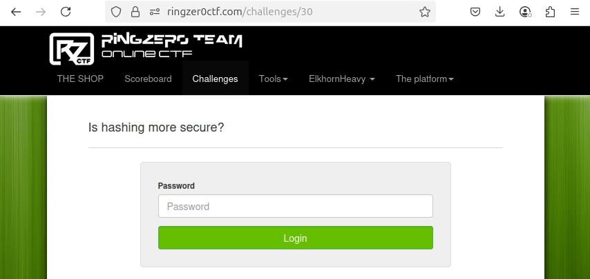

# Hashing is more secure

- Write-up by: ElkhornHeavy
- Category: JavaScript
- Points: 1

## The Challenge



This challenge contains only an input for a Password, plus a Login button.

Right-clicking the page and selecting `View Page Source` from the context menu
brings up the source.

### The Form

The first important part of the source is the form component containing the
input and Login button. This all looks very standard with no big surprises. Some
formatting and comments make it a bit more clear:

```html
<!-- The "action" is blank, so the form logic is probably in Javascript on the
web page itself. -->
<form action="" method="post">
  <label>Password</label>
  <!-- The input for the password, with an "id" value of "cpass" -->
  <input
    type="password"
    class="form-control"
    name="password"
    id="cpass"
    placeholder="Password"
  />

  <!-- The button to submit the form, with a "class" value of "c_submit" -->
  <input
    type="submit"
    style="margin-top: 12px;"
    value="Login"
    class="c_submit form-control btn btn-success"
  />
</form>
```

### The Code

Further down the page is the important part: the JavaScript that checks the
password. Some formatting and comments make it a bit more clear:

```javascript
// The $() syntax is jQuery, a library for making it easier to write JavaScript
// that runs in the browser. It starts with saying that when the Login
// (c_submit) button is clicked then do the code within the clause that follows.
$(".c_submit").click(function (event) {
  // Prevent the default action of the form: do not submit to the server.
  event.preventDefault();

  // Read the password from the form input.
  var p = $("#cpass").val();

  // Use the Sha1 library (imported from sha1.js) to create the SHA-1 hash value
  // of the password. Check if the hash matches the "b89356..." value.
  if (Sha1.hash(p) == "b89356ff6151527e89c4f3e3d30c8e6586c63962") {
    // Password hash matches: call the server, which displays the flag if the
    // password is correct.
    if (document.location.href.indexOf("?p=") == -1) {
      document.location = document.location.href + "?p=" + p;
    }
  } else {
    // Password hash does not match, so display an error message.
    $("#cresponse").html(
      "<div class='alert alert-danger'>Wrong password sorry.</div>"
    );
  }
});
```

### Background: Hashing

SHA-1 (Secure Hash Algorithm 1) is a cryptographic hash function that takes any
input and creates a short _hash_ or _digest_. The input can be a string,
binary file, or anything digital. It's basically a fingerprint: even a tiny
change in the input creates a completely different hash.

Hash functions like SHA-1 are one-way: there's no practical method to reverse
the process and recover the original input. They also produce the same hash for
an input no matter how many times they are run. This makes them useful for
verifying data integrity and storing passwords without revealing them.

SHA-1 is no longer considered cryptographically secure. In 2017, researchers
successfully created a _collision_ of two different inputs that produce the same
SHA-1 hash. This undermines one of the function's core guarantees. Modern
systems have moved to stronger hash functions like SHA-256 and SHA-3, which are
much harder to break using current computing power.

## Solving the Challenge

Although there's a solution to this challenge, there are many paths that need to
be explored before getting to the end.

### Is it SHA-1?

Skepticism is important! Although the script says that it's using SHA-1, is it
really? The page source shows that the file `sha1.js` is imported, so it's a
good idea to look at that file. Not being a cryptographer, it's hard to tell if
the file implements SHA-1 correctly, but it isn't a glaringly obvious fake
implementation. No luck there!

### SHA-1 is Broken

The SHA-1 algorithm should no longer be used, as attacks have made it possible
to find collisions. So in theory, another "password" value could be found that
produces the same SHA-1 hash. There are two flaws with this approach, though:

1. It would take significant time / money / effort to come up with a collision.
   This seems like an excessive solution for a 1 point challenge!
2. Perhaps a collision could be found, for instance if the password was "secret"
   but the word "pencil" produced the same hash. The web page sends the password
   to the web server for verification, and there's a chance that the backend is
   comparing passwords and not their hashes. In that case this approach again
   goes nowhere.

### Educated Guesses

One flaw in this challenge is that the hash is stored in the web page source.
The hash value can be copied from the page and then attacked "offline" without
involving the web server. It's a good idea to copy the `sha1.js` file from the
server, just in case it is flawed in some way (purposely or otherwise).

A JavaScript tool [hash_password.js](hash_password.js) can be written:

```javascript
// Produce a SHA-1 hash for a given password. Uses the sha1.js file used by
// RingZer0 CTF challenge #30.
//
// Usage:
//    node hash_password.js <target_hash> <text_to_hash>
//    node hash_password.js b89356ff6151527e89c4f3e3d30c8e6586c63962 pencil
//

const path = require("path");

const Sha1 = require("./sha1.js");

// The two parameters that are read from the command line.
const targetHash = process.argv[2];
const input = process.argv[3];

// Check that the parameters were provided, and exit if not.
if (!targetHash || !input) {
  const scriptName = path.basename(process.argv[1]);
  console.error(`Usage: node ${scriptName} <target_hash> <text_to_hash>`);

  process.exit(1);
}

// The real work: compute the hash for the user input.
const computedHash = Sha1.hash(input);

console.log(`Input:       ${input}`);
console.log(`Input Hash:  ${computedHash}`);
console.log(`Target Hash: ${targetHash}`);

// Check if the hash matches - this is less error prone than having a human look
// at the hashes.
if (computedHash.toLowerCase() === targetHash.toLowerCase()) {
  console.log("✅ Match!");
} else {
  console.log("❌ No match.");
}
```

Now to run this script against some passwords. The password for the previous
challenge was `JavaScriptIsSecure` so perhaps it's a variation on that?

```
$ node hash_password.js b89356ff6151527e89c4f3e3d30c8e6586c63962 JavaScriptIsSecure
Input:       JavaScriptIsSecure
Input Hash:  d5792c173ec5fc37e89b9d0344d35ffb238b916f
Target Hash: b89356ff6151527e89c4f3e3d30c8e6586c63962
❌ No match.
$ node hash_password.js b89356ff6151527e89c4f3e3d30c8e6586c63962 Sha1IsSecure
Input:       Sha1IsSecure
Input Hash:  b688a47db58749ea8a2ddec38c3f52dca2bd2410
Target Hash: b89356ff6151527e89c4f3e3d30c8e6586c63962
❌ No match.
$ node hash_password.js b89356ff6151527e89c4f3e3d30c8e6586c63962 SHA1IsSecure
Input:       SHA1IsSecure
Input Hash:  4222fc02fb5947f7a804273f24299292779b6faf
Target Hash: b89356ff6151527e89c4f3e3d30c8e6586c63962
❌ No match.
$ node hash_password.js b89356ff6151527e89c4f3e3d30c8e6586c63962 SHA-1IsSecure
Input:       SHA-1IsSecure
Input Hash:  81cc6b1c7a6beb86cdaa62c9591d619584de51fb
Target Hash: b89356ff6151527e89c4f3e3d30c8e6586c63962
❌ No match.
$ node hash_password.js b89356ff6151527e89c4f3e3d30c8e6586c63962 pencil
Input:       pencil
Input Hash:  d2fc512490a15036460b5489401439d6da5407fa
Target Hash: b89356ff6151527e89c4f3e3d30c8e6586c63962
❌ No match.
```

Wow, this is tedious! On a real target it might be worth the effort of continued
guesses. Maybe it's just a common English word?

### Using a Dictionary

Write another tool, [hash_password_file.js](hash_password_file.js) to compare
all the words in a dictionary file:

```javascript
// Produce a SHA-1 hash for each password in a file. Uses the sha1.js file from
// RingZer0 CTF challenge #30.
//
// Usage:
//    node hash_password_file.js <target_hash> <filename>
//    node hash_password_file.js b89356ff6151527e89c4f3e3d30c8e6586c63962 /usr/share/dict/words
//

const fs = require("fs");
const path = require("path");
const readline = require("readline");

const Sha1 = require("./sha1.js");

// The two parameters that are read from the command line.
const targetHash = process.argv[2];
const filename = process.argv[3];

// Check that the parameters were provided, and exit if not.
if (!targetHash || !filename) {
  const scriptName = path.basename(process.argv[1]);
  console.error(`Usage: node ${scriptName} <target_hash> <filename>`);
  process.exit(1);
}

// Create a read stream and line reader.
const rl = readline.createInterface({
  input: fs.createReadStream(filename),
  crlfDelay: Infinity,
});

// Process each line from the file.
rl.on("line", (line) => {
  const word = line.trim();
  const hash = Sha1.hash(word);

  if (hash.toLowerCase() === targetHash.toLowerCase()) {
    console.log(`✅ Match found: "${word}" → ${hash}`);
    rl.close();
  }
});
```

```
$ node hash_password_file.js b89356ff6151527e89c4f3e3d30c8e6586c63962 /usr/share/dict/words
$
```

Nothing!

Maybe it's time to get a little more serious. In 2009 the company RockYou had a
data breach of millions of plaintext passwords. That password list lives on as a
common source of passwords.

```
$ node hash_password_file.js b89356ff6151527e89c4f3e3d30c8e6586c63962 rockyou.txt
$
```

Nothing again! RockYou is just the beginning. There are many similar collections
of passwords out there.

```
$ git clone -q https://github.com/danielmiessler/SecLists
$ find SecLists -type f -exec \
    node hash_password_file.js b89356ff6151527e89c4f3e3d30c8e6586c63962 '{}' \;
✅ Match found: "[REMOVED: CHALLENGE PASSWORD]" → b89356ff6151527e89c4f3e3d30c8e6586c63962
✅ Match found: "[REMOVED: CHALLENGE PASSWORD]" → b89356ff6151527e89c4f3e3d30c8e6586c63962
✅ Match found: "[REMOVED: CHALLENGE PASSWORD]" → b89356ff6151527e89c4f3e3d30c8e6586c63962
...
```

After an uncomfortably long delay, the hits start rolling in!

This found the password that is the solution to the challenge, but the solution
itself doesn't _feel_ right:

- The files containing the password are not common password files, they're not
  obvious at all
- Is this solution a little extreme for a 1 point challenge?
- Is there an easier solution? A logic flaw in the page code?
- Was this challenge designed to be solved by using script kiddie tools, and if
  so, then how is it a "JavaScript" challenge?

## Security Considerations

- Never store sensitive information in the browser's code for web pages. Users
  can read the code, and they will.
- Hashes that are publicly stored can be brute-forced without involving the web
  server.
- Common passwords are sitting ducks when they are easy to check.
- Never assume your users are friendly.
