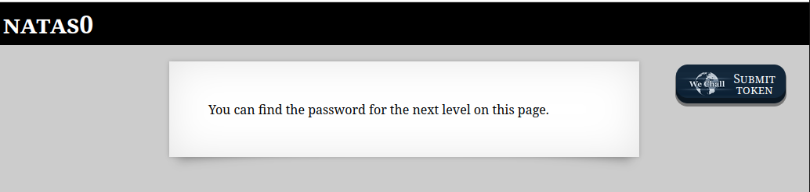
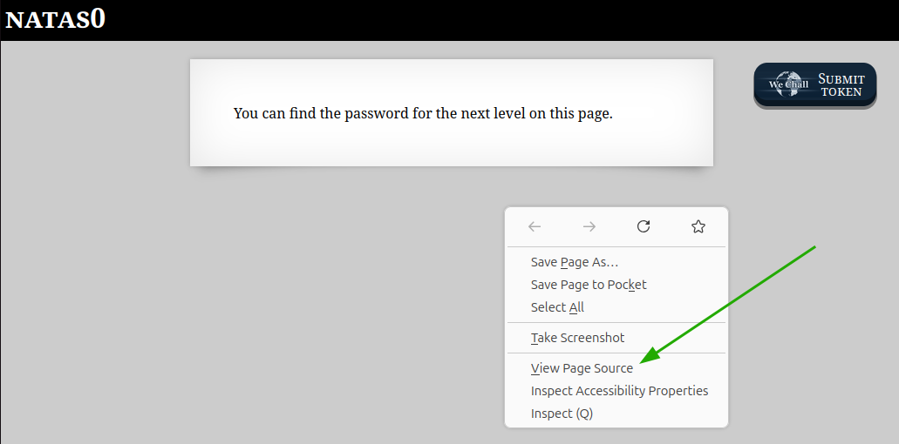
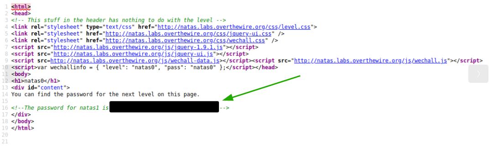
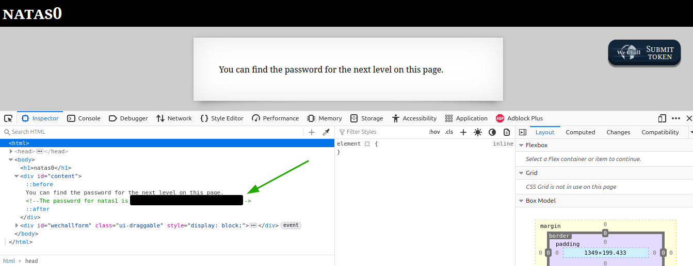

# OverTheWire - Natas - Level 1

[OverTheWire](https://overthewire.org) offers a series of "wargames" that teach
security skills. From their website:

> Natas teaches the basics of serverside web-security.

## Challenge Overview

The first challenge was the introduction, and displays the following web page:

## Initial Analysis

The web page instructions

> You can find the password for the next level on this page.

are self-explanatory, and looking around the web page should reveal the next
password.

## Approach Strategy

1. Look at the page source to see what is there

## Step-by-Step Solution

Browsers provide a way to look at the "source code" of a web page. For example
in Firefox, right-clicking on a page brings up a context menu that includes an
item to "View Page Source":

The page source is the HTML that makes up the page. In this first challenge the
password is very obvious, as it is stored in a comment in the HTML. Note that
the password has been redacted in this image:

## Key Takeaways

HTML comments contain data that is not displayed on a web page. They can be a
valuable source of information.

## Beyond the Challenge

The "View Page Source" context menu item is one way to see the HTML code for a
web page. Browsers also have "Developer Tools" that can be used to look at the
source for a web page. These tools are also called the "F12 Tools" as the `F12`
key is used to run them:

