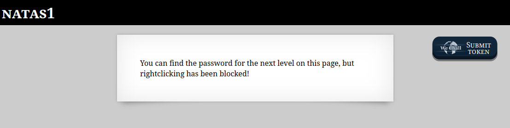
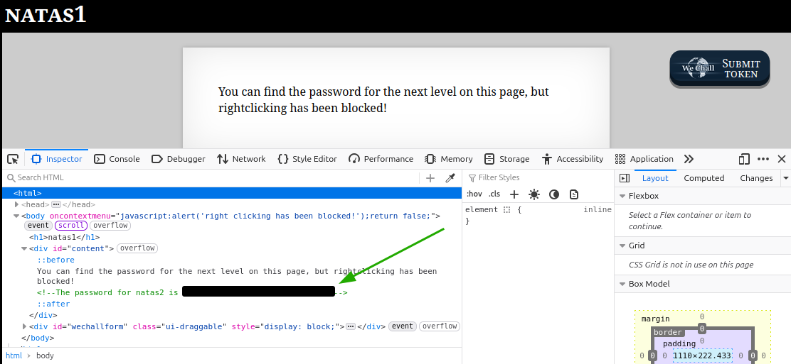

# OverTheWire - Natas - Level 2

[OverTheWire](https://overthewire.org) offers a series of "wargames" that teach
security skills. From their website:

> Natas teaches the basics of serverside web-security.

## Challenge Overview

After discovering the `natas1` password in the previous challenge, it can be
used to log into http://natas1.natas.labs.overthewire.org:

## Initial Analysis

The web page instructions are:

> You can find the password for the next level on this page, but rightclicking
> has been blocked!

So the context menu in the browser has been disabled. However, the Developer
Tools probably still work.

## Approach Strategy

1. Use the Developer Tools to look at the page source to see what is there

## Step-by-Step Solution

Browsers have "Developer Tools" that can be used to look at the source for a web
page. These tools are also called the "F12 Tools" as the `F12` key is used to
run them. Note that the password has been redacted in this image:

## Key Takeaways

HTML comments contain data that is not displayed on a web page. They can be a
valuable source of information and can be displayed with the Developer Tools.

## Beyond the Challenge

It's always a good idea to think about other solutions. In this challenge some
options are:

1. Right click and select the View Page Source menu, as this does actually work
   in Firefox 137 - browsers are a moving target
1. The page could be saved locally and then the source can be viewed
