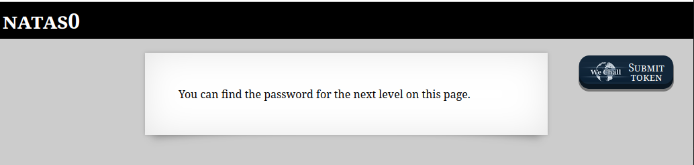

# OverTheWire - Natas - Level 0

[OverTheWire](https://overthewire.org) offers a series of "wargames" that teach
security skills. From their website:

> Natas teaches the basics of serverside web-security.

## Challenge Overview

The first challenge is the introduction, and the username and password are
provided:

> - Username: natas0
> - Password: natas0
> - URL: http://natas0.natas.labs.overthewire.org

This displays the following web page:

## Initial Analysis

That's it for this challenge! It's the introduction, so all that is needed is to
log in.
