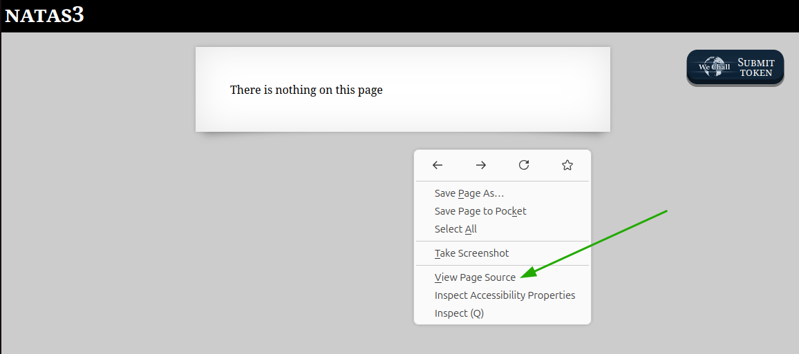
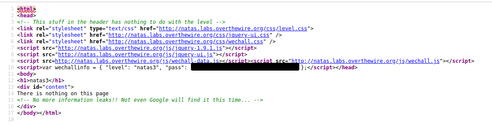
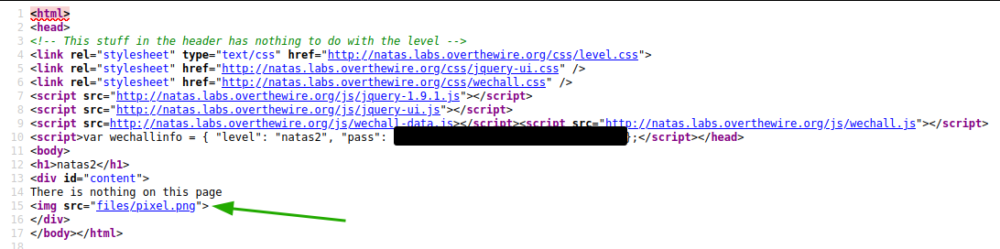
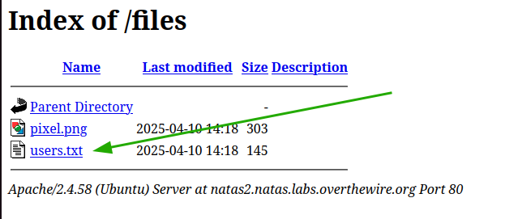

# OverTheWire - Natas - Level 3

[OverTheWire](https://overthewire.org) offers a series of "wargames" that teach
security skills. From their website:

> Natas teaches the basics of serverside web-security.

## Challenge Overview

After discovering the `natas2` password in the previous challenge, it can be
used to log into http://natas2.natas.labs.overthewire.org:

## Initial Analysis

The web page instructions are:

> There is nothing on this page

Very interesting, but there must be _something_ somewhere.

## Approach Strategy

1. Use "View Page Source" to look for the password

## Step-by-Step Solution

Browsers provide a way to look at the "source code" of a web page. For example
in Firefox, right-clicking on a page brings up a context menu that includes an
item to "View Page Source":

The page source is the HTML that makes up the page. The current `natas2`
password for "WeChall" has been redacted in this image, but that's not the
password that is needed:

The comment at the top in green that says that the header information can be
ignored. That's nice of the challenge developer to make this a little easier.
The page also includes an `` tag at the bottom:

The image on the page doesn't appear to be of interest. However, it is in a
directory called `files`. Perhaps there is something else in that directory.
Appending `/files` to the original web page url results in
http://natas2.natas.labs.overthewire.org/files, which provides a nice list of
what is in the directory, including something called `users.txt`:

Clicking on the `users.txt` link will display the file. It contains pairs of
usernames and passwords, including the `natas3` user (password redacted):

## Key Takeaways

- Reading the source code of a web page can uncover directories of interest
- Misconfigured web servers can provide directory listings and/or sensitive
  files

## Beyond the Challenge

It's always a good idea to think about other solutions. In this challenge an
option is to use the Developer Tools instead of the View Page Source function.
