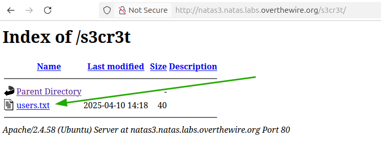

# OverTheWire - Natas - Level 4

[OverTheWire](https://overthewire.org) offers a series of "wargames" that teach
security skills. From their website:

> Natas teaches the basics of serverside web-security.

## Challenge Overview

After discovering the `natas3` password in the previous challenge, it can be
used to log into http://natas3.natas.labs.overthewire.org:

## Initial Analysis

The web page instructions are:

> There is nothing on this page

This is the same message as the previous challenge, but the assumption is that
there must be _something_ somewhere else.

## Approach Strategy

1. Use "View Page Source" to look for the password

## Step-by-Step Solution

Browsers provide a way to look at the "source code" of a web page. For example
in Firefox, right-clicking on a page brings up a context menu that includes an
item to "View Page Source":

The page source is the HTML that makes up the page. The current `natas3`
password for "WeChall" has been redacted in this image, but that's not the
password that is needed:

The comment at the top in green says that the header information can be ignored.
That's nice of the challenge developer to make this a little easier.

The page has another comment at the bottom saying

> No more information leaks!! Not even Google will find it this time...

This is a nice hint! Search engines use "web crawlers", or "spiders", or
"robots" to index all the content on a website. This is done by loading the
front page of the website and then following every link that exists. The
administrator of a web site can control the robots using the `/robots.txt` file:

This file says that the secret directory `/s3cr3t` should not be indexed. That
directory probably contains interesting things:

Clicking on the `users.txt` link will display the file. It contains the username
and password for the `natas4` user (password redacted):

## Key Takeaways

- Reading the `robots.txt` file can uncover items of interest
- Misconfigured web servers can provide directory listings and/or sensitive
  files

## Beyond the Challenge

It's always a good idea to think about other solutions. In this challenge some
options are:

- Instead of using the View Page Source, the Developer Tools would have
  uncovered the comment, again leading to the `robots.txt` file
