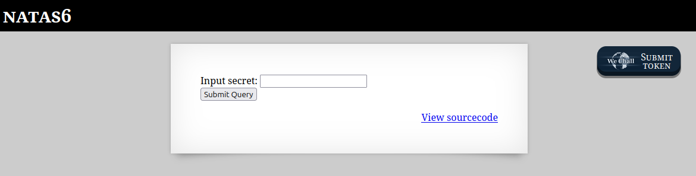
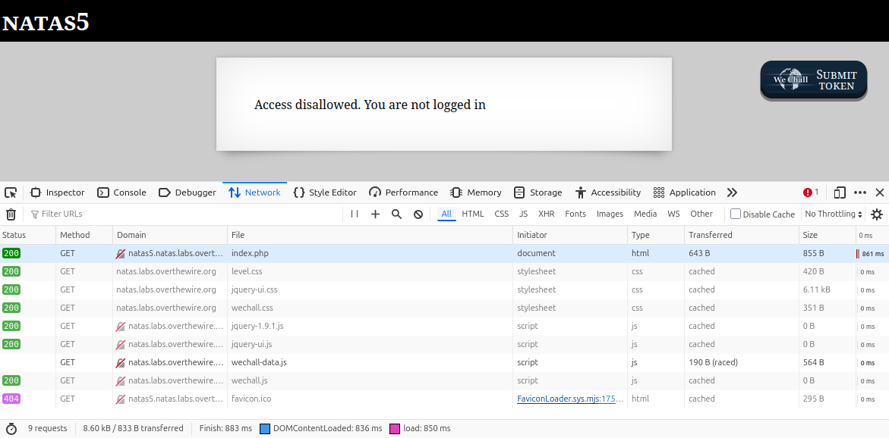
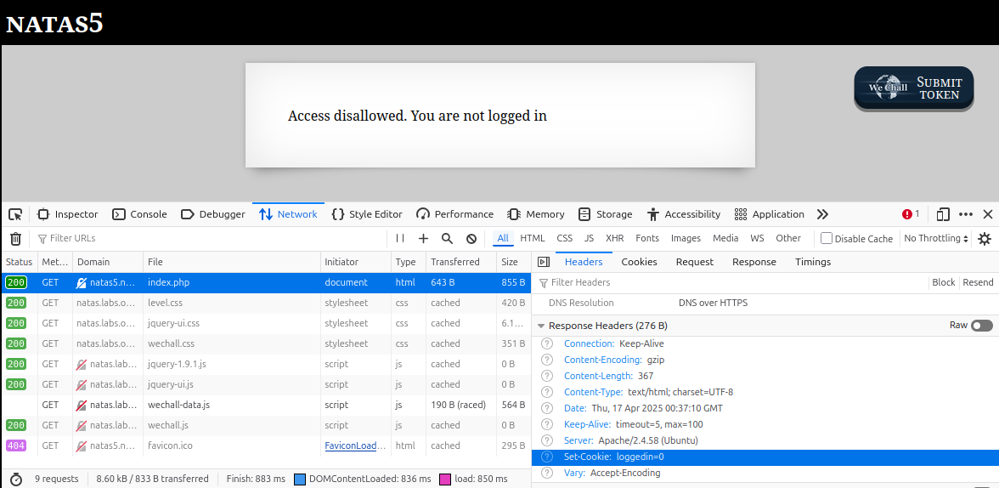
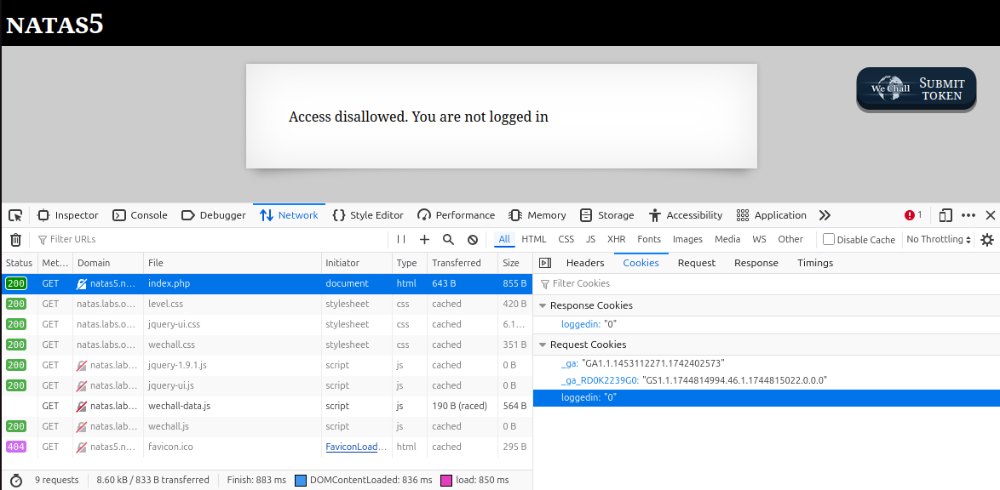
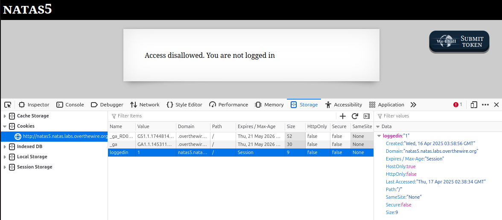
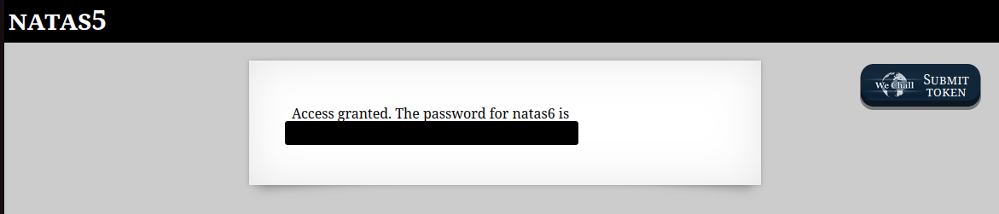

# OverTheWire - Natas - Level 6

[OverTheWire](https://overthewire.org) offers a series of "wargames" that teach
security skills. From their website:

> Natas teaches the basics of serverside web-security.

## Challenge Overview

After discovering the `natas5` password in the previous challenge, it can be
used to log into http://natas5.natas.labs.overthewire.org:

## Initial Analysis

The web page instructions are:

> Access disallowed. You are not logged in

This is interesting! The previous challenges all requested a username and
password before the page could be viewed. While the solution might be to find a
way to submit the username and password, perhaps something else is going on.

## Approach Strategy

1. Use "Developer Tools" to look at the network traffic
1. Make it up from there!

## Step-by-Step Solution

Browsers have "Developer Tools" that can be used to troubleshoot problems that
happen on websites. These tools can also be used to exploit security
vulnerabilities. These tools are also called the "F12 Tools" as the `F12` key is
used to run them:

In the Developer Tools the `Network` tab is open. The top HTTP request is for
`index.php`, which is the main file for the web page. Clicking that request
shows the details:

On the right is a new set of tabs, the first of which is the `Headers`. The
browser sends HTTP headers when it makes a request, and the web server response
also contains HTTP headers. One response header that jumps out is called
`Set-Cookie: loggedIn=0`. This header will cause the browser to set a cookie
(name=value pair) in the browser.

Switching to the `Cookies` tab, the highlighted cookie is the one that was set
by the browser when it received the response header:

Cookies are sent back to the web server on each request that follows. If `0`
causes the message that the user is not logged in, perhaps the solution is to
set the cookie value to `1` (assuming it is a boolean setting).

By switching to the `Storage` tab, and then selecting `Cookies` on the left,
the cookies for this site are shown. On the right the `loggedIn` cookie is
highlighted. By double-clicking the `Value` of `0` for the cookie, it can be
changed:

Now to click the reload button in the browser:

Success! This works because reloading the page makes all the same HTTP requests
as before, except with a cookie where `loggedIn=1`. The web server is trusting
that the cookie won't be changed, which is a Bad Idea.

There it is: `Access granted` and the `natas6` password (removed).

## Key Takeaways

- HTTP responses contain headers that can include cookies
- Cookies can be manipulated by the user, so they should never contain sensitive
  data
- Web servers should always be suspicious about any headers or data being sent
  by the user

## Beyond the Challenge

It's always a good idea to think about other solutions. While there are numerous
other tools that could be used to solve this challenge, doing it in the browser
Developer Tools doesn't require anything too fancy.
