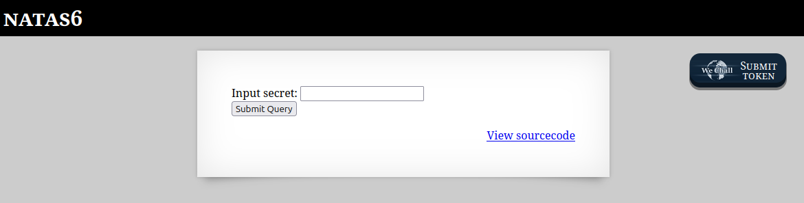
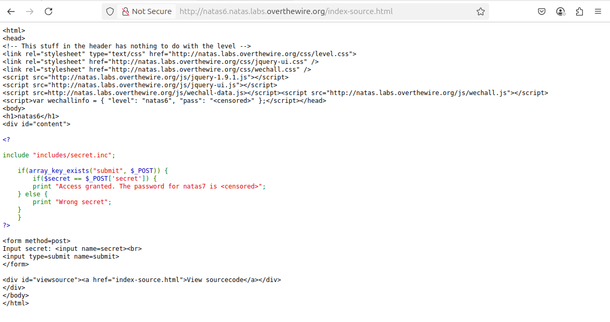
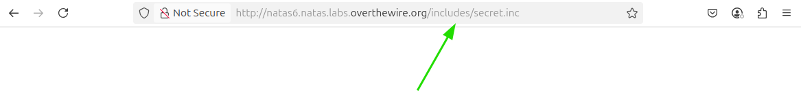
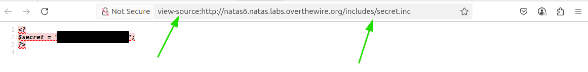
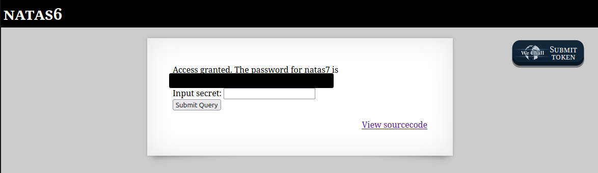

# OverTheWire - Natas - Level 7

[OverTheWire](https://overthewire.org) offers a series of "wargames" that teach
security skills. From their website:

> Natas teaches the basics of serverside web-security.

## Challenge Overview

After discovering the `natas6` password in the previous challenge, it can be
used to log into http://natas6.natas.labs.overthewire.org:



## Initial Analysis

The web page has no instructions, just a prompt:

> Input secret

There's an input box to putting in the secret and a `View sourcecode` link that
certainly seems like a hint.

## Approach Strategy

1. Click the `View sourcecode` link
1. Make it up from there!

## Step-by-Step Solution

Clicking on the `View sourcecode` link does indeed show the source code for the
webpage. The passwords are censored, but the logic for the page is shown:



This is PHP code. With a little formatting and commenting it becomes clearer
what is going on:

```php

// Include the secret from another file. It hides it a little bit from people
// who are looking at the page source.
include "includes/secret.inc";

// The $_POST array is all the values that were submitted in the form. Does it
// include "submit", the Submit Query button? In other words, is this page being
// displayed after the form was submitted? If so then print some extra text.
if (array_key_exists("submit", $_POST)) {
  // Does $secret from the "includes/secret.inc" file match the 'secret' value
  // entered by the user on the form?
  if ($secret == $_POST['secret']) {
    // The secret matches - print the next password.
    print "Access granted. The password for natas7 is <censored>";
  } else {
    // The secret does not match.
    print "Wrong secret";
  }
}
```

The code here is solid! No logic errors that can be exploited, or anything like
that.

However, what about that `includes/secret.inc` file? Is it possible to retrieve
it by putting the path into the URL bar in the browser?



Putting the file into the URL bar didn't seem to work, as the page is blank. But
wait - this is the output of the code on the page, not the code itself. Right-clicking the page and selecting "View Page Source" shows the source code:



Aha, there is the secret! The developer was trying to be sneaky by putting the
secret in another file, but that file can still be retrieved from the web
server.

Now to return to the index page, enter the secret, and submit the form:



There it is: `Access granted` and the `natas7` password (removed).

## Key Takeaways

- Check all dependencies (includes, imports) in case they contain sensitive
  information

## Beyond the Challenge

It's always a good idea to think about other solutions, but for this challenge
it seems that displaying the included secret is the key to success.
