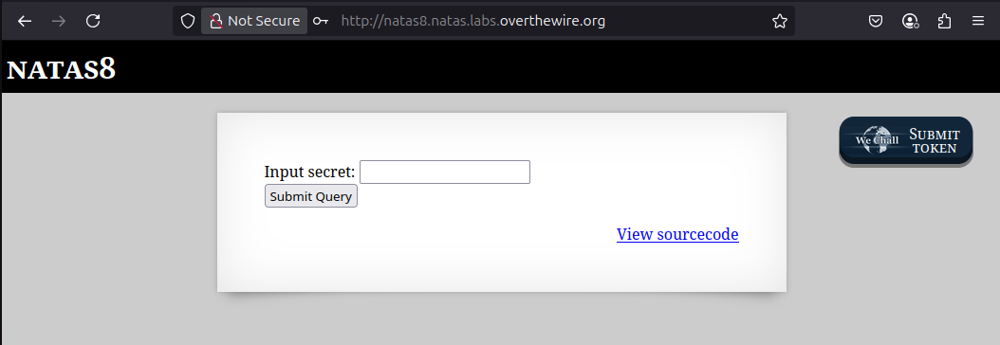
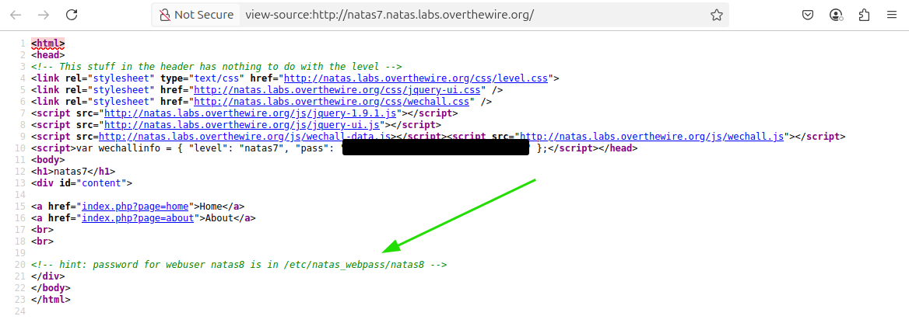
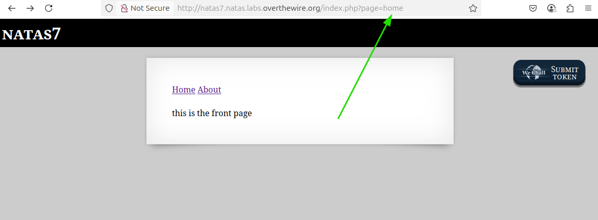
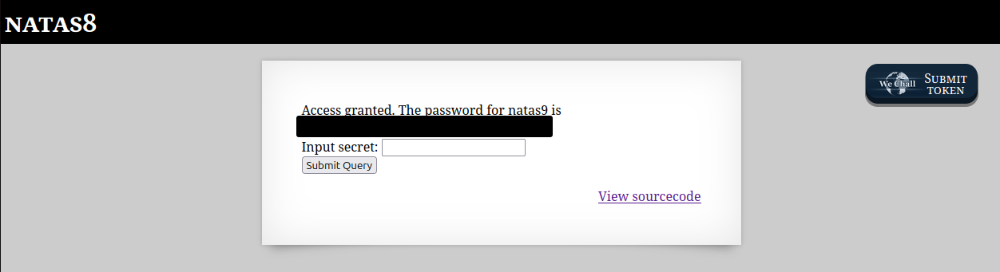

# OverTheWire - Natas - Level 8

[OverTheWire](https://overthewire.org) offers a series of "wargames" that teach
security skills. From their website:

> Natas teaches the basics of serverside web-security.

## Challenge Overview

After discovering the `natas7` password in the previous challenge, it can be
used to log into http://natas7.natas.labs.overthewire.org:

## Initial Analysis

The web page has no instructions, just links for `Home` and `About`.

## Approach Strategy

1. View the source code for the page and look for interesting things
1. Click the `Home` link to see what happens, and if it's a different page then
   view its source code
1. Click the `About` link to see what happens, and then view its source code

## Step-by-Step Solution

Right-clicking in the index page bring up the context menu, and the
`View Page Source` menu item displays the HTML source for the page. The `natas7`
password has been removed but the comment at the bottom gives a very strong
hint:

The `Home` link displays the same page but with "this is the front page" text
added. The `About` link similarly displays the same page but with "this is the
about page" text added.

What is interesting is the URLs of these two pages. Looking at the `Home` page:

The word `home` is sent to the server as the value of the `page` parameter. How
secure is this web site? What happens if some unexpected value is sent in as the
page parameter? For example, the page source said that the `natas8` password is
stored in `/etc/natas_webpass/natas8`. Using that as the `page` parameter gives:

There it is: the `natas8` password (removed).

What happened here is that the server is taking the `page` parameter and then
displaying the contents of that file on the screen. It is only expecting `home`
to display a file named `home`, or `about` to display a file named `about`. It
is not expecting that any file readable by the web server can be displayed.

## Key Takeaways

- Look for places where the file being displayed on the page can be controlled.

## Beyond the Challenge

It's always a good idea to think about other solutions, but for this challenge
it seems that displaying the indicated file is the way to go.
