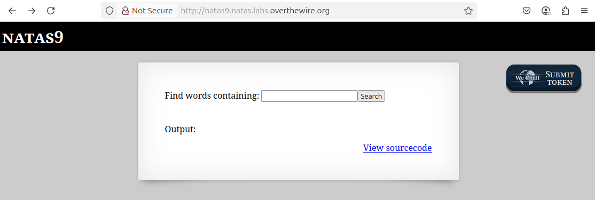
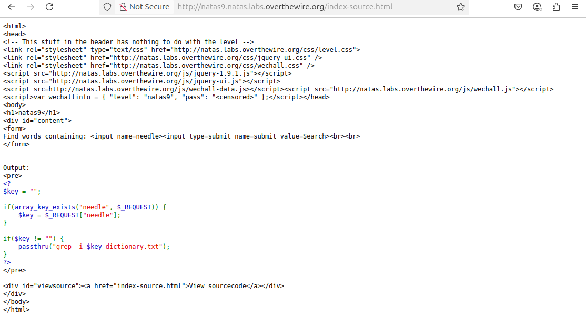
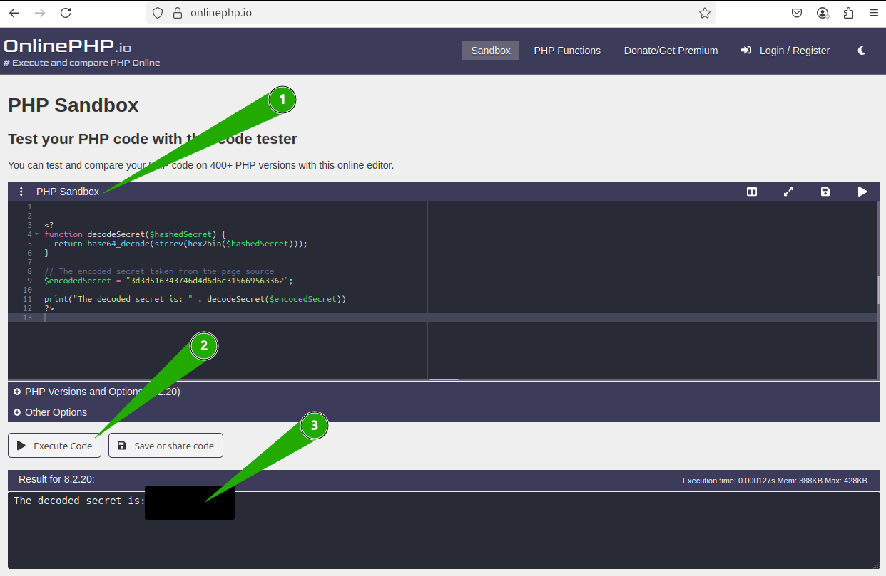
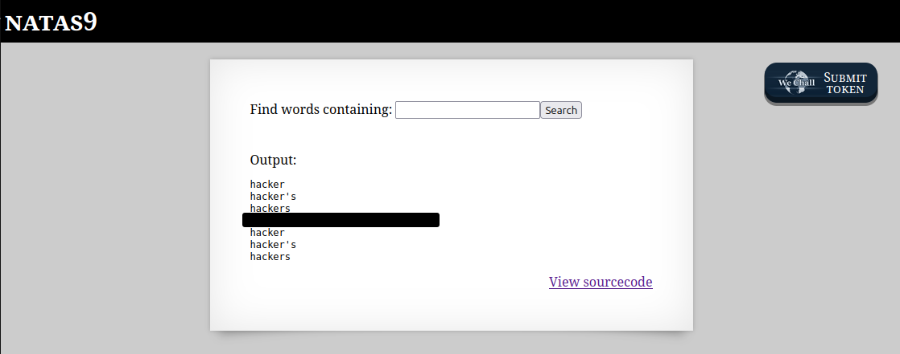

# OverTheWire - Natas - Level 9

[OverTheWire](https://overthewire.org) offers a series of "wargames" that teach
security skills. From their website:

> Natas teaches the basics of serverside web-security.

## Challenge Overview

After discovering the `natas8` password in the previous challenge, it can be
used to log into http://natas8.natas.labs.overthewire.org:



## Initial Analysis

This looks exactly the same as [Level 7](./level_07.md), but it's unlikely that
it will be the same solution. The web page has no instructions, just a prompt:

> Input secret

There's an input box to putting in the secret and a `View sourcecode` link that
certainly seems like a hint.

## Approach Strategy

1. Click the `View sourcecode` link
1. Make it up from there!

## Step-by-Step Solution

Clicking on the `View sourcecode` link does indeed show the source code for the
webpage. The passwords are censored, but the logic for the page is shown:



This is PHP code. With a little formatting and commenting it becomes clearer
what is going on:

```php
// This is the secret that has been encoded using the "encodeSecret" function.
$encodedSecret = "3d3d516343746d4d6d6c315669563362";

// Function that can be called with a secret, and returns the encoded version of
// that secret.
function encodeSecret($secret) {
  // The algorithm to encode the secret
  //  1. do a base64 encoding of the secret
  //  2. do a string reversal of the result of step 1
  //  3. do a binary to hexadecimal conversion of the result of step 2
  return bin2hex(strrev(base64_encode($secret)));
}

// The $_POST array is all the values that were submitted in the form. Does it
// include "submit", the Submit Query button? In other words, is this page being
// displayed after the form was submitted? If so then print some extra text.
if (array_key_exists("submit", $_POST)) {
  // Does the encoded version of the inputted secret match the previously
  // encoded value stored in "encodedSecret"?
  if (encodeSecret($_POST['secret']) == $encodedSecret) {
    // The secret matches - print the next password.
    print "Access granted. The password for natas9 is <censored>";
  } else {
    // The secret does not match.
    print "Wrong secret";
  }
}
```

Even with the added comments, this is going to require some explanation.

### Hashed Passwords

Login systems (also called authentication systems) store usernames and passwords
(which are also called credentials). To log into these systems, the user
supplies the username and password, and the system checks that they match what
was previously stored in a file or in a database.

This is a simplified view of things: it is a bad security practice to store
passwords in their "plain text" form. The reason for this is that if someone was
able to read the file or database containing the credentials, they would then be
able to log in as any user.

When login systems store passwords, they store a "hashed" value of the password.
It is critical that the function used to hash a password is "one way". This
means that once the password is hashed, there is no way to retrieve the original
password from the hashed value. It's also important that "collisions" are very
unlikely: different passwords should not hash to the same value.

Back to the code on this page: the secret has been encoded and then stored in
the source code. When the user enters a value, it is encoded in the same way and
then compared to the encoded secret. These are both the correct way of doing
things. The problem is that the encoding function is not one way. Each of the
three functions used to encode the secret can be reversed. Since the encoded
secret is stored on the web page, the original secret can be found with a little
effort.

### Decoding the Secret

The function used to encode the secret calls three other functions:

```php
function encodeSecret($secret) {
  return bin2hex(strrev(base64_encode($secret)));
}
```

These functions are chained together, with the output of one function acting as
the input to the next function. The order of operations is:

1. Send `$secret` to the `base64_encode` function
2. Take the output of step 1 as the input to `strrev`
3. Take the output of step 2 as the input to `bin2hex`

In PHP the opposite of `base64_encode` is `base64_decode`. The `strrev` function
reverses a string (`abc` -> `cba`) so it is a "symmetric" function and calling
it twice produces the original string. Finally, `bin2hex` can be reversed with
the PHP function `hex2bin`. So by putting the decoding function in the opposite
order, the decoding function would be:

```php
<?
function decodeSecret($hashedSecret) {
  return base64_decode(strrev(hex2bin($hashedSecret)));
}

// The encoded secret taken from the page source
$encodedSecret = "3d3d516343746d4d6d6c315669563362";

print("The decoded secret is: " . decodeSecret($encodedSecret))
?>
```

This is great in theory, but how to actually run the code? A quick online search
says that https://onlinephp.io provides a sandbox for trying out PHP code:



1. Paste the code into the `PHP Sandbox`
2. Click the `Execute Code` button
3. The output of the code appears in the result box (password removed)

Now this secret can be used in the original web page:



There it is: the `natas9` password (removed).

## Key Takeaways

- It's important to never store plain text passwords or secrets
- If passwords or secrets are stored as hashed values, the hashing function must
  be one way

## Beyond the Challenge

It's always a good idea to think about other solutions. The unix system provides
a bunch of commands that can manipulate text. To turn this solution into a shell
script, the three functions need to be reproduced using shell commands.

The `hex2bin` function can be reproduced using the `xxd` command that was
introduced in [Bandit 13](../bandit/level_13.md):

```
$ echo -n 3d3d516343746d4d6d6c315669563362 | xxd -r -p
==QcCtmMml1ViV3b
```

This is still encoded and not human readable, but those `=` signs look like base
64 padding, so this looks promising. Next to reverse the string using `rev`:

```
$ echo -n 3d3d516343746d4d6d6c315669563362 | xxd -r -p | rev
b3ViV1lmMmtCcQ==
```

This is indeed the reverse of the previous output, so `rev` is the correct
command here. Next is to decode the base 64 using `base64 -d`:

```
$ echo -n 3d3d516343746d4d6d6c315669563362 | xxd -r -p | rev | base64 -d
[REMOVED: DECODED SECRET]
```

Done!
