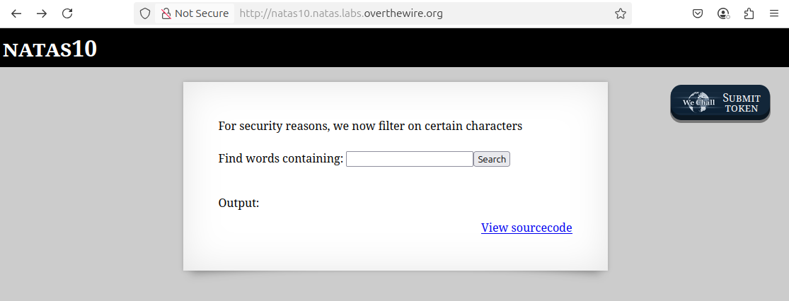
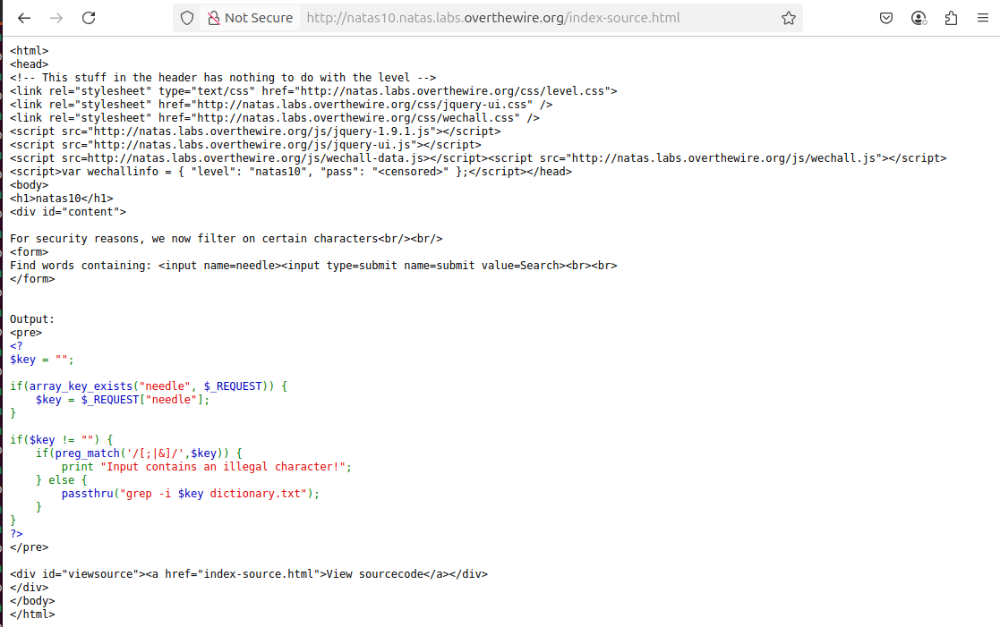
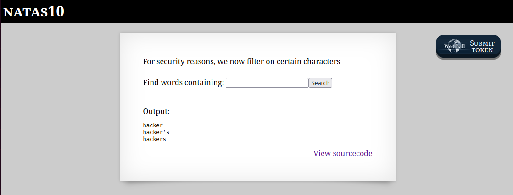

# OverTheWire - Natas - Level 10

[OverTheWire](https://overthewire.org) offers a series of "wargames" that teach
security skills. From their website:

> Natas teaches the basics of serverside web-security.

## Challenge Overview

After discovering the `natas9` password in the previous challenge, it can be
used to log into http://natas9.natas.labs.overthewire.org:



## Initial Analysis

The web page has no instructions, just a prompt:

> Find words containing

There's an input box to putting in the words, whatever those are. There is also
a `View sourcecode` link that certainly seems like a hint.

## Approach Strategy

1. Click the `View sourcecode` link
1. Make it up from there!

## Step-by-Step Solution

Clicking on the `View sourcecode` link does indeed show the source code for the
webpage. The passwords are censored, but the logic for the page is shown:



This is PHP code. With a little formatting and commenting it becomes clearer
what is going on:

```php
// Initialize the "$key" variable to the empty string.
$key = "";

// The "$_REQUEST" is all the input parameters in the HTTP request. So this will
// check to see if the "needle" parameter is defined. The form on this page has
// an input named "needle", so what this is doing is checking if the user has
// submitted a value or not.
if (array_key_exists("needle", $_REQUEST)) {
  // If the user put a value into the input box, then set "$key" to that value.
  $key = $_REQUEST["needle"];
}

// If the "$key" variable has a value - that is, it was entered by the user -
// then run the passthru command.
if ($key != "") {
  // Run the "grep" command in case-insensitive ("-i") mode to look for the
  // value of "$key" in the file "dictionary.txt". Print the output of the grep
  // command.
  passthru("grep -i $key dictionary.txt");
}
```

This code is pretty good, but it doesn't have anything to do with passwords. It
just looks up words in a dictionary and prints anything that matches. Entering
the word `hacker` and clicking the `Search` button displays:



If there are no secrets or passwords or anything else in this code, then what is
the solution to the challenge? All this code appears to do is print out words
from a dictionary file. The answer is that the `passthru` command is not
"sanitizing" the input from the user. User input should never be trusted!

All this code does is run the command `grep -i $key dictionary.txt` on the
command line, with the value of `$key` supplied by the user. If the user submits
the word `hacker` then the command is:

```
$ grep -i hacker dictionary.txt
```

A sneaky user can exploit this command. What if the input was
`hacker dictionary.txt; cat /etc/natas_webpass/natas10; grep -i hacker`? On the
command line this becomes three commands:

```
$ grep -i hacker dictionary.txt; cat /etc/natas_webpass/natas10; grep -i hacker dictionary.txt
```

Now it looks for "hacker", then prints the next password, then looks for
"hacker" again. Trying this out:


There it is: the `natas10` password (removed).

## Key Takeaways

- It's important to never trust user input
- The source code isn't usually available, but entering input with special
  characters might produce output the indicates unsantized input.

## Beyond the Challenge

It's always a good idea to think about other solutions. What is a shorter input
string?

The example input above produces good input for demonstrating the example. It
can be shortened by

1. Doing something short to finish the `grep` command
2. Printing the password
3. Commenting out the remainder of the command.

The input `qqq *; cat /etc/natas_webpass/natas10 #` would search for an unlikely
string in the current directory, and then print the password. The command that
is run is:

```
$ grep -i qqq *; cat /etc/natas_webpass/natas10 #dictionary.txt
```
