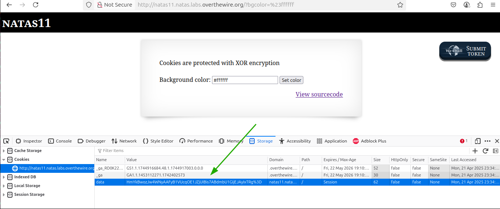
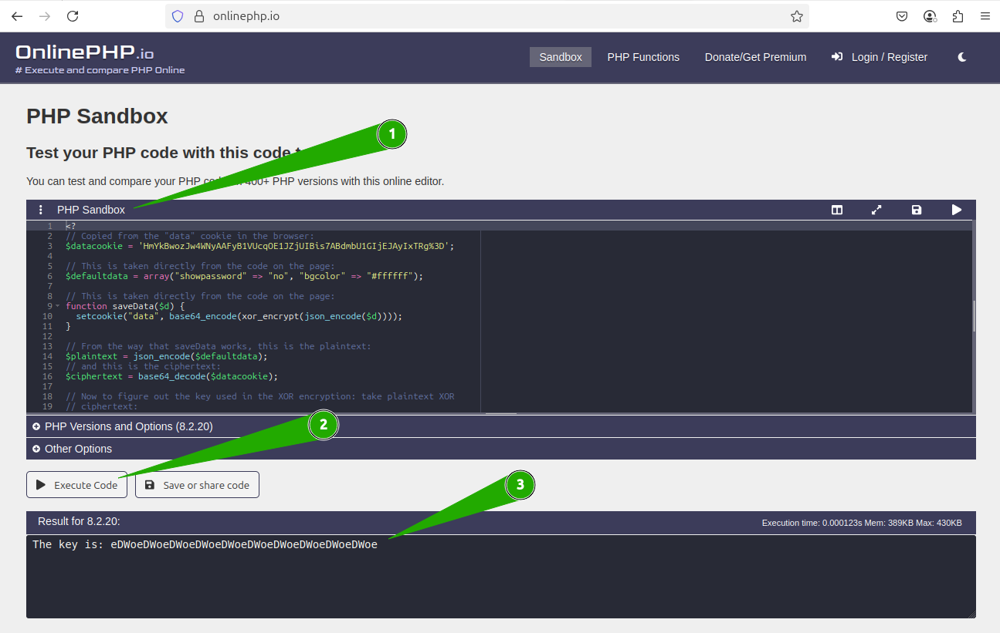
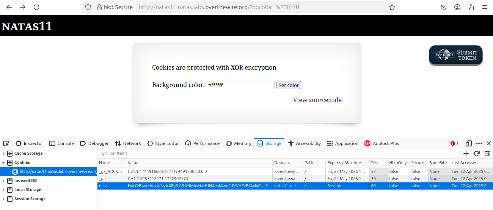
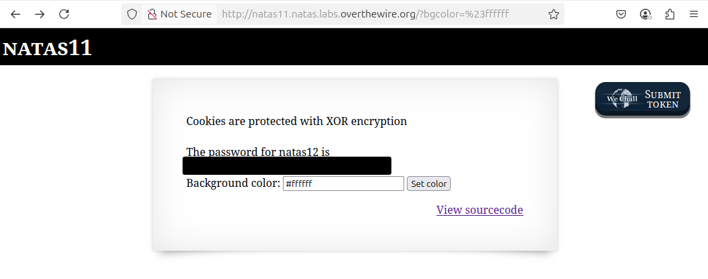

# OverTheWire - Natas - Level 11

[OverTheWire](https://overthewire.org) offers a series of "wargames" that teach
security skills. From their website:

> Natas teaches the basics of serverside web-security.

## Challenge Overview

After discovering the `natas11` password in the previous challenge, it can be
used to log into http://natas11.natas.labs.overthewire.org:


## Initial Analysis

This is a change from the previous two challenges. The explanation text says:

> Cookies are protected with XOR encryption

There is an input box with a prompt that says:

> Background color:

The current value of the input box is `#ffffff`. This is a RGB (red / green /
blue) hex value that is used in HTML styling to define colours. This colour is
the maximum (`ff`) of each of the red, green, and blue colour components, so
this colour is white. The colour `#ff0000` would be red (all red, no green, no
blue), `#808080` would be a medium gray, `#000000` would be black.

There is also a `View sourcecode` link that seems like a hint.

## Approach Strategy

1. Click the `View sourcecode` link
1. Make it up from there!

## Step-by-Step Solution

Clicking the `View sourcecode` link show the source code for the web page. The
passwords are censored, but the PHP code for the page is shown:


Yikes, that is a lot of PHP code to read and understand. The best approach is to
break it down.

### High Level Code Analysis

The code for this page starts with:

```php
// Define the default data for when the user first visits the page: the password
// is not to be shown, and the background colour is white.
$defaultdata = array("showpassword" => "no", "bgcolor" => "#ffffff");
```

Next comes the definitions of three functions: `xor_encrypt`, `loadData`, and
`saveData`. Those are complicated, so for now they will be skipped. Then comes
the logic for the page:

```php
// Call "loadData" with the default data: password not shown and background
// colour is white.
$data = loadData($defaultdata);

// If the user put a colour into the form and clicked the "Set color" button,
// then do the actions inside this clause.
if (array_key_exists("bgcolor", $_REQUEST)) {
  // If the colour is a valid hex colour string of a hash mark followed by six
  // hexadecimal digits (a through f, plus \d which is a shortcut for the digits
  // 0 through 9) then do the actions inside this clause.
  if (preg_match('/^#(?:[a-f\d]{6})$/i', $_REQUEST['bgcolor'])) {
    // In the data array above, set the bgcolor attribute to the new value.
    $data['bgcolor'] = $_REQUEST['bgcolor'];
  }
}

// Finally, save the data.
saveData($data);
```

This is good code so far with no sign of a vulnerability. That leaves the three
functions: which one of them can be used to solve this challenge?

### The loadData Function

When the code first runs it calls `loadData`:

```php
function loadData($def) {
  // Make the web cookies for this site available in the $COOKIE array
  global $_COOKIE;

  // Set $mydata to the input parameter, which is always going to be
  // $defaultdata: array("showpassword" => "no", "bgcolor" => "#ffffff")
  $mydata = $def;

  // This is an important check - if there is already a cookie set with "data",
  // then run the code in this clause.
  if (array_key_exists("data", $_COOKIE)) {
    // Do some manipulation of the data to decode it from what is in the cookie.
    // First decode it from base64 to whatever it might be, then run the
    // xor_encrypt function on it, and then decode it from JSON to a PHP object.
    $tempdata = json_decode(xor_encrypt(base64_decode($_COOKIE["data"])), true);

    // If the decoded cookie is valid (having showpassword and bgcolor fields)
    // then run the code in this clause.
    if (is_array($tempdata) && array_key_exists("showpassword", $tempdata) && array_key_exists("bgcolor", $tempdata)) {
      // If the "bgcolor" in the cookie is a valid RGB colour string, then run
      // the code in this clause.
      if (preg_match('/^#(?:[a-f\d]{6})$/i', $tempdata['bgcolor'])) {
        // Set $mydata with the "showpassword" and "bgcolor" fields from the
        // cookie.
        $mydata['showpassword'] = $tempdata['showpassword'];
        $mydata['bgcolor'] = $tempdata['bgcolor'];
      }
    }
  }

  // Return the data. So if there is no cookie set, then this will be the
  // $defauldata value of array("showpassword" => "no", "bgcolor" => "#ffffff").
  // However, if there is a cookie set with a valid "bgcolor", then this will
  // be the "showpassword" and "bgcolor" from the data.
  //
  // In other words, this function returns the cookie data, unless it is the
  // first time visiting this page and then it returns $defaultdata.
  return $mydata;
}
```

So `loadData` is fairly simple - load the cookie data if it exists, otherwise
use the `$defaultdata` value.

### The saveData Function

The next function is `saveData`:

```php
function saveData($d) {
  // This will take the parameter and save it as the "data" cookie. The encoding
  // and encrypting functions here are the opposite or what is done when loading
  // the cookie.
  setcookie("data", base64_encode(xor_encrypt(json_encode($d))));
}
```

Now that `loadData` and `saveData` are understood, the PHP code for this script
appears to work correctly:

- a default cookie is created on the first page load
- if the user enters a valid RGB colour string, the cookie is read, updated, and
  saved
- at no time is the `showpassword` value of the cookie ever changed

All of this code looks secure. That leaves the final function: `xor_encrypt`.

### The xor_encrypt Function

Finally, the `xor_encrypt` function is used by _both_ `loadData` and `saveData`:

```php
function xor_encrypt($in) {
  // There is an encryption key, of some length, that is used to encrypt the
  // data.
  $key = '<censored>';

  // Copy the $in parameter into $text
  $text = $in;

  // Initialize the $outText parameter to an empty string
  $outText = '';

  // Iterate through each character in the input string, which is now in $text.
  // This loop basically counts each letter in the input string (starting with
  // 0) and assigns that to the $i variable. The "strlen" function returns the
  // string length, so it tells the for loop when to stop counting. For example,
  // if $text was "abc" and strlen($text) = 3, then the body of the loop would
  // run three times, with $i set to 0, then 1, and then 2.
  //
  for ($i = 0; $i < strlen($text); $i++) {
    // This is the actual XOR operation. Take the nth letter from $text and XOR
    // (^) with the nth letter from $key. The "$i % strlen($key)" clause is
    // modular arithmetic to re-use the key if $text is longer then $key. For
    // example, if the input is "password" and the key is "mykey", then outText
    // is:
    //   outText[0] = $text[0] ^ $key[0] // p ^ m
    //   outText[1] = $text[1] ^ $key[1] // a ^ y
    //   outText[2] = $text[2] ^ $key[2] // s ^ k
    //   outText[3] = $text[3] ^ $key[3] // s ^ e
    //   outText[4] = $text[4] ^ $key[4] // w ^ y
    //   outText[5] = $text[5] ^ $key[0] // o ^ m
    //   outText[6] = $text[6] ^ $key[1] // r ^ y
    //   outText[7] = $text[7] ^ $key[2] // d ^ k
    $outText .= $text[$i] ^ $key[$i % strlen($key)];
  }

  // Return the encrypted string.
  return $outText;
}
```

This function is implementing a one-time pad (OTP). If one-time pads are used
correctly, they are perfectly secure and cannot be broken. However, one-time
pads do have strict limitations:

1. The key must be at least as long as the plaintext
2. It is a _one_ time pad - the key must never be re-used
3. If the plaintext and the ciphertext are known, the key can be retrieved

For the first limitation, the `$key` value in the code - and its length - are
unknown. It is possible that it is long enough that the modular arithmetic used
to "wrap" the key is never used.

For the second limitation, `$key` is being re-used every time the user submits a
new colour code. This breaks some of the security of the OTP.

For the third limitation, both the plaintext (`$defaultdata`) and the ciphertext
(the cookie) are known. This means that the key can be retrieved. To understand
this gets a little mathy. However, it is important to understand how XOR
encryption works, so that it's also understood how it fails.

XOR is short for "exclusive or", which is different from the regular "inclusive"
OR function. For two parameters "A" and "B", the regular OR is true when either
A, or B, or both, is true. The truth table for OR is:

|   A   |   B   | A &#124; B |
| :---: | :---: | :--------: |
| false | false |   false    |
| false | true  |    true    |
| true  | false |    true    |
| true  | true  |    true    |

The exclusive or, though, is true if A is true, or if B is true, but not if
both are true. The truth table for XOR is:

|   A   |   B   | A ^ B |
| :---: | :---: | :---: |
| false | false | false |
| false | true  | true  |
| true  | false | true  |
| true  | true  | false |

This leads to some really interesting properties of XOR. In the code, both the
`loadData` and the `saveData` functions use the `xor_encrypt` function - but
isn't one decrypting?! Plaintext XORed with a key produces the ciphertext, but
the ciphertext can then be decrypted by XORing it again with the same key. XOR
is both an encrypting and decrypting function. This leads to some very
interesting math. For encryption and decryption,

PLAINTEXT ^ KEY = CIPHERTEXT and CIPHERTEXT ^ KEY = PLAINTEXT

it is also true that

PLAINTEXT ^ CIPHERTEXT = KEY

This is the "key" (sorry, not sorry) to solving this challenge!

### The Solution

#### Step 1: Find the Key

The first step of solving this challenge is to figure out the key. In the
Developer Tools in the browser, the Cookies tab shows the value of the `data`
cookie:



This cookie can be copied as the `$datacookie` variable:

```php
<?
// Copied from the "data" cookie in the browser:
$datacookie = 'HmYkBwozJw4WNyAAFyB1VUcqOE1JZjUIBis7ABdmbU1GIjEJAyIxTRg%3D';

// This is taken directly from the code on the page:
$defaultdata = array("showpassword" => "no", "bgcolor" => "#ffffff");

// This is taken directly from the code on the page:
function saveData($d) {
  setcookie("data", base64_encode(xor_encrypt(json_encode($d))));
}

// From the way that saveData works, this is the plaintext:
$plaintext = json_encode($defaultdata);
// and this is the ciphertext:
$ciphertext = base64_decode($datacookie);

// Now to figure out the key used in the XOR encryption: take plaintext XOR
// ciphertext:
$key = $plaintext ^ $ciphertext;

print("The key is: " . $key . "\n");
?>
```

Now to actually run the code: in [Level 8](./level_08.md) a quick online search
was used to find https://onlinephp.io, which provides a sandbox for running PHP
code:



1. Paste the code into the `PHP Sandbox`
2. Click the `Execute Code` button
3. The output of the code appears in the result box

The key is `eDWo`, which is repeated multiple times to encrypt the entire
plaintext. The first part of the solution is complete.

#### Step 2: Manipulate the Cookie

Now that the key is known, it can be used to alter the browser cookie:

```php
<?
// This is taken directly from the code on the page:
$defaultdata = array("showpassword" => "no", "bgcolor" => "#ffffff");

// Given the above, change it to show the password:
$manipulatedData = array("showpassword" => "yes", "bgcolor" => "#ffffff");

// This is taken directly from the code on the page, other than setting $key:
function xor_encrypt($in) {
  $key = 'eDWo';
  $text = $in;
  $outText = '';

  // Iterate through each character
  for ($i = 0; $i < strlen($text); $i++) {
    $outText .= $text[$i] ^ $key[$i % strlen($key)];
  }

  return $outText;
}

// This is taken directly from the code on the page:
function saveData($d) {
  setcookie("data", base64_encode(xor_encrypt(json_encode($d))));
}

// Using saveData above, this will create a cookie from the manipulated data:
$manipulatedCookie = base64_encode(xor_encrypt(json_encode($manipulatedData)));

print("The manipulated cookie is: " . $manipulatedCookie . "\n");
?>
```

Running this code produces:

```
The manipulated cookie is: HmYkBwozJw4WNyAAFyB1VUc9MhxHaHUNAic4Awo2dVVHZzEJAyIxCUc5
```

#### Step 3: Insert the Cookie

Now a cookie value has been created with a `showpassword` value of `yes`. In the
browser Developer Tools, the existing value of the cookie can be double-clicked,
and the new cookie value can be pasted in:



#### Step 4: Viewing the Password

It's known from examining the code on the page that when the user clicks the
`Set color` button, if the RGB colour code is valid then:

1. The cookie is read from the browser
2. The colour code part of the cookie is updated
3. The cookie is saved to the browser
4. The page is redisplayed

All that is needed now is to click the button:



There it is: the `natas12` password (removed).

## Key Takeaways

This challenge included a lot of information:

- XOR encryption is perfectly secure as long as its limitations are respected
- XOR encryption is not secure if the key repeats
- The XOR encryption key can be retrieved if the plaintext and ciphertext are
  known
- Data stored in the cookies can be manipulated by the user, so to be secure the
  encryption method must be secure

## Beyond the Challenge

It's always a good idea to think about other solutions. However, this challenge
appears to be set up to provide this straightforward solution.
