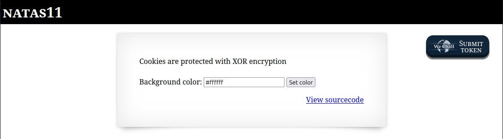

# OverTheWire - Natas - Level 11

[OverTheWire](https://overthewire.org) offers a series of "wargames" that teach
security skills. From their website:

> Natas teaches the basics of serverside web-security.

## Challenge Overview

After discovering the `natas10` password in the previous challenge, it can be
used to log into http://natas10.natas.labs.overthewire.org:



## Initial Analysis

This looks very similar to the previous challenge except that there is new text
saying:

> For security reasons, we now filter on certain characters

The prompt is the same

> Find words containing:

There's an input box for submitting the "words". There is also a
`View sourcecode` link that certainly seems like a hint.

## Approach Strategy

1. Click the `View sourcecode` link
1. The code has probably been tightened up a bit but see if it can be
   exploited

## Step-by-Step Solution

Clicking on the `View sourcecode` link does indeed show the source code for the
webpage. The passwords are censored, but the logic for the page is shown:


This is PHP code very similar to the previous challenge. With a little
formatting and commenting it becomes clearer what is going on:

```php
// Initialize the "$key" variable to the empty string.
$key = "";

// The "$_REQUEST" is all the input parameters in the HTTP request. So this will
// check to see if the "needle" parameter is defined. The form on this page has
// an input named "needle", so this checks if the user has submitted a value.
if (array_key_exists("needle", $_REQUEST)) {
  // If the user put a value into the input box, then set "$key" to that value.
  $key = $_REQUEST["needle"];
}

// If the "$key" variable has a value - that is, it was entered by the user -
// then run the code within this clause.
if ($key != "") {
  // This is the new code: check that the input doesn't contain the character
  // ';', '|', or '&'.
  if (preg_match('/[;|&]/', $key)) {
    print "Input contains an illegal character!";
  } else {
    // Run the "grep" command in case-insensitive ("-i") mode to look for the
    // value of "$key" in the file "dictionary.txt". Print the output of the
    // grep command.
    passthru("grep -i $key dictionary.txt");
  }
}
```

This code is pretty good, but it doesn't have anything to do with passwords. It
just looks up words in a dictionary and prints anything that matches. Entering
the word `hacker` and clicking the `Search` button displays:


If there are no secrets or passwords or anything else in this code, then what is
the solution to the challenge? All this code appears to do is print out words
from a dictionary file. The `$key` used in the `passthru` command now has some
sanitizing of the input: the characters `;`, `|`, and `&` are no longer allowed.
This filter can be tried by tweaking the input from the previous challenge:
`hacker dictionary.txt; cat /etc/natas_webpass/natas11; grep -i hacker`:


Great, this is expected: the character `;` is no longer allowed.

So, the code runs the command:

```
$ grep -i $key dictionary
```

Looking at the `man` page for `grep`, it can also search for regular
expressions. So running `grep . file` would return every line of `file` that has
one or more characters. Combining this with the comment character `#`, the input
string `. /etc/natas_webpass/natas11 #` will run the command:

```
$ grep -i . /etc/natas_webpass/natas11 # dictionary
```

This looks like it will work! Every non-empty line of the `natas11` file will be
printed and then the `#` comment throws away the remainder of the command line:


There it is: the `natas11` password (removed).

## Key Takeaways

- It's important to never trust user input
- Input filters have to catch every malicious character - it is better to use a
  list of characters that are safe, rather than try to find every unsafe
  character
- The source code isn't usually available, but entering special characters might
  produce output that indicates a possible vulnerability

## Beyond the Challenge

It's always a good idea to think about other solutions. However, this filter is
pretty good!
