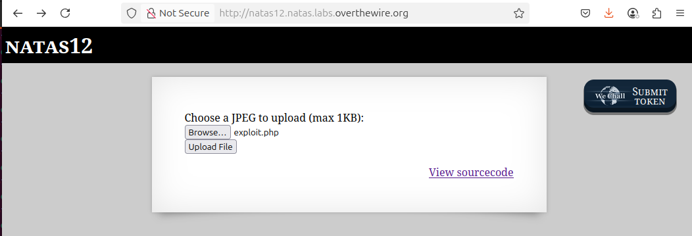
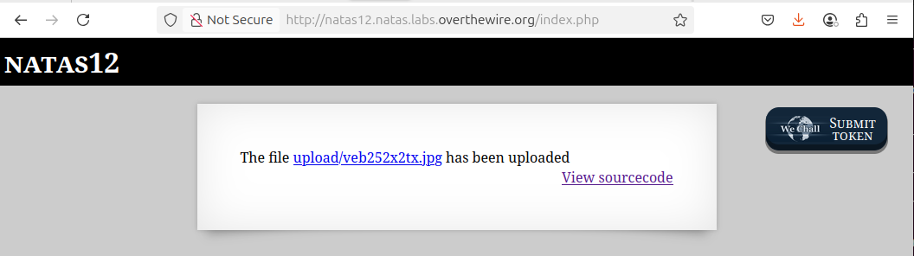
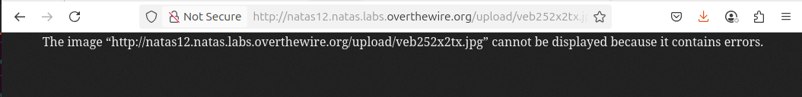
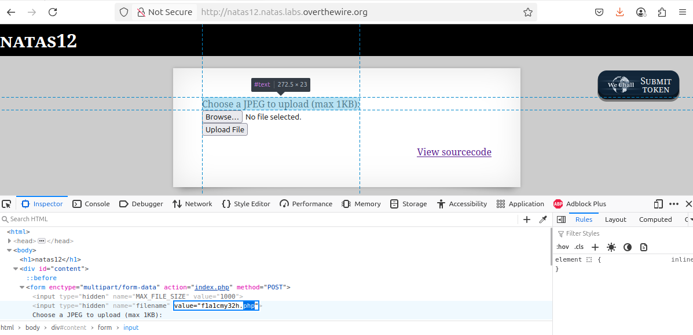
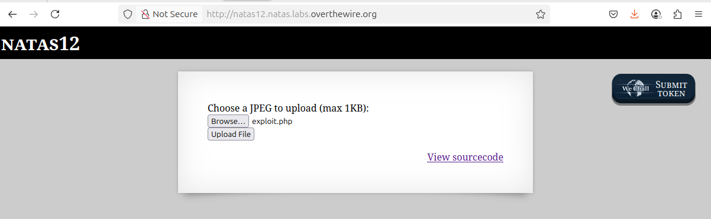
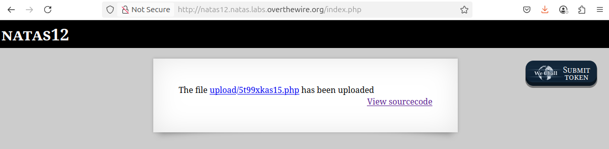
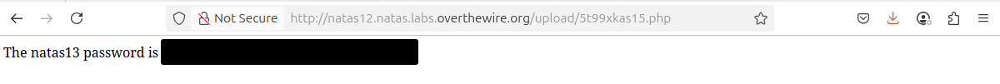

# OverTheWire - Natas - Level 12

[OverTheWire](https://overthewire.org) offers a series of "wargames" that teach
security skills. From their website:

> Natas teaches the basics of serverside web-security.

## Challenge Overview

After discovering the `natas12` password in the previous challenge, it can be
used to log into http://natas12.natas.labs.overthewire.org:


## Initial Analysis

There is no explanation text for this page, just:

> Choose a JPEG to upload (max 1KB):

And a pair of buttons to `Browse...` and then `Upload File`.

There is also a `View sourcecode` link that seems like a hint.

## Approach Strategy

1. Click the `View sourcecode` link
1. Figure out how this file upload can be exploited

## Step-by-Step Solution

Clicking the `View sourcecode` link show the source code for the web page. The
passwords are censored, but the PHP code for the page is shown:


It is a lot of PHP code to read and understand. The best approach is to break it
down.

### High Level Code Analysis

The code on this page starts with three functions:

- `genRandomString`: produces a ten character string made up of the characters
  `a` through `z` and `0` through `9`. This uses the PHP function `mt_rand`,
  which isn't a cryptographically secure way of generating values, but that
  isn't important in this challenge
- `makeRandomPath`: given a directory and extension, produce a random filename
  in the directory that is not already in use. This does have a race condition
  between checking that the file is unused and then using it, but again that is
  not important to this challenge
- `makeRandomPathFromFilename`: given a directory and filename, use the above
  two functions to find an unused random filename in the path.

The code that follows these function definitions is fairly simple:

- if the user uploaded a file, then check that it isn't too big and if not then
  move it into the uploads directory
- there is a `hidden` form element that contains a random JPEG filename

This code is all pretty good, and doesn't allow the reading of outside files or
anything like that. However, there is a hint on the page: "Choose a JPEG to
upload". The question is, what if something else was uploaded? Nowhere in the
code does it enforce that the uploaded file is a JPEG. It could be a GIF. Or a
PDF. Or... a PHP file!

### The PHP Exploit File

The next step is to create an [exploit file](files/level_12/exploit.php) that
displays the `natas13` password:

```php
<?php

echo "The natas13 password is ", file_get_contents('/etc/natas_webpass/natas13');

?>
```

Click the `Browse...` button and locate and select the exploit file:



Then click the `Upload File` button to upload it:



As expected, it has been uploaded using the 10 character random filename. Now to
click the link and run the PHP code:



Rats! Something obviously went wrong. Maybe it's because it's actually saving it
as a JPEG file, and PHP code definitely isn't a valid JPEG image. In the code
analysis it was noted that nothing enforces that the file is a JPEG, although
the page does upload it as a JPEG. With the Developer Tools it is possible to
change the value of the `hidden` form element.

Going back to the starting page and opening the Developer Tools to the
`Inspector` tab and finding the `hidden` element with the filename. The filename
can then be changed to have a `.php` extension:



Starting over with the steps to upload the exploit file, click the `Browse...`
button and locate and select the exploit file:



Then click the `Upload File` button to upload it:



As expected, it has been uploaded using the 10 character random filename but now
with a `.php` extension. Now to click the link and run the PHP code:



There it is: the `natas13` password (removed).

## Key Takeaways

- When a file can be uploaded there is the possibility of doing a remote code
  execution

## Beyond the Challenge

It's always a good idea to think about other solutions. Perhaps there are other
types of files that could be uploaded (shell scripts, etc) but PHP seems to be
the language of choice for these challenges.
