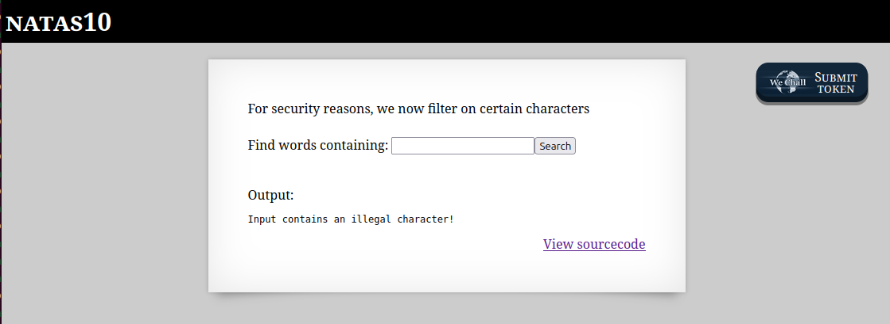
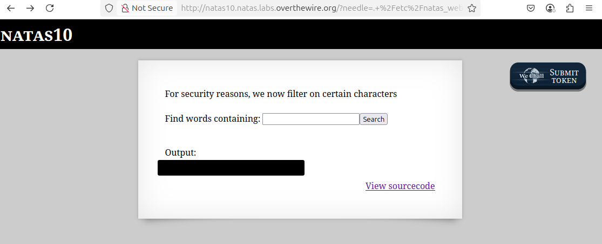

# OverTheWire - Natas - Level 12

[OverTheWire](https://overthewire.org) offers a series of "wargames" that teach
security skills. From their website:

> Natas teaches the basics of serverside web-security.

## Challenge Overview

After discovering the `natas11` password in the previous challenge, it can be
used to log into http://natas11.natas.labs.overthewire.org:


## Initial Analysis

This is a change from the previous two challenges. The explanation text says:

> Cookies are protected with XOR encryption

There is an input box with a prompt that says:

> Background color:

The current value of the input box is `#ffffff`. There is also a
`View sourcecode` link that seems like a hint.

## Approach Strategy

1. Click the `View sourcecode` link
1. Make it up from there!

## Step-by-Step Solution

Clicking the `View sourcecode` link does indeed show the source code for the web
page. The passwords are censored, but the PHP code for the page is shown:


Yikes, that is a lot of PHP code to read and understand. The best way to
understand it is to break it down.

### High Level Code Analysis

The code for this page starts with:

```php
// Define the default data for when the user first visits the page: the password
// is not shown, and the background colour is white.
$defaultdata = array("showpassword" => "no", "bgcolor" => "#ffffff");
```

Next come the definitions of three functions: `xor_encrypt`, `loadData`, and
`saveData`. Those are complicated, so for now they will be skipped. Then comes
the logic for the page:

```php
// Call "loadData" with the default data: password not shown and background
// colour is white.
$data = loadData($defaultdata);

// If the user put a colour into the form and clicked the "Set color" button,
// then do the actions inside this clause.
if (array_key_exists("bgcolor", $_REQUEST)) {
  // If the colour is a valid hex colour string of a hash mark followed by six
  // hexadecimal digits (0, 1, 2, 3, 4, 5, 6, 7, 8, 9, a, b c, d, e, f) then do
  // the actions inside this clause.
  if (preg_match('/^#(?:[a-f\d]{6})$/i', $_REQUEST['bgcolor'])) {
    // In the data array above, set the bgcolor attribute to the new value.
    $data['bgcolor'] = $_REQUEST['bgcolor'];
  }
}

// Finally, save the data.
saveData($data);
```

This is good code and there don't appear to be any vulnerabilities in it. That
leaves the three functions: which one of them can be used to solve this
challenge?

### The xor_encrypt Function

The `xor_encrypt` function is fairly straight forward:

```php
function xor_encrypt($in) {
  // There is an encryption key, of some length, that is used to encrypt the
  // data. This is very important.
  $key = '<censored>';

  // Copy the $in parameter into $text
  $text = $in;

  // Initialize the $outText parameter to an empty string
  $outText = '';

  // Iterate through each character in the input string, which is now in $text.
  // This loop basically counts each letter in the input string (starting with
  // 0) and assigns that to the $i variable. The "strlen" function returns the
  // string length, so it tells the for loop when to stop counting. For example,
  // if $text was "abc" and strlen($text) = 3, then the body of the loop would
  // run three times, with $i set to 0, then 1, and then 2.
  //
  for ($i = 0; $i < strlen($text); $i++) {
    // This is the actual "XOR" operation.
    $outText .= $text[$i] ^ $key[$i % strlen($key)];
  }

  // Return the encrypted string.
  return $outText;
}
```

This code is pretty good, but it doesn't have anything to do with passwords. It
just looks up words in a dictionary and prints anything that matches. Entering
the word `hacker` and clicking the `Search` button displays:


If there are no secrets or passwords or anything else in this code, then what is
the solution to the challenge? All this code appears to do is print out words
from a dictionary file. The `$key` used in the `passthru` command now has some
sanitizing of the input: the characters `;`, `|`, and `&` are no longer allowed.
This filter can be tried by tweaking the input from the previous challenge:
`hacker dictionary.txt; cat /etc/natas_webpass/natas11; grep -i hacker`:



Great, this is expected: the character `;` is no longer allowed.

So, the code runs the command:

```
$ grep -i $key dictionary
```

Looking at the `man` page for `grep`, it can also search for regular
expressions. So running `grep . file` would return every line of `file` that has
one or more characters. Combining this with the comment character `#`, the input
string `. /etc/natas_webpass/natas11 #` will run the command:

```
$ grep -i . /etc/natas_webpass/natas11 # dictionary
```

This looks like it will work! Every non-empty line of the `natas11` file will be
printed and then the `#` comment throws away the remainder of the command line:



There it is: the `natas11` password (removed).

## Key Takeaways

- It's important to never trust user input
- Input filters have to catch every malicious character - it is better to use a
  list of characters that are safe, rather than try to find every unsafe
  character
- The source code isn't usually available, but entering special characters might
  produce output that indicates a possible vulnerability

## Beyond the Challenge

It's always a good idea to think about other solutions. However, this filter is
pretty good!
