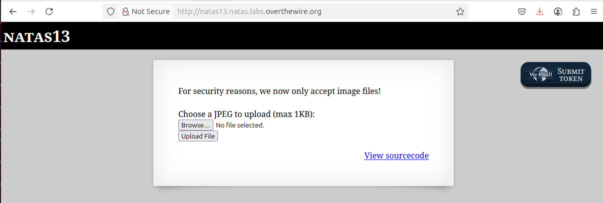
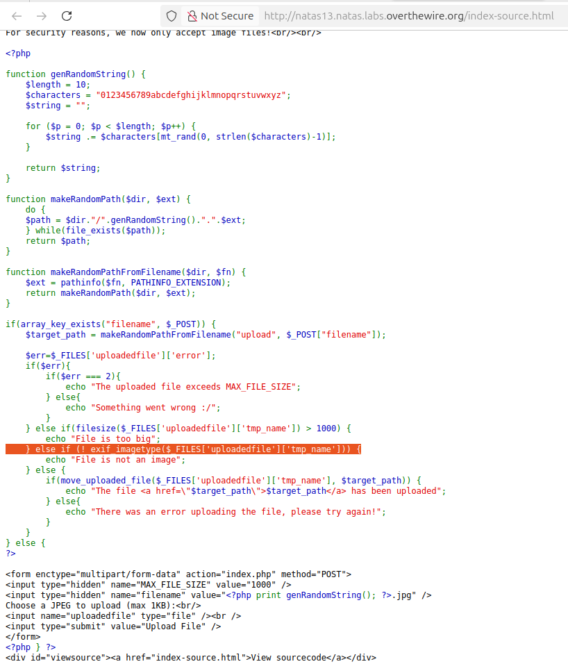
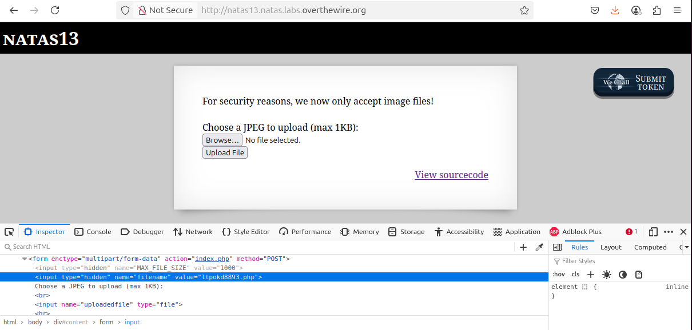
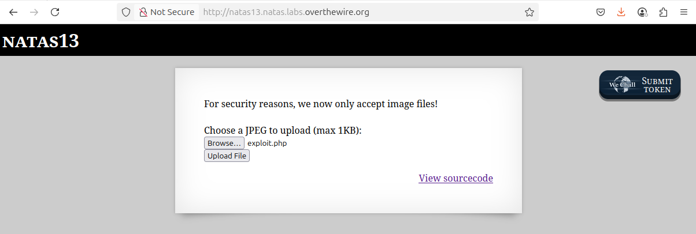
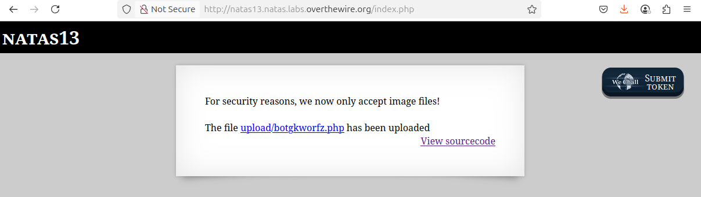
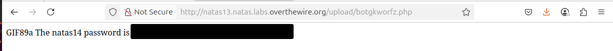

# OverTheWire - Natas - Level 13

[OverTheWire](https://overthewire.org) offers a series of "wargames" that teach
security skills. From their website:

> Natas teaches the basics of serverside web-security.

## Challenge Overview

After discovering the `natas13` password in the previous challenge, it can be
used to log into http://natas13.natas.labs.overthewire.org:



## Initial Analysis

This looks similar to the previous challenge except that the web page
instructions now say:

> For security reasons, we now only accept image files!

The text from the previous challenge is displayed again:

> Choose a JPEG to upload (max 1KB):

And a pair of buttons to `Browse...` and then `Upload File`.

There is also a `View sourcecode` link that seems like a hint.

## Approach Strategy

1. Click the `View sourcecode` link
1. Figure out how this file upload can be exploited

## Step-by-Step Solution

Clicking the `View sourcecode` link show the source code for the web page. The
passwords are censored, but the PHP code for the page is shown:



This looks like the code from [level 12](level_12.md) except that code is added
to check the file:

```php
    } else if (! exif_imagetype($_FILES['uploadedfile']['tmp_name'])) {
        echo "File is not an image";
```

That new code looks like it's going to make things a lot trickier! Reading the
code for the `exif_imagetype` function:

> exif_imagetype() reads the first bytes of an image and checks its signature

So this function is reading the `magic bytes` at the start of the file. Many
file types - not just images - use special byte sequences at the start of the
file to indicate what type of data is in the file. This means that systems
reading the file can use the first few bytes to determine the file type, rather
than rely on something like the filename extension. The downside is that files
of one type can use these magic bytes to masquerade as another file type.

An example of magic bytes is GIF files, which start with `GIF89a`. This is an
easy set of magic bytes to use in exploits because they are printable
characters, unlike the JPEG magic bytes which are the binary sequence
`0xFF0xD80xFF0xE0`.

### The PHP Exploit File

The next step is to create an [exploit file](files/level_13/exploit.php) that
starts with the GIF magic bytes and then runs code to display the `natas14`
password:

```php
GIF89a
<?php

echo "The natas14 password is ", file_get_contents('/etc/natas_webpass/natas14');

?>
```

Open the Developer Tools to the `Inspector` tab and find the `hidden` element
with the random filename. The filename can then be changed to have a `.php`
extension:



Starting over with the steps to upload the exploit file, click the `Browse...`
button and locate and select the exploit file:



Then click the `Upload File` button to upload it:



As expected, it has been uploaded using the 10 character random filename but now
with a `.php` extension. Now to click the link and run the PHP code:



There it is: the `natas14` password (removed).

## Key Takeaways

- When a file can be uploaded there is the possibility of doing a remote code
  execution
- Magic bytes to identify file types are a great tool but can be exploited if
  they are the only protection

## Beyond the Challenge

It's always a good idea to think about other solutions. Perhaps there are other
types of files that could be uploaded (shell scripts, etc) but PHP seems to be
the language of choice for these challenges.
