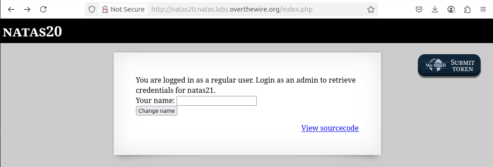
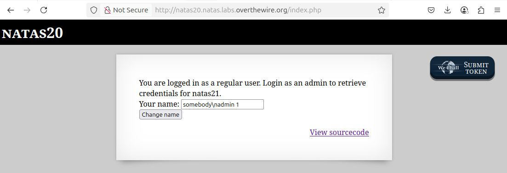
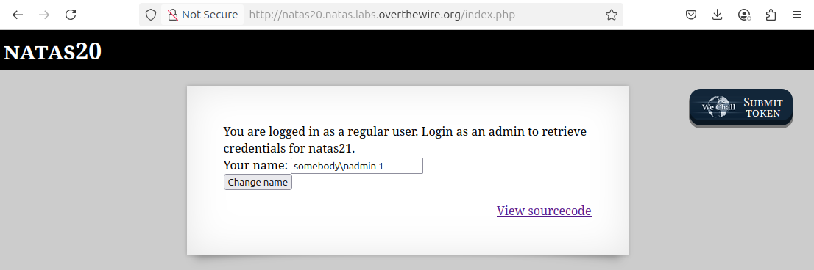
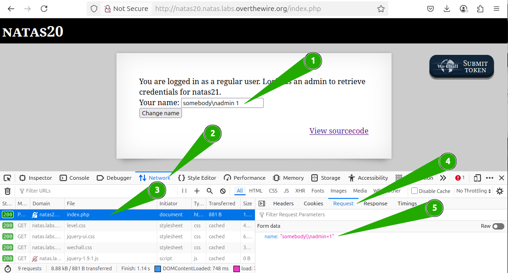
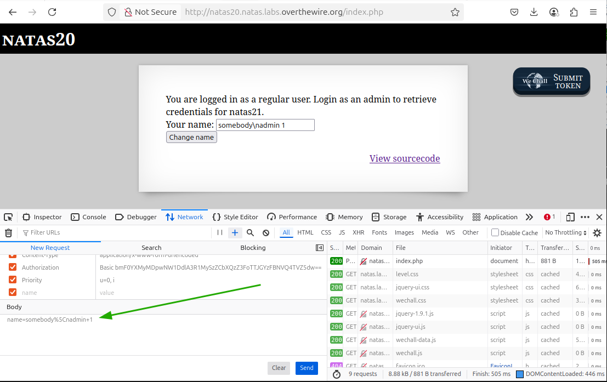
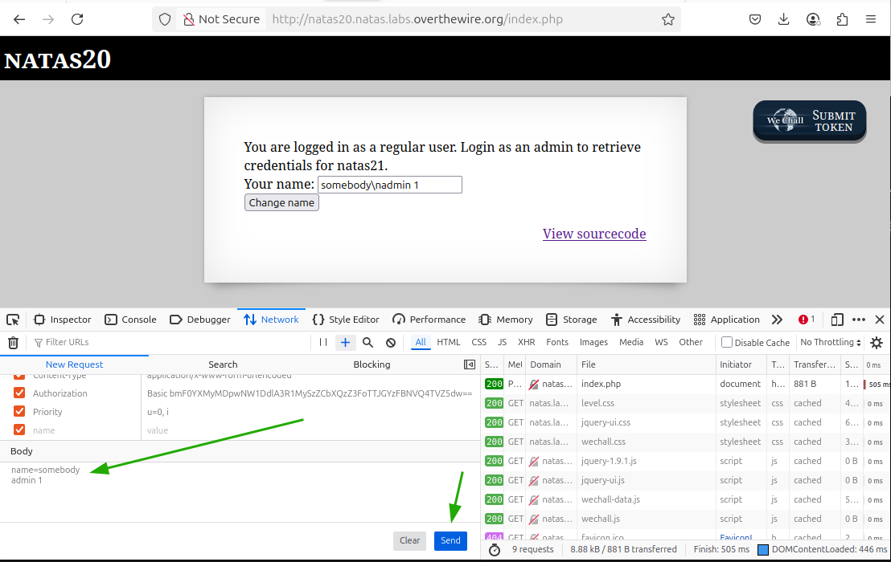
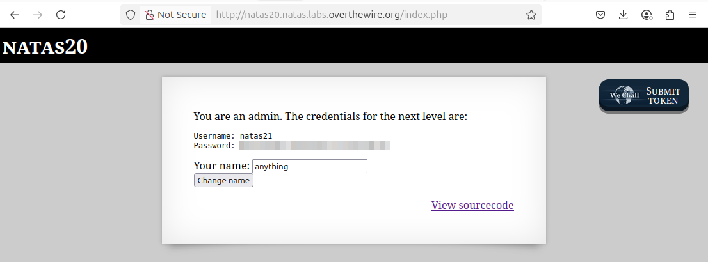

# OverTheWire - Natas - Level 20

[OverTheWire](https://overthewire.org) offers a series of "wargames" that teach
security skills. From their website:

> Natas teaches the basics of serverside web-security.

## Challenge Overview

After discovering the `natas20` password in the previous challenge, it can be
used to log into http://natas20.natas.labs.overthewire.org:



## Initial Analysis

This challenge page has description text that reads:

> You are logged in as a regular user. Login as an admin to retrieve credentials
> for natas21.

There's a `Your name` input box, and a `Change name` button.

There is also a `View sourcecode` link that seems like a hint.

## Approach Strategy

1. Click the `View sourcecode` link
1. Figure it out from there!

## Step-by-Step Solution

Clicking the `View sourcecode` link shows the source code for the web page. The
passwords are censored, but the PHP code for the page is shown. It's a lot of
squirrelly code and too big for a useful screenshot. However, it can be broken
down piece by piece and simplified to make it understandable:

### The Uninteresting Functions

- `debug`: print debugging information when the request hasa `debug` parameter
- `myclose`: unused, returns `true`
- `mydestroy`: unused, returns `true`
- `mygarbage`: unused, returns `true`
- `myopen`: unused, returns `true`

The first thing to do is open the Developer (F12) Tools in the browser and look
at the cookies:

### `myread`

This is where the code starts to get "interesting". By removing the `debug`
calls, formatting, and commenting, it becomes more understandable:

```php
function myread($sid) {
  // Do an early return of "" if $sid contains characters other than
  // alphanumeric and dash.
  if (strspn($sid, "1234567890qwertyuiopasdfghjklzxcvbnmQWERTYUIOPASDFGHJKLZXCVBNM-") != strlen($sid)) {
    return "";
  }

  // Do an early return of "" if there is no file called "mysess_$sid".
  $filename = session_save_path() . "/" . "mysess_" . $sid;
  if (!file_exists($filename)) {
    return "";
  }

  // Read the contents of the session file.
  $data = file_get_contents($filename);

  // Clear the session data for this session with a new array.
  $_SESSION = array();

  // Each line of the file is a space separated key / value pair. Set the
  // session variables to these pairs.
  foreach(explode("\n", $data) as $line) {
    $parts = explode(" ", $line, 2);
    if ($parts[0] != "") {
      $_SESSION[$parts[0]] = $parts[1];
    }
  }

  // Serialize the session variables into a string.
  return session_encode() ?: "";
}
```

### `mywrite`

The code continues with the `mywrite` function. Again by removing the `debug`
calls, formatting, and commenting, it becomes more understandable:

```php
function mywrite($sid, $data) {
  // Original comment: $data contains the serialized version of $_SESSION but
  // our encoding is better.

  // Do an early return if $sid contains characters other than alphanumeric and
  // dash.
  if (strspn($sid, "1234567890qwertyuiopasdfghjklzxcvbnmQWERTYUIOPASDFGHJKLZXCVBNM-") != strlen($sid)) {
    return;
  }

  // Use the same filename as "myread" - nothing tricky going on here.
  $filename = session_save_path() . "/" . "mysess_" . $sid;

  // Reverse the read process: sort the session variable by key and then store
  // as key / value pairs separated by a space.
  $data = "";
  ksort($_SESSION);
  foreach($_SESSION as $key => $value) {
    $data .= "$key $value\n";
  }

  // Save the session data into the file, and make it readable and writable to
  // only the web server user.
  file_put_contents($filename, $data);
  chmod($filename, 0600);

  return true;
}
```

Note the comment from the original code:

> \$data contains the serialized version of \$\_SESSION but our encoding is
> better.

Hints don't get much stronger than this!

#### Background: Serialization

The `serialization` process takes data and turns it into something that can be
put into storage or transmitted over a network. The opposite process,
`deserialization`, converts the serialized information back into data that can
be used in code.

In this code, the session data is being serialized and stored to a file. Then
when it is deserialized it can again be used as session data.

### The Page Code

The main code on the page itself is as follows:

```php
// Set up the session handling to use the custom functions on this page. Then
// start the session.
session_set_save_handler(
  "myopen",
  "myclose",
  "myread",
  "mywrite",
  "mydestroy",
  "mygarbage");
session_start();

// The user entered a name in the form, saving it as "name" in the session.
if (array_key_exists("name", $_REQUEST)) {
  $_SESSION["name"] = $_REQUEST["name"];
}

// Print the credentials.
print_credentials();

// Clear the name, and if it exists in the session then set it.
$name = "";
if (array_key_exists("name", $_SESSION)) {
  $name = $_SESSION["name"];
}
```

This is all good so far, with one thing remaining: what does `print_credentials`
do?

### `print_credentials`

```php
function print_credentials() {
  // If the session has an "admin" key set to "1", then print the password.
  if ($_SESSION and array_key_exists("admin", $_SESSION) and $_SESSION["admin"] == 1) {
    print "You are an admin. The credentials for the next level are:<br>";
    print "<pre>Username: natas21\n";
    print "Password: <censored></pre>";
  } else {
    print "You are logged in as a regular user. Login as an admin to retrieve credentials for natas21.";
  }
}
```

Now that the code is understood, the question is: how to exploit it? The "admin"
session variable is never set in the code, so it must be something that can be
created.

## The Solution

Much like an SQL injection attack, the first thing to do is visualize what is
happening on the server. The `$_SESSION` array will get serialized to a file
with space-separated key/value pairs that look like:

```
name not_admin
admin 0
other other
```

So if the `name` itself contains a newline, and then a space-separated
key/value pair, then when it is deserialized it will get added as a separate key
in the session.

For example, if the name is "somebody\nadmin 1" then when this gets serialized
the file looks like:

```
name somebody
admin 1
```

Then when this is deserialized it becomes two keys in the session:

- `name`: `somebody`
- `admin`: `1`

The newline is commonly represented as `\n`, so that is the thing to use for
submitting it to the server:



The clicking the `Change name` button causes it to be serialized. Then clicking
the `Change name` button a second time causes it to be deserialized:



Failure! Maybe it needs `\\n` or `\\\\n`? No luck with those either! If it is
getting encoded to send to the server, maybe it needs to be encoded as `%0a`,
but again failure, failure, failure!

Time to bring in the Developer Tools.



After opening the Developer Tools:

1. Use `somebody\nadmin 1` as the name and click the `Change name` button
2. Go the `Network` tab of the Developer Tools
3. Set the request for `index.php`
4. Open the `Request` tab
5. There it is: the form data being submitted

The browser is very kindly escaping the newline for us! In the normal world this
is a good thing, but when trying to solve a challenge it's less of a good thing.

Another wonderful thing about the Developer Tools, at least in Firefox, is that
the `index.php` request can be right-clicked and there is a menu item
`Edit and Resend`. This brings up the request editor, and at the bottom is the
body for the request, and the `\` is being encoded as the ASCII `%5C`:



As the name suggests, this can be edited and resent:



After clicking the "Send" button, the data should be craftily serialized to the
file. Then all that is needed is to click the `Change name` button on the form
to deserialize the data:



Hooray! (password pixelated)

## Key Takeaways

- It's important to never trust user-controlled data
- Serialization and deserialization can be dangerous

## Beyond the Challenge

It's always a good idea to think about other solutions.

Doing this challenge through the browser was a bit of a challenge, but it could
also have been done using Python code, the `curl` command, or anything else that
sends requests to a web server.
