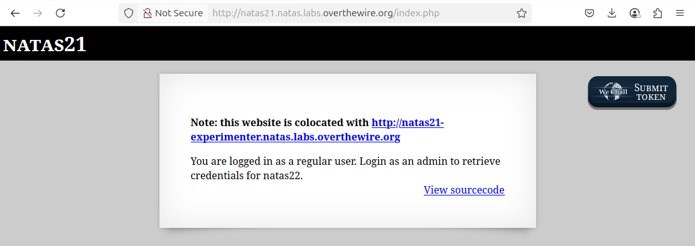
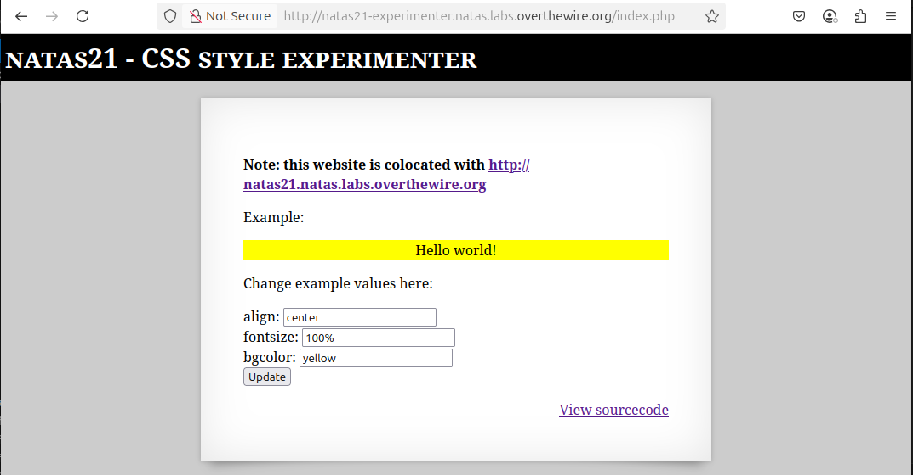
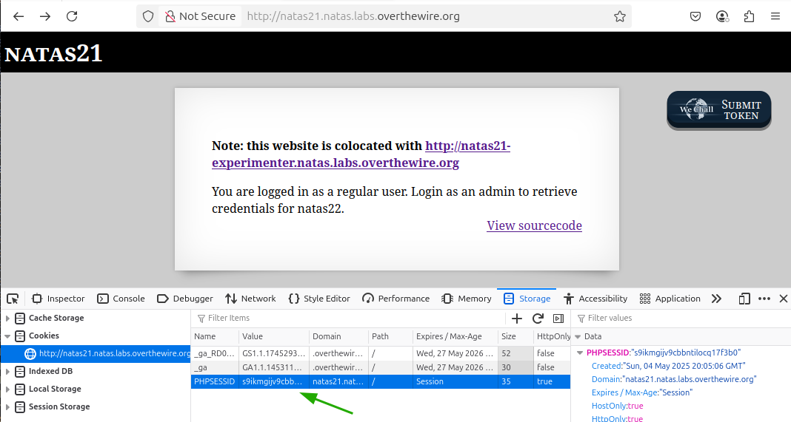
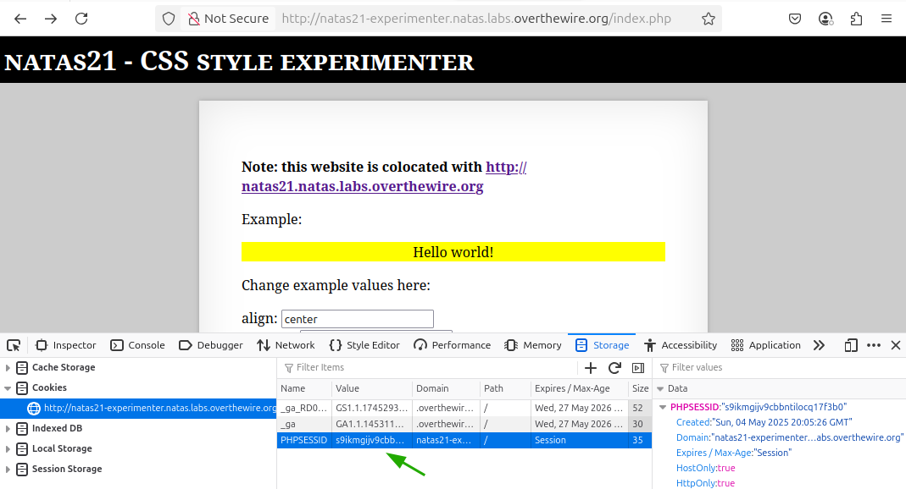
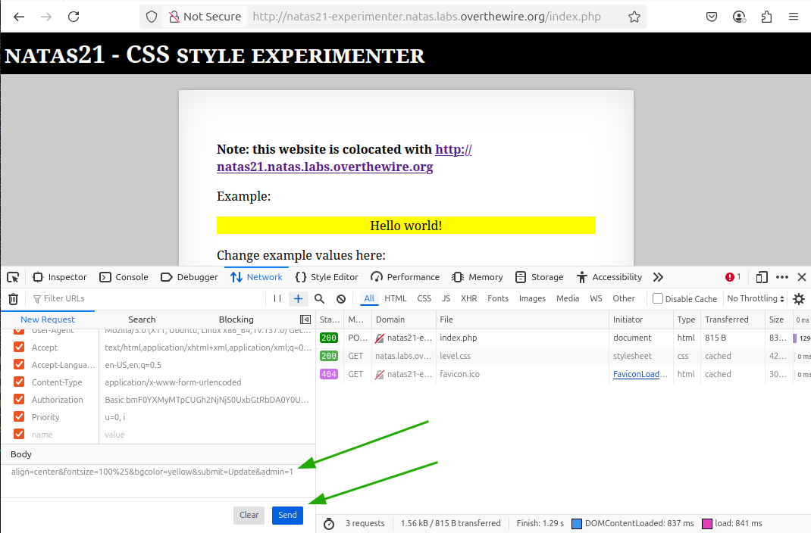
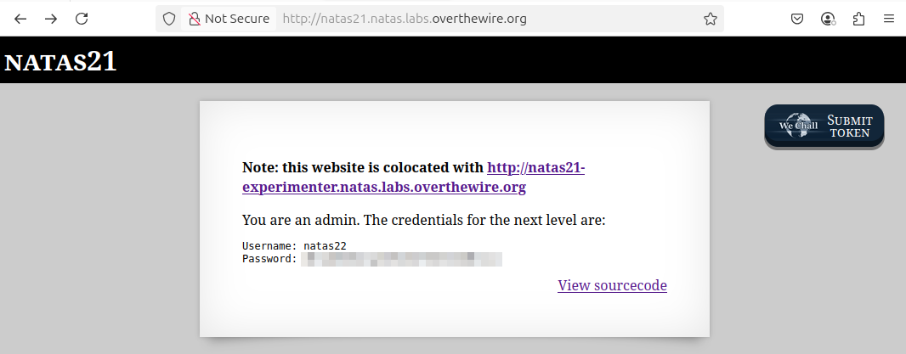

# OverTheWire - Natas - Level 21

[OverTheWire](https://overthewire.org) offers a series of "wargames" that teach
security skills. From their website:

> Natas teaches the basics of serverside web-security.

## Challenge Overview

After discovering the `natas21` password in the previous challenge, it can be
used to log into http://natas21.natas.labs.overthewire.org:



## Initial Analysis

This challenge page has a cryptic banner that reads:

> **Note: this website is colocated with http://natas21-experimenter.natas.labs.overthewire.org**

Other than that, it appears to be similar to previous challenges. It has
description text that reads:

> You are logged in as a regular user. Login as an admin to retrieve credentials
> for natas22.

There is also a `View sourcecode` link that seems like a hint.

## Approach Strategy

1. Click the `View sourcecode` link
1. Check out that other website to see what's going on
1. Figure it out from there!

## Step-by-Step Solution

Clicking the `View sourcecode` link shows the source code for the web page. It
is fairly simple code, and is based on the code from previous challenges:

```php

function print_credentials() {
  if ($_SESSION and array_key_exists("admin", $_SESSION) and $_SESSION["admin"] == 1) {
    print "You are an admin. The credentials for the next level are:<br>";
    print "<pre>Username: natas22\n";
    print "Password: <censored></pre>";
  } else {
    print "You are logged in as a regular user. Login as an admin to retrieve credentials for natas22.";
  }
}

session_start();
print_credentials();
```

There isn't much here! If the session variable `admin` has the value of `1` then
the password for the next challenge is displayed. There isn't anything here to
set the `admin` variable, so perhaps the "colocated" site has something to do
with it.

Clicking the link to the colocated site produces:



This page also has a `View sourcecode` link, and that is where the magic
happens:

```php
session_start();

// For every key=value pair in the request, copy them into the session state.
if (array_key_exists("submit", $_REQUEST)) {
  foreach($_REQUEST as $key => $val) {
    $_SESSION[$key] = $val;
  }
}
```

This is very dangerous code if the session state is used for anything related to
security. This page is assuming that the submitted data will only be from the
form on the page, but the last challenge demonstrated that HTTP requests can be
manipulated by the user. If `admin=1` can be sent to this page, then the `admin`
variable will be set to `1` in the session state.

### Step 1: Main Page Session

Going back to the main page and opening the Developer Tools, the Storage tab is
used to copy the session ID:



### Step 2: Colocated Page Session

Switching to the colocated page, the session ID can be edited and changed to
that of the main page:



Now both pages are sharing the session ID and have the same session. Any session
variables set in one page are available in the other.

### Step 3: Set the `admin` Variable

On the colocated page switch the Developer Tools to the Network tab. Then click
the `Update` button on the page to send the HTTP request to the server. By right
clicking the network request and selecting `Edit and Resend`, the `Body` of the
form submission can be altered to add `&admin=1`. After that all that needs to
be done is click the `Send` button.



Now there is an `admin` variable in the session with a value of `1`. Since the
session is shared with the main site, a refresh of that page displays the
password (pixelated):



## Key Takeaways

- It's important to never trust user-controlled data
- Session keys can be changed by the user
- A security issue in the session handling of one web site can be used to
  exploit sites sharing that session
- Serialization and deserialization can be dangerous

## Beyond the Challenge

It's always a good idea to think about other solutions.

Doing this challenge through the browser was probably the easiest way, but it
could also have been done using Python code, the `curl` command, or anything
else that sends requests to a web server.
