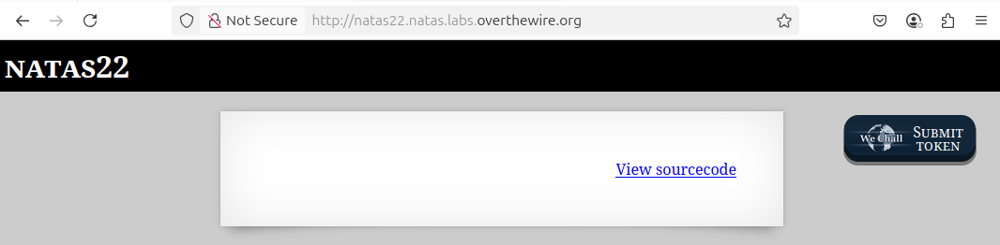
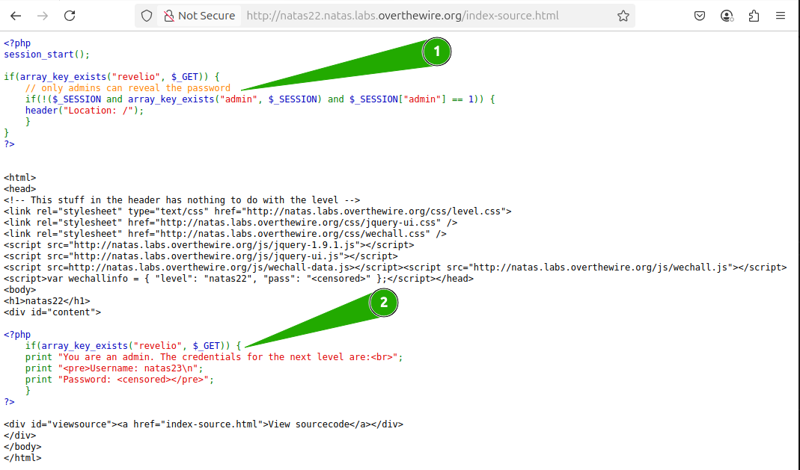
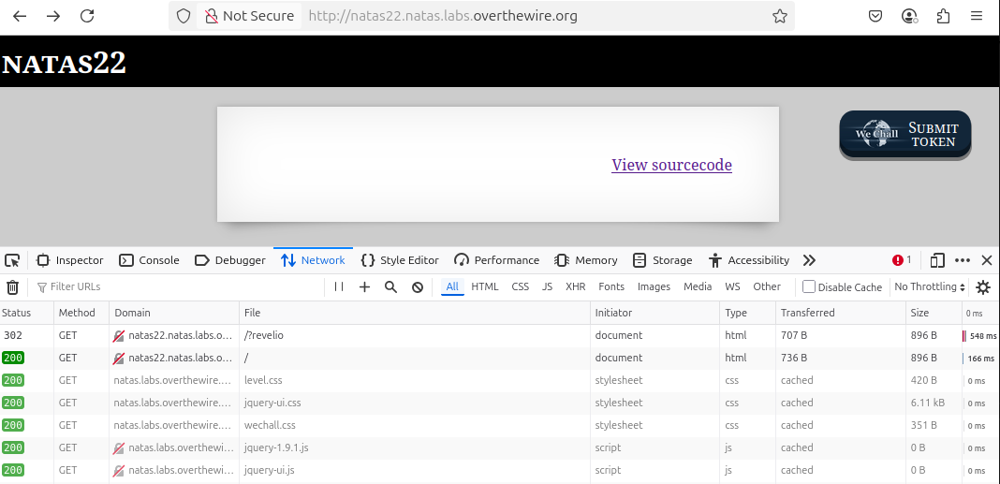
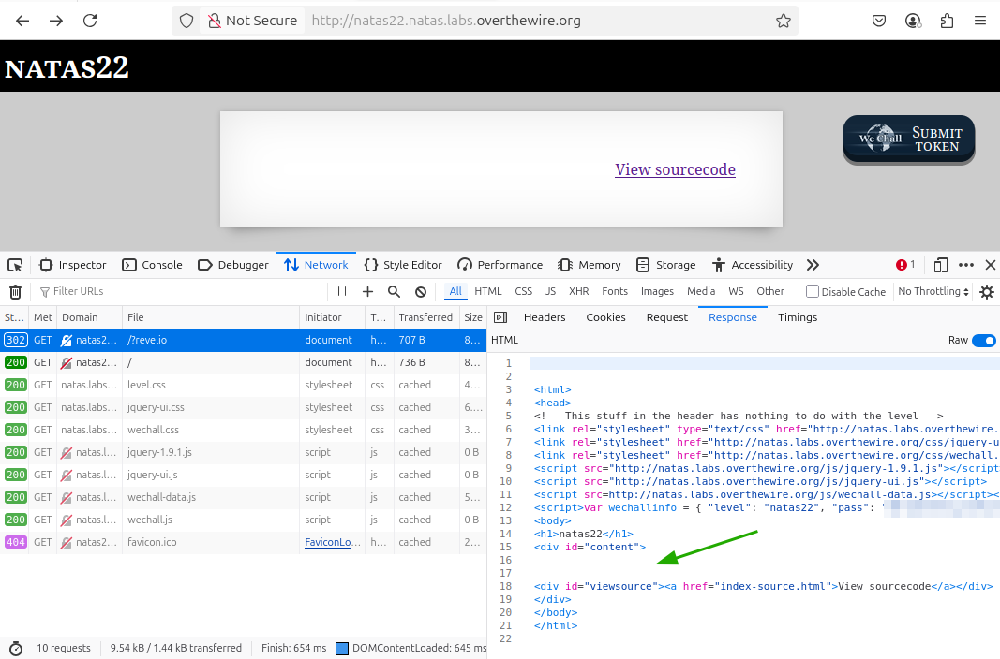

# OverTheWire - Natas - Level 22

[OverTheWire](https://overthewire.org) offers a series of "wargames" that teach
security skills. From their website:

> Natas teaches the basics of serverside web-security.

## Challenge Overview

After discovering the `natas22` password in the previous challenge, it can be
used to log into http://natas22.natas.labs.overthewire.org:



## Initial Analysis

The only thing on this page is a `View sourcecode` link that seems like a hint.

## Approach Strategy

1. Click the `View sourcecode` link
1. Figure it out from there!

## Step-by-Step Solution

Clicking the `View sourcecode` link shows the source code for the web page:



This page is fairly simple, although it does have some interesting things going
on.

1. At the top of the page, it checks if there is a GET parameter called
   `revelio`. If so, it checks if the `admin` session variable is set to `1`,
   and if not then it uses the `Location` header to redirect to itself.
2. Lower down the page, it again checks if the `revelio` GET parameter exists.
   If so, it prints the password to the next level.

The important thing to note is that the top section of code does a security
check of the `admin` session variable, but the bottom section of code does not
check this variable.

What the security for the page is doing is checking for the `revelio`
parameter - this could be done just by adding it to the URL to produce
http://natas22.natas.labs.overthewire.org/?revelio. When this URL is visited,
the code in #1 then checks if the `admin` session variable is set, and if not
then it redirects back to http://natas22.natas.labs.overthewire.org/ without the
`revelio` parameter.

On the other hand, if the URL http://natas22.natas.labs.overthewire.org/?revelio
is used and the `admin` session variable is set to `1`, then the redirect does
not happen and the page is displayed including the password in #2. This page,
however, doesn't seem to allow the setting of the `admin` session variable
anywhere. So there must be some other solution.

The trick is that when the "redirect" page is sent to the browser, it does
run the code in #2 and include the password in the redirect response. But the
browser redirects and instead displays the page without the password.

Opening the Developer Tools in the browser, the URL can be changed to include
the `revelio` parameter: http://natas22.natas.labs.overthewire.org/?revelio.



This screenshot above is after the redirect happens to the page without the
`revelio` parameter. However, note that the top HTTP request is for `/?revelio`
and is a 302. This tells the browser to redirect to a different URL, and the
next HTTP Request is for `/`.

By clicking on the top HTTP request with the `302` response, the response
contents can be seen in the "Response" tab:



Uh-oh! It should show the rendered password, even though it wasn't displayed in
the browser. That's awkward!

Perhaps the browser is trying to be helpful by displaying the final response
after the redirect, rather than the actual contents of the 302 response. Turning
to the `curl` command line tool and using the `-i` switch to print response
headers:

```
$ curl -i -u natas22:[REMOVED: NATAS22 PASSWORD] \
    http://natas22.natas.labs.overthewire.org/?revelio
HTTP/1.1 302 Found
Date: Sun, 04 May 2025 23:44:53 GMT
Server: Apache/2.4.58 (Ubuntu)
Set-Cookie: PHPSESSID=14gvg2eb7ht7r0b1b637hq14um; path=/; HttpOnly
Expires: Thu, 19 Nov 1981 08:52:00 GMT
Cache-Control: no-store, no-cache, must-revalidate
Pragma: no-cache
Location: /
Content-Length: 1028
Content-Type: text/html; charset=UTF-8


<html>
<head>
<!-- This stuff in the header has nothing to do with the level -->
<link rel="stylesheet" type="text/css" href="http://natas.labs.overthewire.org/css/level.css">
<link rel="stylesheet" href="http://natas.labs.overthewire.org/css/jquery-ui.css" />
<link rel="stylesheet" href="http://natas.labs.overthewire.org/css/wechall.css" />
<script src="http://natas.labs.overthewire.org/js/jquery-1.9.1.js"></script>
<script src="http://natas.labs.overthewire.org/js/jquery-ui.js"></script>
<script src=http://natas.labs.overthewire.org/js/wechall-data.js></script><script src="http://natas.labs.overthewire.org/js/wechall.js"></script>
<script>var wechallinfo = { "level": "natas22", "pass": "[REMOVED: NATAS22 PASSWORD]" };</script></head>
<body>
<h1>natas22</h1>
<div id="content">

You are an admin. The credentials for the next level are:<br><pre>Username: natas23
Password: [REMOVED: NATAS23 PASSWORD]</pre>
<div id="viewsource"><a href="index-source.html">View sourcecode</a></div>
</div>
</body>
</html>
```

There it is! The `natas22` and `natas23` passwords have been removed, but the
`curl` command does show the contents of the 302 response, including the
password for `natas23`.

## Key Takeaways

- It's important to do full permission checks before displaying data, even on
  redirect pages

## Beyond the Challenge

While it's a good idea to think about other solutions, this one is fairly
simple.
