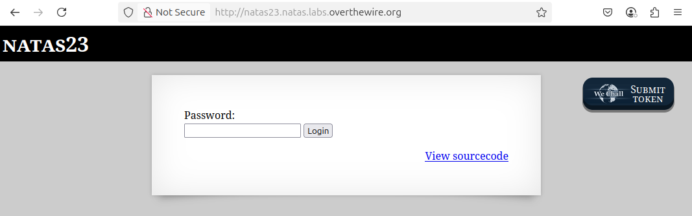
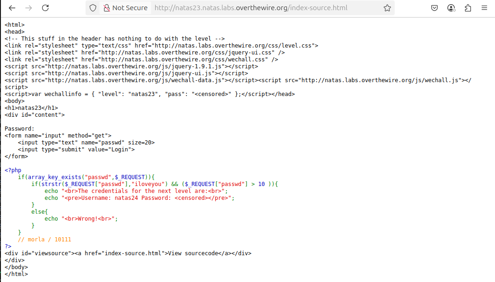
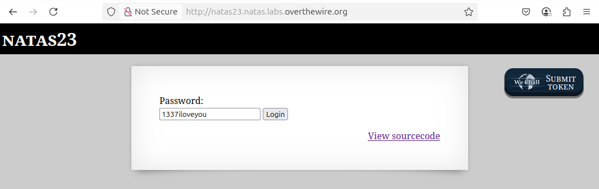
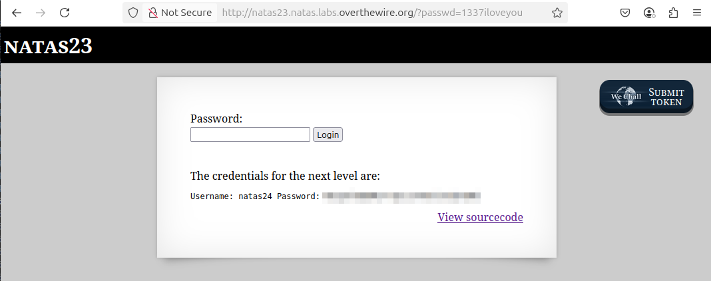

# OverTheWire - Natas - Level 23

[OverTheWire](https://overthewire.org) offers a series of "wargames" that teach
security skills. From their website:

> Natas teaches the basics of serverside web-security.

## Challenge Overview

After discovering the `natas23` password in the previous challenge, it can be
used to log into http://natas23.natas.labs.overthewire.org:

## Initial Analysis

This challenge is similar to all the other levels. It has a `Password` input and
a `Login` button.

It also has a `View sourcecode` link that seems like a hint.

## Approach Strategy

1. Click the `View sourcecode` link
1. Figure it out from there!

## Step-by-Step Solution

Clicking the `View sourcecode` link shows the source code for the web page:

This page is fairly simple, doing a check of the `passwd` parameter, and if
correct then displaying the password for `natas24`. The code that checks
`passwd` is strange:

- It uses `strstr` to check if the password entered by the user includes the
  string `iloveyou`
- It then uses `> 10` to check if the numeric value of the password is more than 10.

PHP, and JavaScript and other weakly typed languages, use type coersion when
dealing with variables. So `$REQUEST["passwd"]` can be used as both a string
in the `strstr` call, and a number in the `>` comparison. The solution is to
use a password that also evaluates to a number:

And clicking the `Login` button gives up the password for `natas24`:

## Key Takeaways

- Not even sure what the point of this challenge was.
