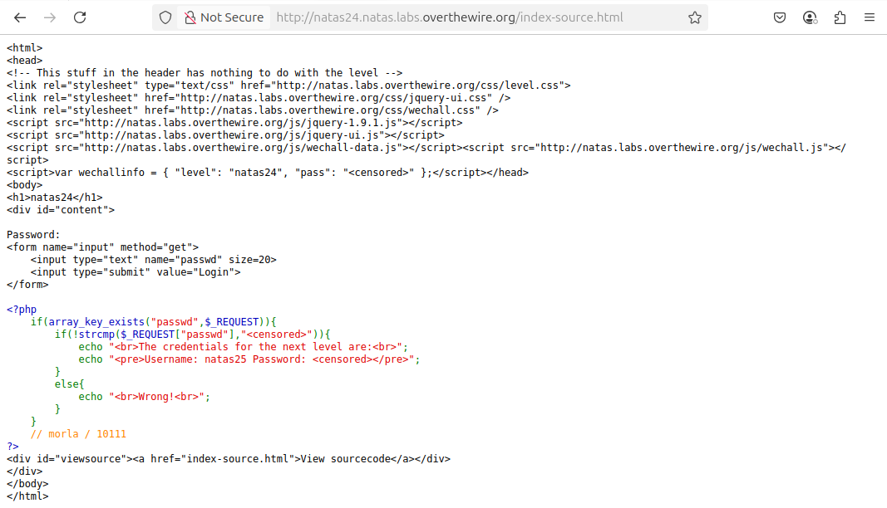

# OverTheWire - Natas - Level 24

[OverTheWire](https://overthewire.org) offers a series of "wargames" that teach
security skills. From their website:

> Natas teaches the basics of serverside web-security.

## Challenge Overview

After discovering the `natas24` password in the previous challenge, it can be
used to log into http://natas24.natas.labs.overthewire.org:

## Initial Analysis

This looks the same as the last challenge: a `Password` input and a `Login`
button.

It also has a `View sourcecode` link that seems like a hint.

## Approach Strategy

1. Click the `View sourcecode` link
1. Figure it out from there!

## Step-by-Step Solution

Clicking the `View sourcecode` link shows the source code for the web page:

This page is fairly simple, doing a check of the `passwd` parameter, and if
correct then displaying the password for `natas25`. Entering `pencil` as the
password, the page says `Wrong!` as expected:

Back to the source, the code that checks `passwd` _appears_ to be
straightforward:

- It uses `strcmp` to check if the password entered by the user matches the
  password for the page
- It uses the logical negation of the `strcmp` return value in the comparison
  when it should be using a strict (`===` or `!==`) comparison that compares
  both value and type

What sticks out about this comparison is how it is used. The `strcmp` function
in PHP returns `0` if strings match, and non-zero if they do not. The code is
doing something "fancy", and "fancy" is another word for "maybe not doing what
it looks like". So it's negating the return value of `strcmp`, using `!strcmp()`
rather than `strcmp() === 0` - and there is a difference!

Many functions in PHP return `NULL` on error, and `strcmp` is one of those
functions. Since `!NULL` is the same as `!0`, if user input can be found that
causes `strcmp` to fail, the password is displayed.

With this knowledge, the URL for the page can be changed to submit _multiple_
`passwd` fields. This will be interpreted as an array of values, and `strcmp`
works on strings, not arrays:

(password pixelated)

## Key Takeaways

- As always, user input should never be trusted. There are many ways that a user
  can manipulate data
- Always validate user input, including variable types

## Beyond the Challenge

While it's a good idea to think about other solutions, this one is fairly
simple - but perhaps there are other ways to make `strcmp` fail.
