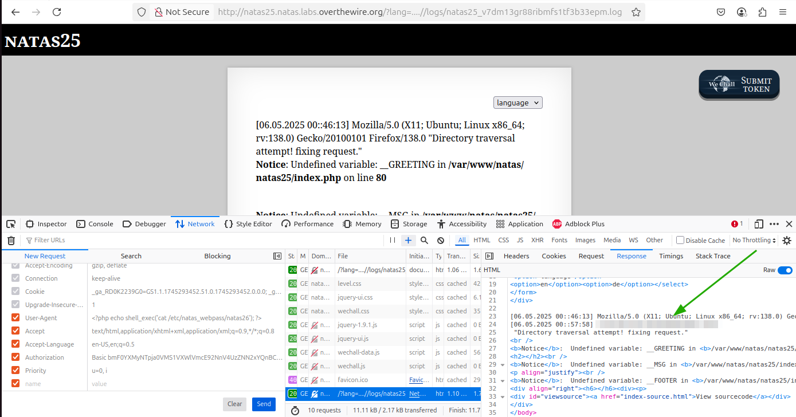

# OverTheWire - Natas - Level 25

[OverTheWire](https://overthewire.org) offers a series of "wargames" that teach
security skills. From their website:

> Natas teaches the basics of serverside web-security.

## Challenge Overview

After discovering the `natas25` password in the previous challenge, it can be
used to log into http://natas25.natas.labs.overthewire.org:


## Initial Analysis

This challenge looks different - a big body of text, and of particular interest
is a `language` drop-down list containing `en` and `de`.

It also has a `View sourcecode` link that seems like a hint.

## Approach Strategy

1. Click the `View sourcecode` link
1. Figure it out from there, with focus on that `language` drop-down

## Step-by-Step Solution

Clicking the `View sourcecode` link shows the source code for the web page. It
is too much code for a useful screenshot, but it can be broken down by function.
Some formatting and comments make it easier to understand.

### `setLanguage`

The first function is called `setLanguage`. It looks to be secure.

```php
function setLanguage() {
  // Check to see if the "lang" parameter is part of the request variables.
  if (array_key_exists("lang", $_REQUEST)) {
    // If so, call the "safeinclude" function (described below) to attempt
    // include()ing the file on the page.
    if (safeinclude("language/" . $_REQUEST["lang"])) {
      return 1;
    }
  }

  // If things go wrong including the file, then display the english file.
  safeinclude("language/en");
}

```

### `safeinclude`

The next function is called `safeinclude`:

```php
function safeinclude($filename) {
  // Preventing directory traversal is a good idea. You don't want someone
  // trying to use a filename like language/../../../etc/natas_webpass/natas26.
  if (strstr($filename, "../")) {
    logRequest("Directory traversal attempt! fixing request.");
    // Replacing all occurrences of "../" with "" seems like it should be enough
    // to prevent directory traversal, but it's not quite enough! More on that
    // later.
    $filename = str_replace("../", "", $filename);
  }

  // Next up: don't allow files with "natas_webpass" in the path. So even if
  // directory traversal was possible, it could not be used to read the password
  // file!
  if (strstr($filename, "natas_webpass")) {
    logRequest("Illegal file access detected! Aborting!");

    exit(-1);
  }

  // If the checks above pass, then include() the file into the page. This is
  // dangerous if the user can control the contents of the file being included.
  if (file_exists($filename)) {
    include($filename);

    return 1;
  }

  return 0;
}
```

The code above looks like it has a couple of problems. This challenge is
interesting because no flaw on its own can be used to solve the challenge, but
using the flaws together should do the trick!

### `listFiles`

The `listFiles` function, as expected, lists files. It's not important for
solving the challenge.

### `logRequest`

The final function to look through is `logRequest`:

```php
function logRequest($message) {
  // Create a log string consisting of the date, the HTTP_USER_AGENT used to
  // identify the browser, and then the message parameter for the function. As
  // the HTTP_USER_AGENT is something that can be controlled by the user, this
  // is a dangerous function.
  $log = "[". date("d.m.Y H::i:s", time()) ."]";
  $log = $log . " " . $_SERVER['HTTP_USER_AGENT'];
  $log = $log . " \"" . $message ."\"\n";

  // Open a file descriptor for the log file - its name is based on the session
  // ID that the user has. The $log line above it appended ("a") to the file and
  // then the file descriptor is closed.
  $fd = fopen("/var/www/natas/natas25/logs/natas25_" . session_id() . ".log", "a");
  fwrite($fd, $log);
  fclose($fd);
}
```

Now things are getting interesting! The user-controlled string for the
`HTTP_USER_AGENT` is being written to the log file. This string is typically
used to indicate which browser is fetching the web page, but it is entirely
under the control of the user visiting the page.

### The Page Code

The code on the page that brings all of the above together is fairly simple:

```php
session_start();
setLanguage();

echo "<h2>$__GREETING</h2>";
echo "<p align=\"justify\">$__MSG";
echo "<div align=\"right\"><h6>$__FOOTER</h6><div>";
```

To bring everything together in some pseudocode, the page does this:

- Start the session with `session_start`
- Call `setLanguage`, which:
  - Takes the `lang` parameter of the request and appends it to `language/` to
    create a filename
  - Call `safeinclude` with the filename, which:
    - If directory traversal is attempted, a log entry is created and a (flawed)
      sanitization of the filename is done
    - Exits if `natas_webpass` is in the file path, preventing reading the
      password file directly - also creates a log entry
    - After the above, `include()`s the resulting file in the web page

## The Solution

There are two parts to this solution:

1. Find a way to display the log file
2. Find a way to get the `natas26` password into the log file

### 1. Display the Log File

The `safeinclude` function takes a `filename` parameter that can be controlled
by the user. Normal this function is called by the user selecting `en` as the
language, then the `filename` will be `language/en`. To prevent directory
traversal attacks, `safeinclude` will remove all occurrences of `../` from the
filename. So if a nefarious user sends `../../../../etc/natas_webpass/natas26`
as the language, the filename `language/../../../../etc/natas_webpass/natas26`
is used and would display the password file.

This is a good start to prevent directory traversal, but it's not enough. If
`../` is removed from the file path, then what if the user sent in
`....//....//....//....//etc/natas_webpass/natas26`? Removing all occurrences
of `../` leaves a path of `../../../../etc/natas_webpass/natas26`. Oh no!

Unfortunately the `safeinclude` function also prevents any file path that
includes the string `natas_webpass`. However, directory traversal can be used to
read the log file. The filename of the log file, from `logRequest`, is
`/var/www/natas/natas25/logs/natas25_` plus the session ID plus `.log`.

Using the Developer Tools, the session ID can be found in the Storage tab and
the Cookies section:


Copying the session ID of `v7dm13gr88ribmfs1tf3b33epm`, the log filename is then
`/var/www/natas/natas25/logs/natas25_v7dm13gr88ribmfs1tf3b33epm.log`. With the
filename, and some directory traversal, it should be possible to display the log
file rather than the page text. One way is to use a huge number of `../` in the
filename to get to the root directory. However, a wild guess says that the
`logs` and `language` directories are in the same parent directory:


So the filename ends up being
`language/../logs/natas25_v7dm13gr88ribmfs1tf3b33epm.log` - classic directory
traversal. The only log entry is that the function thought it was preventing
directory traversal, haha.

Now to get that log file to display the `natas26` password.

### 2. The `natas26` Password

The `safeinclude` function can be used to write user-controlled data to the log
file. This is because `logRequest` writes the `HTTP_USER_AGENT` string to the
file with every log entry.

The first step is to switch the Developer Tools to the Network tab:


1. Right-click the HTTP request that did the directory traversal to display the
   log file
2. Change the `User-Agent` to be PHP code that prints the password for
   `natas26`: `<?php echo shell_exec('cat /etc/natas_webpass/natas26'); ?>`
3. Click the `Send` button

The password should now be displayed whenever the code in the log file is run.
On the right side of the Network tab switch to the Response tab and there it is:



(password pixelated)

## Key Takeaways

- As always, user input should never be trusted. There are many ways that a user
  can manipulate data
- Always validate user input, including request headers
- Be careful about what is logged
- Multiple small vulnerabilities can be combined to create a larger
  vulnerability.

## Beyond the Challenge

While it's a good idea to think about other solutions, this one is has a fairly
specific solution.
